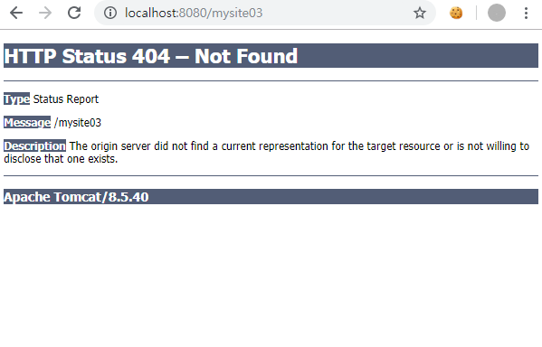
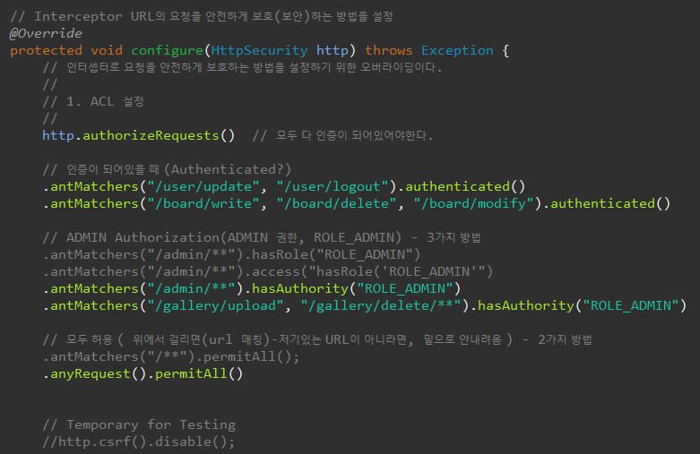

[TOC]

---

## 6개의 Filter를 구현할 것임

1, SecurityContextPersistenceFilter

	- SecurityContext(Autentication)를 관리하고 응답
	- principal(SecurityUser)관리

2, LogoutFilter

3, UsernamePasswordAuthenticationFilter

	- 인증, `email={}&password={}` 요청으로 인증 정보가 날라옴
	- AuthenticationManager에서 AuthenticationProvider(여러개갖고있음)로 인증정보(username, password)를 넘김
	- AuthenticationProvider에서 UserDetailServiceImpl, PasswordEncoder를 갖고있음 (프로바이더에서 사용자가 입력한 이름, 비밀번호를 갖고있꼬, 그 이메일로 db에서 꺼내온 사용자 정보를 가져와서 두개를 비교해서 일치하면 login 다르면 실패!)

4, AnonymousAuthenticationFilter

5, ExceptionTranslationFilter

6, FilterSecurityInterceptor

---


---

## FilterChainProxy 사용할 필터 체인 걸기


**실습용 AppSecurityConfig2.java**

### **그냥 통과시킬 url**

> 
>
> ```java
> @Configuration
> @EnableWebSecurity
> public class AppSecurityConfig2{
> 
>     @Bean(name="springSecurityFilterChain")
>     public FilterChainProxy filterChainProxy() {
>         List<SecurityFilterChain> filterChains = new ArrayList<SecurityFilterChain>();
> 
>         // 필터 그냥 통과시킬 URL
>         filterChains.add(new DefaultSecurityFilterChain(new AntPathRequestMatcher("/assets/**")));
>         filterChains.add(new DefaultSecurityFilterChain(new AntPathRequestMatcher("/favicon.ico")));
> 
>         return new FilterChainProxy(filterChains);
>     }
> }
> ```

**AppConfig.java** 에 import AppSecurityConfig2로 바꾸고 실행해보기

```java
@Import({DBConfig.class, MyBatisConfig.class, AppSecurityConfig2.class})
```





<br>

### **필터체인 탑승 url**



위의 기존 SecurityConfig의 다른 버전


```java
package com.cafe24.config.app;

import java.util.ArrayList;
import java.util.Arrays;
import java.util.Collection;
import java.util.LinkedHashMap;
import java.util.List;

import org.springframework.beans.factory.annotation.Autowired;
import org.springframework.context.annotation.Bean;
import org.springframework.context.annotation.Configuration;
import org.springframework.security.access.ConfigAttribute;
import org.springframework.security.access.SecurityConfig;
import org.springframework.security.access.vote.AffirmativeBased;
import org.springframework.security.access.vote.AuthenticatedVoter;
import org.springframework.security.access.vote.RoleVoter;
import org.springframework.security.authentication.AuthenticationManager;
import org.springframework.security.authentication.AuthenticationProvider;
import org.springframework.security.authentication.ProviderManager;
import org.springframework.security.authentication.dao.DaoAuthenticationProvider;
import org.springframework.security.config.annotation.web.configuration.EnableWebSecurity;
import org.springframework.security.core.userdetails.UserDetailsService;
import org.springframework.security.crypto.bcrypt.BCryptPasswordEncoder;
import org.springframework.security.crypto.password.PasswordEncoder;
import org.springframework.security.web.DefaultSecurityFilterChain;
import org.springframework.security.web.FilterChainProxy;
import org.springframework.security.web.SecurityFilterChain;
import org.springframework.security.web.access.AccessDeniedHandlerImpl;
import org.springframework.security.web.access.ExceptionTranslationFilter;
import org.springframework.security.web.access.expression.DefaultWebSecurityExpressionHandler;
import org.springframework.security.web.access.expression.ExpressionBasedFilterInvocationSecurityMetadataSource;
import org.springframework.security.web.access.expression.WebExpressionVoter;
import org.springframework.security.web.access.intercept.FilterInvocationSecurityMetadataSource;
import org.springframework.security.web.access.intercept.FilterSecurityInterceptor;
import org.springframework.security.web.authentication.AbstractAuthenticationProcessingFilter;
import org.springframework.security.web.authentication.AnonymousAuthenticationFilter;
import org.springframework.security.web.authentication.AuthenticationSuccessHandler;
import org.springframework.security.web.authentication.LoginUrlAuthenticationEntryPoint;
import org.springframework.security.web.authentication.SimpleUrlAuthenticationFailureHandler;
import org.springframework.security.web.authentication.UsernamePasswordAuthenticationFilter;
import org.springframework.security.web.authentication.logout.CookieClearingLogoutHandler;
import org.springframework.security.web.authentication.logout.LogoutFilter;
import org.springframework.security.web.authentication.logout.SecurityContextLogoutHandler;
import org.springframework.security.web.context.HttpSessionSecurityContextRepository;
import org.springframework.security.web.context.SecurityContextPersistenceFilter;
import org.springframework.security.web.util.matcher.AntPathRequestMatcher;
import org.springframework.security.web.util.matcher.RequestMatcher;

import com.cafe24.mysite.security.CustomUrlAuthenticationSuccessHandler;

@Configuration
@EnableWebSecurity
public class AppSecurityConfig2 {

    @Autowired
    private UserDetailsService userDetailsService;

    @Bean(name = "springSecurityFilterChain")
    public FilterChainProxy filterChainProxy() throws Exception {
        List<SecurityFilterChain> filterChains = new ArrayList<SecurityFilterChain>();

        // 필터 그냥 통과시킬 URL
        filterChains.add(new DefaultSecurityFilterChain(new AntPathRequestMatcher("/assets/**")));
        filterChains.add(new DefaultSecurityFilterChain(new AntPathRequestMatcher("/favicon.ico")));

        // 필터 탈 URL
        filterChains.add(new DefaultSecurityFilterChain(new AntPathRequestMatcher("/**"),
                                                        // filter chains
                                                        // 1.
                                                        securityContextPersistenceFilter(),

                                                        // 2.
                                                        logoutFilter(),

                                                        // 3.
                                                        usernamePasswordAuthenticationFilter(),

                                                        // 4.
                                                        anonymousAuthenticationFilter(),

                                                        // 5.
                                                        exceptionTranslationFilter(),

                                                        // 6.
                                                        filterSecurityInterceptor()

                                                       ));

        return new FilterChainProxy(filterChains);
    }

    /**
	 * 1. SecurityContextPersistenceFilter
	 * 
	 * SecurityContext를 관리하는 필터
	 */
    @Bean
    public SecurityContextPersistenceFilter securityContextPersistenceFilter() {
        return new SecurityContextPersistenceFilter(new HttpSessionSecurityContextRepository());
    }

    /**
	 * 2. LogoutFilter
	 * 
	 *  - logout url을 감시한다.
	 *  CustomLogoutSuccessHandler(로그아웃이 성공하면 web에서는  main화면 이지만,
	 *  api인 경우에는 JSONResult
	 */
    @Bean 
    public LogoutFilter logoutFilter() throws Exception {
        CookieClearingLogoutHandler cookieClearingLogoutHandler= new CookieClearingLogoutHandler("JSESSIONID");
        SecurityContextLogoutHandler securityContextLogoutHandler = new SecurityContextLogoutHandler();
        securityContextLogoutHandler.setInvalidateHttpSession(true);
        securityContextLogoutHandler.setClearAuthentication(true);

        LogoutFilter logoutFilter = new LogoutFilter("/", cookieClearingLogoutHandler);
        logoutFilter.setFilterProcessesUrl("/user/logout");
        logoutFilter.afterPropertiesSet(); 

        return logoutFilter;
    }

    /**
	 * 3. UsernamePasswordAuthenticationFilter
	 * 
	 * 인증(Authentication) 처리
	 * 
	 */
    @Bean
    public AbstractAuthenticationProcessingFilter usernamePasswordAuthenticationFilter() {
        UsernamePasswordAuthenticationFilter usernamePasswordAuthenticationFilter = new UsernamePasswordAuthenticationFilter();

        usernamePasswordAuthenticationFilter.setAuthenticationManager(authenticationManager());
        usernamePasswordAuthenticationFilter.setUsernameParameter("email");
        usernamePasswordAuthenticationFilter.setPasswordParameter("password");
        usernamePasswordAuthenticationFilter.setFilterProcessesUrl("/user/auth");
        usernamePasswordAuthenticationFilter.setAllowSessionCreation(true);
        usernamePasswordAuthenticationFilter.setAuthenticationSuccessHandler(authenticationSuccessHandler());
        usernamePasswordAuthenticationFilter
            .setAuthenticationFailureHandler(new SimpleUrlAuthenticationFailureHandler("/user/login?result=fail"));
        usernamePasswordAuthenticationFilter.afterPropertiesSet();

        return usernamePasswordAuthenticationFilter;
    }

    @Bean
    public AuthenticationSuccessHandler authenticationSuccessHandler() {
        return new CustomUrlAuthenticationSuccessHandler();
    }

    /**
	 * 4. AnonymousAuthenticationFilter
	 * 
	 * 로그인 하지 않은 사용자들을 감시 - !isQuthenticated()에 대한 처리
	 */
    @Bean
    public AnonymousAuthenticationFilter anonymousAuthenticationFilter() {
        return new AnonymousAuthenticationFilter("1a2b3c4d5e6F");

    }

    /**
	 * 5. ExceptionTranslationFilter
	 * 
	 * 예외에 대한 처리 필터 - 인증 또는 권한이 없는 접근은 Exception을 발생시킨다.
	 */
    @Bean
    public ExceptionTranslationFilter exceptionTranslationFilter() {
        ExceptionTranslationFilter exceptionTranslationFilter = new ExceptionTranslationFilter(
            new LoginUrlAuthenticationEntryPoint("/user/login"));

        AccessDeniedHandlerImpl accessDeniedHandler = new AccessDeniedHandlerImpl();
        accessDeniedHandler.setErrorPage("/WEB-INF/views/error/403.jsp");

        exceptionTranslationFilter.setAccessDeniedHandler(accessDeniedHandler);
        exceptionTranslationFilter.afterPropertiesSet();

        return exceptionTranslationFilter;
    }

    /**
	 * 6. FilterSecurityInterceptor
	 * 
	 * Interceptor URL 접근 제어(ACL) 관리
	 * 
	 */
    @Bean
    public FilterSecurityInterceptor filterSecurityInterceptor() throws Exception {
        FilterSecurityInterceptor filterSecurityInterceptor = new FilterSecurityInterceptor();

        filterSecurityInterceptor.setAuthenticationManager(authenticationManager());
        filterSecurityInterceptor.setAccessDecisionManager(accessDecisionManager());

        LinkedHashMap<RequestMatcher, Collection<ConfigAttribute>> requestMap = new LinkedHashMap<RequestMatcher, Collection<ConfigAttribute>>();
        //		requestMap.put(new AntPathRequestMatcher("/user/update", "매핑메소드 get, post ..."), SecurityConfig.createList(""));
        requestMap.put(new AntPathRequestMatcher("/user/update"), SecurityConfig.createList("isAuthenticated()"));
        requestMap.put(new AntPathRequestMatcher("/user/logout"), SecurityConfig.createList("isAuthenticated()"));
        requestMap.put(new AntPathRequestMatcher("/board/write"), SecurityConfig.createList("isAuthenticated()"));
        requestMap.put(new AntPathRequestMatcher("/board/delete"), SecurityConfig.createList("isAuthenticated()"));
        requestMap.put(new AntPathRequestMatcher("/board/modify"), SecurityConfig.createList("isAuthenticated()"));

        // ADMIN권한
        requestMap.put(new AntPathRequestMatcher("/admin**"), SecurityConfig.createList("hasRole('ADMIN')")); // rolevoter.setRolePrefix("ROLE_");
        // 설정
        // 되어있음
        requestMap.put(new AntPathRequestMatcher("/gallery/upload"), SecurityConfig.createList("hasRole('ADMIN')"));
        requestMap.put(new AntPathRequestMatcher("/gallery/delete**"), SecurityConfig.createList("hasRole('ADMIN')"));

        // 그 외는 모두 허락은 안 먹 힘 . -> 이유가 뭘까.
        //		requestMap.put(new AntPathRequestMatcher("/**"), SecurityConfig.createList("permitAll"));

        FilterInvocationSecurityMetadataSource newSource = new ExpressionBasedFilterInvocationSecurityMetadataSource(
            requestMap, new DefaultWebSecurityExpressionHandler());

        filterSecurityInterceptor.setSecurityMetadataSource(newSource);
        filterSecurityInterceptor.afterPropertiesSet();

        return filterSecurityInterceptor;
    }

    @Bean
    public AuthenticationManager authenticationManager() {
        AuthenticationManager authenticationManager = new ProviderManager(Arrays.asList(authenticationProvider()));
        return authenticationManager;
    }

    @Bean
    public AuthenticationProvider authenticationProvider() {
        DaoAuthenticationProvider authProvider = new DaoAuthenticationProvider();
        authProvider.setUserDetailsService(userDetailsService);
        authProvider.setPasswordEncoder(passwordEncoder());
        return authProvider;
    }

    @Bean
    public PasswordEncoder passwordEncoder() {
        return new BCryptPasswordEncoder();
    }

    @Bean
    public AffirmativeBased accessDecisionManager() throws Exception {
        RoleVoter roleVoter = new RoleVoter();
        roleVoter.setRolePrefix("ROLE_");

        AffirmativeBased affirmativeBased = new AffirmativeBased(
            Arrays.asList(roleVoter, new WebExpressionVoter(), new AuthenticatedVoter()));
        affirmativeBased.setAllowIfAllAbstainDecisions(false);
        affirmativeBased.afterPropertiesSet();

        return affirmativeBased;
    }

}

```

