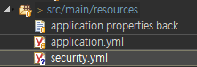

[TOC]

---

## 좋은 예제

spring security sparklr tonr

: <https://projects.spring.io/spring-security-oauth/docs/tutorial.html>


---

## oauth Token


### 1. ResourceServerConfig.java - 지원 서버 접근 권한 설정

```java
@Configuration
@EnableResourceServer
@EnableAuthorizationServer
public class ResourceServerConfig extends ResourceServerConfigurerAdapter{
    @Override
    public void configure(HttpSecurity http) throws Exception {
        //		super.configure(http);
        // 지원 서버 접근 권한 설정
        http
            .authorizeRequests()
            .antMatchers("/hello")
            .access("#oauth2.hasScope('read')");
    }
}
```


### 3. test



**application.yml**

```yml
security:
   basic:
      enabled: false
   user:
      name: test
      password: 1234
   oauth2:
      client:
         client-id: pjmall
         client-secret: 1234
         
server:
       port: 8888
       servlet:
               context-path: /v1


spring:
       profiles:
                active: dev
       devtools:
                livereload:
                           enabled: true
       http:
            encoding:
                     charset: UTF-8
                     enabled: true
                     forced: true
                     forced-request: true
                     forced-response: true
       aop:
           auto: true
       aop-proxy-target-class: true                          
         

```

**ControllerTest.java**

```java
@Test
public void testHelloAuthorized() throws Exception{
    String accessToken = getAccessToken("test", "1234");

    mockMvc
        .perform(get("/hello"))
        .andDo(print())
        .andExpect(status().isOk());		 
}


private String getAccessToken(String username, String password) throws Exception{

    MultiValueMap<String, String> params = new LinkedMultiValueMap<String, String>();
    params.add("grant_type", "password");
    params.add("client_id", "pjmall");
    params.add("username", username);
    params.add("password", password);
    params.add("scope", "read");

    ResultActions resultActions =
        mockMvc
        .perform(post("/oauth/token")
                 .params(params)
                 .with(httpBasic("pjmall","1234"))		
                 .contentType(MediaType.APPLICATION_JSON))
        .andDo(print())
        .andExpect(status().isOk());

    return "";
}
```

> ```
> MockHttpServletResponse:
> Status = 200
> Error message = null
> Headers = {Cache-Control=[no-store], Pragma=[no-cache], Content-Type=[application/json;charset=UTF-8], X-Content-Type-Options=[nosniff], X-XSS-Protection=[1; mode=block], X-Frame-Options=[DENY]}
> Content type = application/json;charset=UTF-8
> Body = {"access_token":"5aad730f-d4a1-4c4d-b4f3-5a119d2d4bb8","token_type":"bearer","refresh_token":"4829fd5b-1805-4d17-9a11-f040f788f089","expires_in":43199,"scope":"read"}
> Forwarded URL = null
> Redirected URL = null
> Cookies = []
> ```
>
> 


