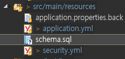
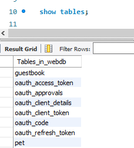
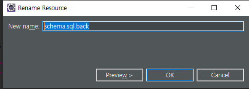
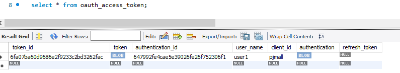

[TOC]

---

## AuthorizationServerConfig

**AuthorizationServerConfig.java** <- AuthorizationServerConfigurerAdapter

```java
@Configuration
@EnableAuthorizationServer
public class AuthorizationServerConfig extends AuthorizationServerConfigurerAdapter {

    @Autowired
    private AuthenticationManager authenticationManager;

    @Override
    public void configure(AuthorizationServerSecurityConfigurer security) throws Exception {
        super.configure(security);
    }

    @Override
    public void configure(ClientDetailsServiceConfigurer clients) throws Exception {
        //		super.configure(clients);
        clients.jdbc(basicDataSource());
    }

    @Override
    public void configure(AuthorizationServerEndpointsConfigurer endpoints) throws Exception {
        // OAuth Server가 작동하기 위한 EndPoint에 대한 정보를 설정
        //super.configure(endpoints);
        endpoints
            .tokenStore( new JdbcTokenStore( basicDataSource() ) )
            .authenticationManager( authenticationManager );
    }

    @Bean
    @ConfigurationProperties("spring.datasource")
    public DataSource basicDataSource() {
        return new BasicDataSource();
    }
}
```

<br>

**pom.xml**

```xml
<!-- spring jdbc -->
<dependency>
    <groupId>org.springframework</groupId>
    <artifactId>spring-jdbc</artifactId>
</dependency>

<!-- Common DBCP -->
<dependency>
    <groupId>commons-dbcp</groupId>
    <artifactId>commons-dbcp</artifactId>
</dependency>

<!-- mariaDB java Client -->
<dependency>
    <groupId>org.mariadb.jdbc</groupId>
    <artifactId>mariadb-java-client</artifactId>
    <version>2.4.0</version>
</dependency>
```

<br>

**application.yml**

```yaml
spring:

      ...
      
        datasource:
           jdbc:
              driver-class-name: org.mariadb.jdbc.Driver
              url: jdbc:mariadb://192.168.1.52:3307/webdb
              username: webdb
              password: webdb
      
security:
   basic:
      enabled: false
      
   user:
      name: user1
      password: 5678
      
#   oauth2:
#      client:
#         client-id: pjmall
#         client-secret: 1234      
```

> 이제 oauth2정보는 db에 저장할거임!!


---

---



**schema.sql**

```sql
-- used in tests that use MariaDB
drop table if exists oauth_client_details;

create table oauth_client_details (
  client_id VARCHAR(255) PRIMARY KEY,
  resource_ids VARCHAR(255),
  client_secret VARCHAR(255),
  scope VARCHAR(255),
  authorized_grant_types VARCHAR(255),
  web_server_redirect_uri VARCHAR(255),
  authorities VARCHAR(255),
  access_token_validity INTEGER,
  refresh_token_validity INTEGER,
  additional_information VARCHAR(4096),
  autoapprove VARCHAR(255)
);

drop table if exists oauth_client_token;
create table oauth_client_token (
  token_id VARCHAR(255),
  token VARBINARY(4096),
  authentication_id VARCHAR(255) PRIMARY KEY,
  user_name VARCHAR(255),
  client_id VARCHAR(255)
);

drop table if exists oauth_access_token;
create table oauth_access_token (
  token_id VARCHAR(255),
  token VARBINARY(4096),
  authentication_id VARCHAR(255) PRIMARY KEY,
  user_name VARCHAR(255),
  client_id VARCHAR(255),
  authentication VARBINARY(4096),
  refresh_token VARCHAR(255)
);

drop table if exists oauth_refresh_token;
create table oauth_refresh_token (
  token_id VARCHAR(255),
  token VARBINARY(4096),
  authentication VARBINARY(4096)
);

drop table if exists oauth_code;
create table oauth_code (
  code VARCHAR(255), authentication VARBINARY(4096)
);

drop table if exists oauth_approvals;
create table oauth_approvals (
   userId VARCHAR(255),
   clientId VARCHAR(255),
   scope VARCHAR(255),
   status VARCHAR(10),
   expiresAt TIMESTAMP,
   lastModifiedAt TIMESTAMP
);


-- customized oauth_client_details table

drop table if exists ClientDetails;
create table ClientDetails (
  appId VARCHAR(255) PRIMARY KEY,
  resourceIds VARCHAR(255),
  appSecret VARCHAR(255),
  scope VARCHAR(255),
  grantTypes VARCHAR(255),
  redirectUrl VARCHAR(255),
  authorities VARCHAR(255),
  access_token_validity INTEGER,
  refresh_token_validity INTEGER,
  additionalInformation VARCHAR(4096),
  autoApproveScopes VARCHAR(255)
);
```

> MariaDB 767 byte 에러

> [MariaDB 767 byte 에러 해결법](https://github.com/yona-projects/yona/wiki/MariaDB-767-byte-%EC%97%90%EB%9F%AC-%EB%8C%80%EC%B1%85)
>
> 256->255
>
> 
>
> 테이블 생성 완료
>
> 아래 주석부분 기본 클라이언트 insert하기 
>
> ```
> security:
>    basic:
>       enabled: false
>       
>    user:
>       name: user1
>       password: 5678
>       
> #   oauth2:
> #      client:
> #         client-id: pjmall
> #         client-secret: 1234
> ```
>
> ```sql
> INSERT
> INTO oauth_client_details (CLIENT_ID, RESOURCE_IDS, CLIENT_SECRET, SCOPE, AUTHORIZED_GRANT_TYPES, WEB_SERVER_REDIRECT_URI, AUTHORITIES, ACCESS_TOKEN_VALIDITY, REFRESH_TOKEN_VALIDITY, ADDITIONAL_INFORMATION, AUTOAPPROVE)
> VALUES ('pjmall', '', '1234', 'MALL_USER', 'password, authorization_code, refresh_token', '', '', null, null, '{}', '');
> ```

<br>

## test

**ControllerTest.java**

```java
@Before
public void setUp() throws Exception {
    mockMvc = MockMvcBuilders
        .webAppContextSetup(webApplicationContext)
        .addFilter(springSecurityFilterChain)
        .build();

    if(accessToken != null) {
        return;
    }

    MultiValueMap<String, String> params = new LinkedMultiValueMap<String, String>();
    params.add("grant_type", "password");
    params.add("client_id", "pjmall");

    params.add("username", "user1"); // 클라이언트이자 리소스 오너
    params.add("password", "5678");

    params.add("scope", "MALL_USER");

    ResultActions resultActions =
        mockMvc 
        .perform(post("/oauth/token")
                 .params(params)
                 .with(httpBasic("pjmall","1234"))		
                 .contentType(MediaType.APPLICATION_JSON))
        .andDo(print())
        .andExpect(status().isOk());

    String resultString = resultActions.andReturn().getResponse().getContentAsString();

    JacksonJsonParser jsonParser = new JacksonJsonParser();
    accessToken = jsonParser.parseMap(resultString).get("access_token").toString();
}
```

**테이블 생성후 sql 파일 이름 바꾸기**

> 


이제 토큰 저장되는 것으로 사용할 수 있음




---


---

url접근 - whitelabel 설정

**application.yml**

```yaml
server:
       port: 8888
#       servlet:
#               context-path: /v1
       contextPath: /v1
       error:
               whitelabel:
                          enabled: false
```


