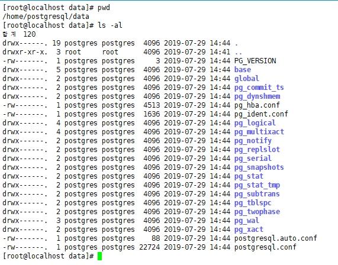
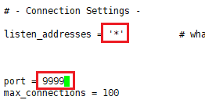
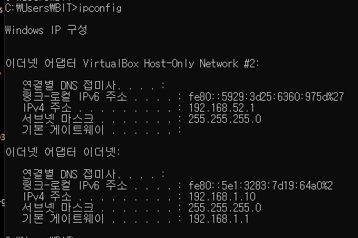
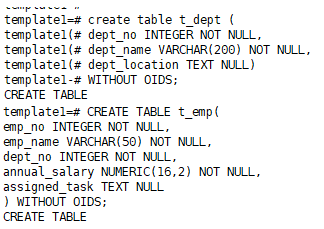
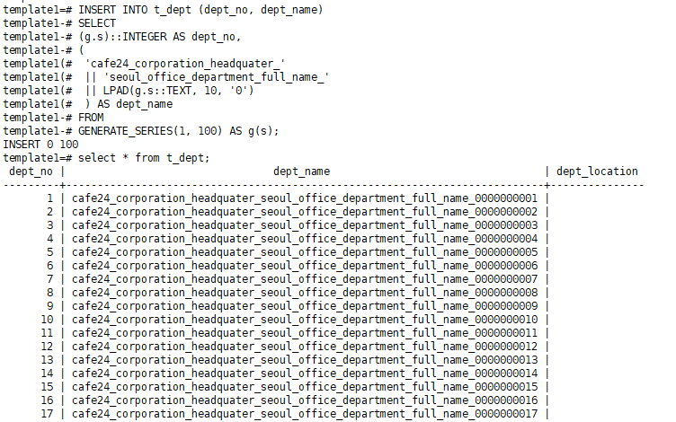
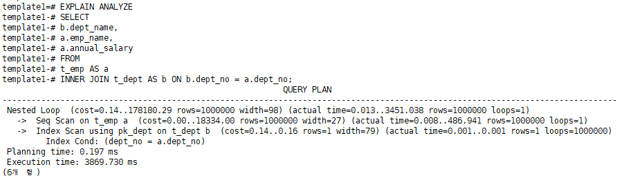
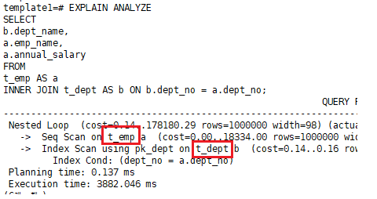

[TOC]

---

# Postgresql

서버 start 

`su -l postgres -c "/cafe24/pgsql/bin/pg_ctl start --pgdata='/home/postgresql/data' --log='/home/postgresql/data/postgresql.log' --wait"`


접근 

`/cafe24/pgsql/bin/psql --port=9999 --username=postgres --dbname=template1`

---


---

### linux

pg_hda.conf의 파일(접근제어)에 접근할 수 있는 호스트 지정?

```sql
mkdir -p '/home/postgresql/data'

chown postgres.postgres '/home/postgresql/data/'

su -l postgres -c "/cafe24/pgsql/bin/initdb --auth=trust --pgdata='/home/postgresql/data' --encoding=UTF8 --locale=C"
```




---


---

`vi postgresql.conf ` : port, 접근 주소 설정



**확인**


---


### 로컬 ip 접근 설정 추가

> 로컬 ip 확인하기
>
> 

<br>

` vi pg_hba.conf `


기존 서버 5432 stop : `/etc/init.d/postgreql stop`


9999포트 start : `su -l postgres -c "/cafe24/pgsql/bin/pg_ctl start --pgdata='/home/postgresql/data' --log='/home/postgresql/data/postgresql.log' --wait"`


접근 : 

`/cafe24/pgsql/bin/psql --port=9999 --username=postgres --dbname=template1`

> 

성공! 


---


---

**table 생성**

```sql
create table t_dept (
dept_no INTEGER NOT NULL,
dept_name VARCHAR(200) NOT NULL,
dept_location TEXT NULL)
WITHOUT OIDS;

REATE TABLE t_emp(
emp_no INTEGER NOT NULL,
emp_name VARCHAR(50) NOT NULL,
dept_no INTEGER NOT NULL,
annual_salary NUMERIC(16,2) NOT NULL,
assigned_task TEXT NULL
) WITHOUT OIDS;
```




**insert하기**

```sql
INSERT INTO t_dept (dept_no, dept_name)
SELECT 
    (g.s)::INTEGER AS dept_no,
    (
     'cafe24_corporation_headquater_'
     || 'seoul_office_department_full_name_'
     || LPAD(g.s::TEXT, 10, '0')
     ) AS dept_name
FROM
GENERATE_SERIES(1, 100) AS g(s);
```



**10만건 넣기**

```sql
INSERT INTO t_emp (emp_no, emp_name, dept_no, annual_salary)
SELECT 
	(g.s)::INTEGER AS emp_no,
	('emp_' || LPAD(g.s::TEXT, 10, '0')) AS emp_name,
	(g.s % 100 + 1)::INTEGER AS dept_no,
	(RANDOM() * 10^6)::NUMERIC(16,2) AS annual_salary
FROM
GENERATE_SERIES(1, 1000000) AS g(s);
```

---

**PK설정**

```sql
ALTER TABLE t_dept
	ADD CONSTRAINT pk_dept
	PRIMARY KEY (dept_no);
```

```sql
ALTER TABLE t_emp
	ADD CONSTRAINT pk_emp
	PRIMARY KEY (emp_no);
```


**FK설정**

```sql
ALTER TABLE t_emp
	ADD CONSTRAINT fk_emp__dept_no
	FOREIGN KEY (dept_no)
	REFERENCES t_dept (dept_no);
```


**테이블 정보 확인**


**hashjoin, sort off**

```sql
SET enable_hashjoin = off;
SET enable_sort = off;
```


**EXPLAIN 확인해보기**

EXPLAIN 옵션 : ANALYZE(실제로 실행을 시켜봄), VERBOSE

```sql
EXPLAIN ANALYZE
SELECT
	b.dept_name,
	a.emp_name,
	a.annual_salary
FROM
	t_emp AS a
	INNER JOIN t_dept AS b ON b.dept_no = a.dept_no;
```



actual time=0.008..475.429  : 실제 쿼리 실행 시간

rows : 쿼리 실행 후 반환되는 로우수

loops : 쿼리내 해당 구문(단계)의 실행 횟수  

[Nested Loop, Sort-Merge, Hash Join 조인연산](https://needjarvis.tistory.com/162)

---


---

**RDBMS Optimizer 가 plan을 결정하는 방식**

CBO vs RBO

- CBO
- RBO

---



지금은 t_emp를 읽고 t_dept를 읽는데

 dept에도 dept_no 인덱스를 만들어 준다면?

`CREATE INDEX ixnn_emp__dept_no ON t_emp USING BTREE (dept_no);`


**t_dept를 먼저 읽음**

---


---

새 table 만들기

```sql
CREATE TABLE t_emp_denormal WITHOUT OIDS
AS
SELECT 
    a.emp_no,
    a.emp_name,
    a.dept_no,
    b.dept_name,
    a.annual_salary,
    a.assigned_task
FROM
    t_emp AS a
    INNER JOIN t_dept AS b ON b.dept_no = a.dept_no;
	
```


