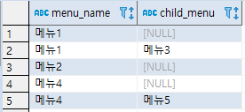

[TOC]

---

```sql
CREATE TABLE daily_order(
    order_date DATE NOT NULL,
    order_count INTEGER NOT NULL,
    CONSTRAINT pk_daily_order PRIMARY KEY (order_date)
) WITHOUT OIDS;

INSERT INTO daily_order VALUES('2019-01-01', 23);
INSERT INTO daily_order VALUES('2019-01-10', 32);
INSERT INTO daily_order VALUES('2019-03-05', 64);
INSERT INTO daily_order VALUES('2019-04-11', 42);
INSERT INTO daily_order VALUES('2019-05-01', 12);
INSERT INTO daily_order VALUES('2019-05-20', 76);
```

**결과1**

```sql
template1=#  select TO_CHAR(order_date,'YYYY-MM') order_month, sum(order_count) monthly_count from daily_order group by order_month order by order_month;
 order_month | monthly_count 
-------------+---------------
 2019-01     |            55
 2019-03     |            64
 2019-04     |            42
 2019-05     |            88
(4개 행)
```

**결과2**

```sql
select 
	coalesce(sum(case when order_date between '2019-01-01' and '2019-01-31' then order_count end), 0) as "2019-01",
	coalesce(sum(case when order_date between '2019-02-01' and '2019-02-28' then order_count end), 0) as "2019-02",
	coalesce(sum(case when order_date between '2019-03-01' and '2019-03-31' then order_count end), 0) as "2019-03",
	coalesce(sum(case when order_date between '2019-04-01' and '2019-04-30' then order_count end), 0) as "2019-04",
	coalesce(sum(case when order_date between '2019-05-01' and '2019-05-31' then order_count end), 0) as "2019-05",
	coalesce(sum(case when order_date between '2019-06-01' and '2019-06-30' then order_count end), 0) as "2019-06"
from daily_order;
```

```
 2019-01 | 2019-02 | 2019-03 | 2019-04 | 2019-05 | 2019-06 
---------+---------+---------+---------+---------+---------
      55 |       0 |      64 |      42 |      88 |       0
(1개 행)
```

---


---

t_code

```sql
create table t_code(
	code_key varchar(20) not null,
	code_value text not null,
	sort_no integer not null,
	constraint pk_code primary key (code_key)
) without oids;

insert into t_code values('A', 'Active', 1);
insert into t_code values('S', 'Sleep', 2);
insert into t_code values('O', 'Out', 3);
```

보통 위와 같이 코드 테이블을 만드는데, 통합 코드 테이블을 생각한다면

```sql
create table t_code_type(
	code_type varchar(20) not null,
	type_desc text not null,
	constraint pk_code_type primary key (code_type)
) without oids;
```

이런 타입 테이블을 만들어 t_code와 FK연결

---


---

```
메뉴 1
	- 메뉴3
메뉴 2
메뉴 4
	- 메뉴 5
```

| menu_depth1 | menu_depth2 |
| ----------- | ----------- |
| 메뉴 1      | null        |
| 메뉴 1      | 메뉴 3      |
| 메뉴 2      | null        |
| 메뉴 4      | null        |
| 메뉴 4      | 메뉴 5      |

### **나의 sql문**

```sql
CREATE TABLE t_parent_menu(
	sort_no INTEGER NOT NULL,
	menu_name VARCHAR(20) NOT NULL,
	CONSTRAINT pk_parent_menu PRIMARY KEY (sort_no)
) WITHOUT OIDS;

SELECT * FROM t_parent_menu;

INSERT INTO t_parent_menu VALUES(1, '메뉴1');
INSERT INTO t_parent_menu VALUES(2, '메뉴2');
INSERT INTO t_parent_menu VALUES(3, '메뉴4');

CREATE TABLE t_menu(
	sort_no INTEGER NOT NULL,
	parent_menu_no INTEGER NOT NULL,  
	child_menu VARCHAR(20) NOT NULL,
	CONSTRAINT pk_menu PRIMARY KEY (sort_no)
) WITHOUT OIDS;

ALTER TABLE t_menu
	ADD CONSTRAINT "FK_parent_menu_TO_menu"
		FOREIGN KEY (
			"parent_menu_no"
		)
		REFERENCES t_parent_menu ( 
			"sort_no" 
		);
	
INSERT INTO t_menu VALUES(1, 1, '메뉴3');
INSERT INTO t_menu VALUES(2, 3, '메뉴5');
INSERT INTO t_menu(sort_no, parent_menu_no) VALUES(3, 1);
INSERT INTO t_menu(sort_no, parent_menu_no) VALUES(4, 2);
INSERT INTO t_menu(sort_no, parent_menu_no) VALUES(5, 3);

SELECT p.menu_name, c.child_menu 
FROM t_menu c, t_parent_menu p
WHERE c.parent_menu_no = p.sort_no
ORDER BY p.sort_no, c.sort_no DESC;
```



---

### **팀장님 sql문**

테이블 2개

- t_menu
- t_menu_tree

```sql
CREATE TABLE t_menu (
  menu_no INTEGER NOT NULL,
  menu_name VARCHAR(100) NOT NULL,
  menu_desc TEXT NULL,
  CONSTRAINT pk_menu PRIMARY KEY (menu_no)
) WITHOUT OIDS;

CREATE TABLE t_menu_tree (
  tree_type CHAR(1) NOT NULL,
  menu_no INTEGER NOT NULL,
  parent_menu_no INTEGER NOT NULL,
  sort_no INTEGER NOT NULL,
  depth_no INTEGER NOT NULL,
  menu_name_for_tree VARCHAR(100) NULL,
  CONSTRAINT pk_menu_tree PRIMARY KEY (tree_type, menu_no, parent_menu_no)
) WITHOUT OIDS;

INSERT INTO t_code_type
VALUES ('menu_tree_type', '메뉴 유형');

INSERT INTO t_code
VALUES ('menu_tree_type', 'A', '대표 운영자용 메뉴', 1, NULL, NULL);
INSERT INTO t_code
VALUES ('menu_tree_type', 'B', '부 운영자용 메뉴', 2, NULL, NULL);

INSERT INTO t_menu VALUES (0, '', NULL);
INSERT INTO t_menu VALUES (1, '메뉴 01', NULL);
INSERT INTO t_menu VALUES (2, '메뉴 02', NULL);
INSERT INTO t_menu VALUES (3, '메뉴 03', NULL);
INSERT INTO t_menu VALUES (4, '메뉴 04', NULL);
INSERT INTO t_menu VALUES (5, '메뉴 05', NULL);
INSERT INTO t_menu VALUES (6, '메뉴 06', NULL);
INSERT INTO t_menu VALUES (7, '메뉴 07', NULL);
INSERT INTO t_menu VALUES (8, '메뉴 08', NULL);
INSERT INTO t_menu VALUES (9, '메뉴 09', NULL);

INSERT INTO t_menu_tree VALUES ('A', 1, 0, 1, 1, '메뉴 01');
INSERT INTO t_menu_tree VALUES ('A', 4, 1, 1, 2, '메뉴 01-04');
INSERT INTO t_menu_tree VALUES ('A', 6, 4, 1, 3, '메뉴 01-04-06');
INSERT INTO t_menu_tree VALUES ('A', 8, 6, 1, 4, '메뉴 01-04-06-08');
INSERT INTO t_menu_tree VALUES ('A', 7, 6, 2, 4, '메뉴 01-04-06-07');
INSERT INTO t_menu_tree VALUES ('A', 3, 4, 2, 3, '메뉴 01-04-03');
INSERT INTO t_menu_tree VALUES ('A', 7, 4, 3, 3, '메뉴 01-04-07');
INSERT INTO t_menu_tree VALUES ('A', 2, 0, 2, 1, '메뉴 02');
INSERT INTO t_menu_tree VALUES ('A', 5, 2, 1, 2, '메뉴 02-05');
INSERT INTO t_menu_tree VALUES ('A', 7, 5, 1, 3, '메뉴 02-05-07');
INSERT INTO t_menu_tree VALUES ('A', 6, 2, 2, 2, '메뉴 02-06');
INSERT INTO t_menu_tree VALUES ('A', 9, 0, 3, 1, '메뉴 09');

SELECT
  /*
  t1.menu_no AS depth1_menu_no,
  (CASE WHEN t1.menu_no <> t2.menu_no THEN t2.menu_no END) AS depth2_menu_no,
  (CASE WHEN t1.menu_no <> t3.menu_no THEN t3.menu_no END) AS depth3_menu_no,
  (CASE WHEN t1.menu_no <> t4.menu_no THEN t4.menu_no END) AS depth4_menu_no,
  */
  t1.menu_name_for_tree AS depth1_menu_name,
  (CASE WHEN t1.menu_no <> t2.menu_no THEN t2.menu_name_for_tree END) AS depth2_menu_name,
  (CASE WHEN t1.menu_no <> t3.menu_no THEN t3.menu_name_for_tree END) AS depth3_menu_name,
  (CASE WHEN t1.menu_no <> t4.menu_no THEN t4.menu_name_for_tree END) AS depth4_menu_name
FROM
  t_menu_tree AS t1
  LEFT OUTER JOIN t_menu_tree AS t2
  ON
  (t2.tree_type = t1.tree_type 
   AND t2.parent_menu_no = t1.menu_no 
   AND t2.depth_no = 2 
   AND t1.depth_no = 1)
   
  OR 
  (t2.tree_type = t1.tree_type AND t2.menu_no = t1.menu_no)
  LEFT OUTER JOIN t_menu_tree AS t3 ON (t3.tree_type = t2.tree_type 
   AND t3.parent_menu_no = t2.menu_no 
   AND t3.depth_no = 3 
   AND t2.depth_no = 2) 
      
  OR (t3.tree_type = t1.tree_type AND t3.menu_no = t1.menu_no) LEFT OUTER JOIN t_menu_tree AS t4 ON (t4.tree_type = t3.tree_type 
   AND t4.parent_menu_no = t3.menu_no 
   AND t4.depth_no = 4 
   AND t3.depth_no = 3) 
    
OR (t4.tree_type = t1.tree_type AND t4.menu_no = t1.menu_no)

WHERE
  t1.tree_type = 'A' AND t1.depth_no = 1
ORDER BY
  t1.sort_no
  , t2.depth_no, t2.sort_no
  , t3.depth_no, t3.sort_no
  , t4.depth_no, t4.sort_no
;

UPDATE t_menu_tree SET sort_no = sort_no + 1 WHERE tree_type = 'A' AND parent_menu_no = 9 AND depth_no = 2 AND sort_no > 1;

UPDATE t_menu_tree SET parent_menu_no = 9, sort_no = 1 WHERE tree_type = 'A' AND menu_no = 4 AND parent_menu_no = 1;
```


