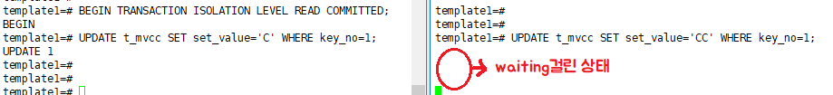
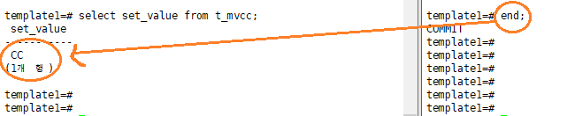
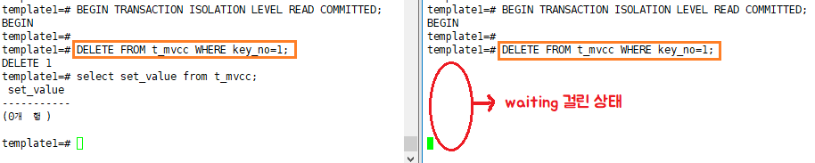
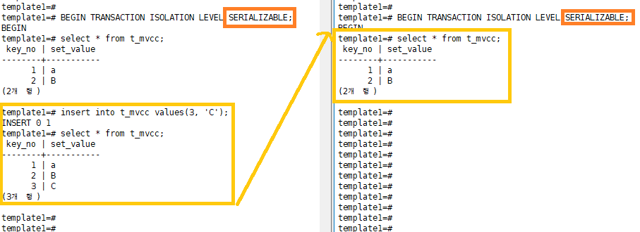
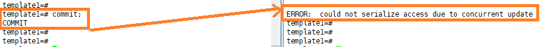
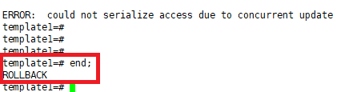
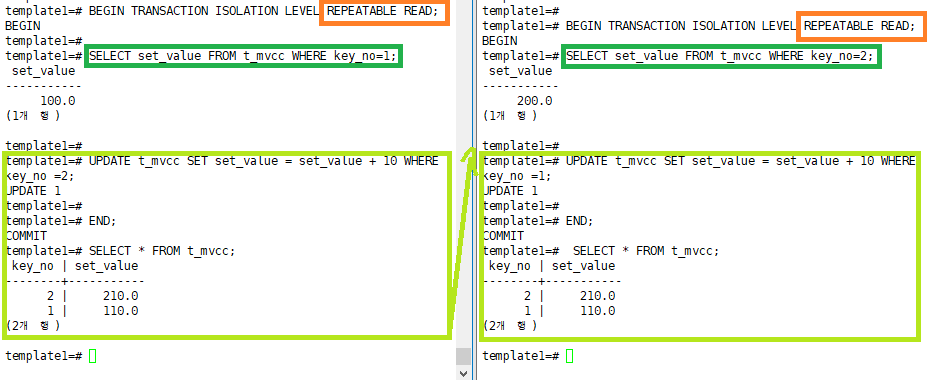
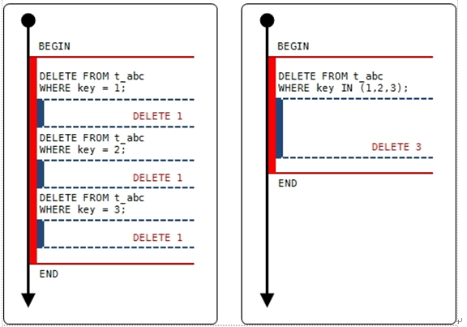
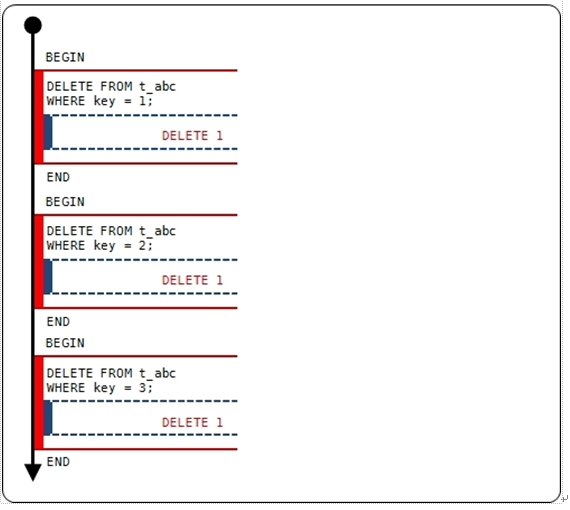

[TOC]

---

```sql
CREATE TABLE t_mvcc (
	key_no INTEGER NOT NULL,
    set_value TEXT NULL,
    CONSTRAINT pk_mvcc PRIMARY KEY (key_no)
)WITHOUT OIDS;

INSERT INTO t_mvcc VALUES (1, 'A');
```

<br>

## BEGIN

`BEGIN` : 새로운 트랜잭션 시작

`UPDATE t_mvcc SET set_value='B' WHERE key_no=1;`

> **각 세션마다 데이터 버전이 다름**
>
> 

<br>

## END

`END;` : 커밋

> 

<br>

## TRANSACTION ISOLATION LEVEL READ COMMITTED

### 동일한 레코드 수정 

```sql
BEGIN TRANSACTION ISOLATION LEVEL READ COMMITTED;
```

> **다른 트랜젝션이 변경되면, 변경된 시점부터 읽겠다.**
>
> 


**양쪽에서 수정 시도하면 한쪽은 막힘**

> 


**첫번째에서 커밋을 해야 두번째가 업데이트 됨**

C업데이트 후에 CC업데이트!

> 


**근데, 두번째 입장에서는 첫번째가 커밋된 후 수정했으니 CC인데,** 

**첫번째 입장에서는 아직 두번째가 커밋 안됐기 때문에 C**

> 


**두번째가 커밋해야 비로소 둘다 CC**

-> C로 업데이트 후에 바로 다른 세션에서 CC로 업데이트 했기 때문에 최종은 CC!

> 

<br>

### 동일한 레코드 삭제

` DELETE FROM t_mvcc WHERE key_no=1;`

> 수정과 똑같이 웨이팅
>
> 

첫번째에서 커밋한 경우, 두번째에서는 삭제한 레코드 0개로 뜸

(이미 왼쪽 세션(첫번째 트랜젝션)에서 삭제가 되었기 때문)

> 

<br>

### 동시 insert

#### PK가 있는 경우 -> insert io

`INSERT INTO t_mvcc VALUES(1, 'A');`

> 

COMMIT 하는 경우 오류가 난다. -> 

> 
>
> 오류난 경우 END는 ROLLBACK이다
>
> 

#### PK가 없는 경우

`ALTER TABLE t_mvcc DROP CONSTRAINT pk_mvcc;`

**INSERT 가능**

> 
>
> 하지만 아직 COMMIT은 안된상태
>
> **COMMIT하기**
>
> 

PK 다시 추가

`ALTER TABLE t_mvcc ADD CONSTRAINT pk_mvcc PRIMARY KEY (key_no)`

---


---

## REPEATABLE READ

```sql
BEGIN TRANSACTION ISOLATION LEVEL REPEATABLE READ;
```


**트랜젝션 사용중에는 다른 세션의 커밋 내용을 보지 않고,**

**커밋 후에 메인버전을 확인하겠다.**

> 

---


---

## SERIALIZABLE

```sql
BEGIN TRANSACTION ISOLATION LEVEL SERIALIZABLE;
```

> 


### 동시 수정

`update t_mvcc set set_value='CCC' where key_no=1;`

> 웨이팅
>
> 

얘는 커밋하면  오류남 -> 처음에 가지고 온 데이터가 변한다면 순서대로가 어긋나니까 안됨!!!!

처음에 가지고온 데이터가 그대로 여야만 내가 바꿀수있음

> 
>
> 이런경우는 ROLLBACK
>
> 

---

<br>

---

## REPEATABLE READ vs SERIALIZABLE 

```sql
DROP TABLE t_mvcc;

CREATE TABLE t_mvcc (
	key_no INTEGER NOT NULL,
    set_value NUMERIC NULL,
    CONSTRAINT pk_mvcc PRIMARY KEY (key_no)
)WITHOUT OIDS;

INSERT INTO t_mvcc VALUES (1, 100.0);
INSERT INTO t_mvcc VALUES (2, 200.0);

template1=# select * from t_mvcc;
 key_no | set_value 
--------+-----------
      1 |     100.0
      2 |     200.0
(2개 행)
```


### BEGIN TRANSACTION ISOLATION LEVEL REPEATABLE READ;

**첫번째 세션**

SELECT set_value FROM t_mvcc WHERE key_no=1;

UPDATE t_mvcc SET set_value = set_value + 10 WHERE key_no =2;

END;

SELECT * FROM t_mvcc;


**두번째 세션**

SELECT set_value FROM t_mvcc WHERE key_no=2;

UPDATE t_mvcc SET set_value = set_value + 10 WHERE key_no =1;

END;

SELECT * FROM t_mvcc;




---

<br>

---

### SERIALIZABLE 

원래대로

```sql
DROP TABLE t_mvcc;

CREATE TABLE t_mvcc (
	key_no INTEGER NOT NULL,
    set_value NUMERIC NULL,
    CONSTRAINT pk_mvcc PRIMARY KEY (key_no)
)WITHOUT OIDS;

INSERT INTO t_mvcc VALUES (1, 100.0);
INSERT INTO t_mvcc VALUES (2, 200.0);
```

`BEGIN TRANSACTION ISOLATION LEVEL SERIALIZABLE;`

**첫번째 세션**

SELECT set_value FROM t_mvcc WHERE key_no=1;

UPDATE t_mvcc SET set_value = set_value + 10 WHERE key_no =2;

END;

SELECT * FROM t_mvcc;


**두번째 세션**

SELECT set_value FROM t_mvcc WHERE key_no=2;

UPDATE t_mvcc SET set_value = set_value + 10 WHERE key_no =1;

END;

SELECT * FROM t_mvcc;


**오류가 남!!!!!**

> 

이유는 : 다른 세션에서 SERIALIZABLE로 읽는 것 만으로도 LOCK이 걸려서 오류가 남!

SERIALIZABLE 는 거의 사용하지 않는다.

---


---

## **결론** 

- BEGIN END는 짧게 짧게 ! ( LOCK구간이 길면 안돼 )

> 아래와 같이 쿼리를 한번에 치는게 좋지만,
>
> 
>
> IN을 사용할 수 없다면, 트랜젝션 구간은 짧게 짧게 BEGIN END를 붙여서 써주는게 좋다.
>
> 


- 중복 데이터 입력 방지는 트랜잭션만 가지고 해결하기 아주 어렵다고 할 수 있기 때문에, PK / UK / Unique Index를 사용해야 한다.


