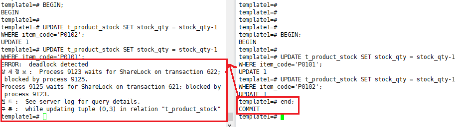

[TOC]

---

상품 : product

옵션 : option

품목 : items

```sql
CREATE TABLE t_product_stock(
	item_code CHAR(5) NOT NULL,
    stock_qty INTEGER NOT NULL,
    CONSTRAINT pk_product_stock PRIMARY KEY (item_code)
) WITHOUT OIDS;

INSERT INTO t_product_stock VALUES ('P0101', 1000);
INSERT INTO t_product_stock VALUES ('P0102', 2000);
```

```sql
template1=# SELECT * FROM t_product_stock;
 item_code | stock_qty 
-----------+-----------
 P0101     |      1000
 P0102     |      2000
```


2명의 사용자가 장바구니에 담는 경우


첫번째 세션

```sql
UPDATE t_product_stock SET stock_qty = stock_qty-1 WHERE item_code='P0101';
```


두번째 세션

```sql
UPDATE t_product_stock SET stock_qty = stock_qty-1 WHERE item_code='P0102';
```


첫번째 세션

```sql
UPDATE t_product_stock SET stock_qty = stock_qty-1 WHERE item_code='P0102';
```


LOCK

> 

---

<br>

---

주문 시 발생하는 DEADLOCK

> 

---

## pg_advisory_lock

`SELECT pg_advisory_lock(123);`

`SELECT pg_advisory_unlock(123);`

> 
>
> <b style="color:red;">요청한 순서대로 lock을 잡을 수 있음</b>


---

<br>

---

VACUUM ANALYZE

<https://blog.gaerae.com/2015/09/postgresql-vacuum-fsm.html>

---

<br>

---

### 다중 버전 동시성 제어

- 데이터를 변경할 대마다 그 변경사항을 UNDO 영역에 저장
- 데이터를 읽다가 쿼리(또는 트랜잭션)시작 시점 이후에 변경된(변경이 진행중이거나 이미 커밋된)값을 발견하면, UNDO 영역에 저장된 정보를 이용해
  쿼리(또는 트랜잭션)시작 시점의 일관성 있는 버전(CR Copy)를 생성하고 읽음

데이터 무결성을 위해서 각각 다른 세션의 트랜잭션이 데이터 값을 변경할 떄 마다 변경 사항을 공유영역에 저장 하며, 쿼리 혹은 트랜잭션 시작 시잠 이후 변경된 값을 발견하면 시작 시점의 일관성 있는 버전을 생성하고 데이터의 상태를 관찰한다.

---

### 데이터베이스 잠금(LOCK)

- 공유잠금 (select)
- 배타적잠금(insert, update, delete)
- <https://battleracoon.tistory.com/2>


