[TOC]

# 카페24 개발자센터 - postman으로 token받기

---

RESTful API - Http Method

Webhook - 역방향 api

---

access token - 2시간

replace token - 14일

---

<br>

## 1 App 등록

[카페24 개발자 센터](https://developer.cafe24.com/admin/apps/front/manage)

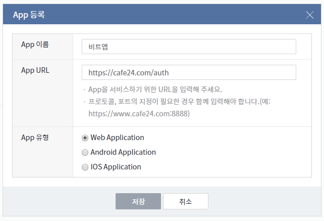

<br>

## 2 App 기본 정보 등록

> 위에서 생성한 앱 클릭

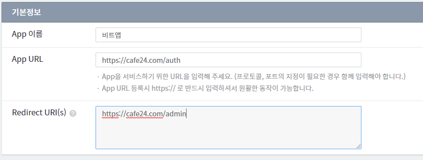

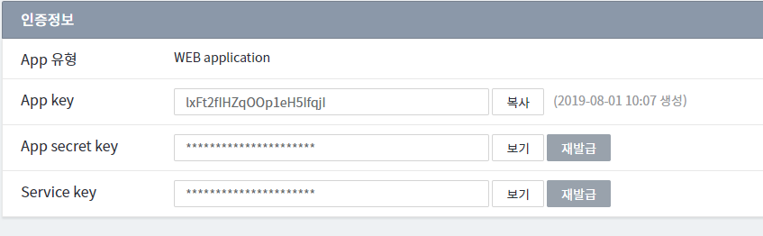

> App Key - client ID
>
> App secret key - 시크릿 키
>
> Service key - 인증과 무관 (할인, 쿠폰 등 금액과 관련있는 서비스를 할 경우 금액(진짜 그 금액이 맞는지)을 검증하는 키)


<br>

## 3 Oauth 인증 코드

[Oauth 인증 개발 가이드](https://developer.cafe24.com/doc/front/develop/oauth/oauthcode)

형식 

```
https://samplemall.cafe24api.com/api/v2/oauth/authorize?response_type=code&client_id=sample7eBNEqSfkd7I8hoA
&state=MTIzNDU2Nzg=&redirect_uri=https://sampleapp.com/oauth/redirect&scope=mall.read_application,mall.write_application
```

<br>

**사용할 url로 수정**

```
https://chry3055.cafe24api.com/api/v2/oauth/authorize?response_type=code&client_id=lxFt2fIHZqOOp1eH5IfqjI&state=bit123&redirect_uri=https://cafe24.com/admin&scope=mall.read_application,mall.write_application
```

<br>

**파라미터 정보**

> 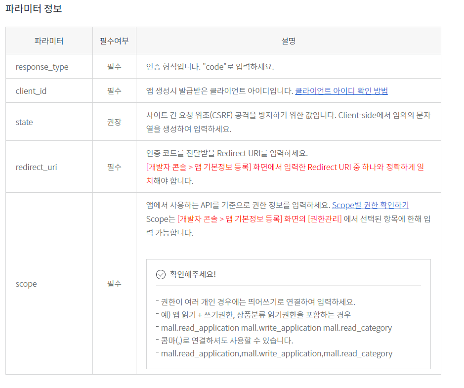

---


---

## 4 위의 url로 접속

```
https://chry3055.cafe24api.com/api/v2/oauth/authorize?response_type=code&client_id=lxFt2fIHZqOOp1eH5IfqjI&state=bit123&redirect_uri=https://cafe24.com/admin&scope=mall.read_application,mall.write_application
```

> 요청페이지 찾을 수 없음 -> 아직 key 발급을 안받았음

<br>

내 쇼핑몰 관리자모드 -> 앱스토어 확인하면 비트앱이 들어와있는것을 확인!

> 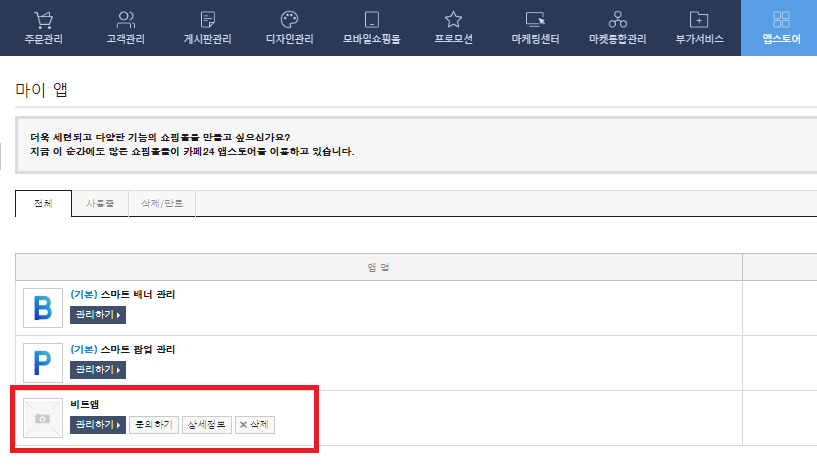

---


---

## 5 엑세스 토큰 발급 (포스트맨)

[엑세스 토큰 발급 개발가이드](https://developer.cafe24.com/doc/front/develop/oauth/token)

[포스트맨 사용가이드](https://developer.cafe24.com/doc/front/develop/api/postman)

### - cafe24 Collections 가져오기

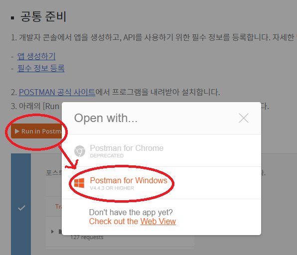

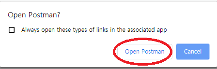

<br>

**Open Postman을 하면 Collections에 들어온다.**

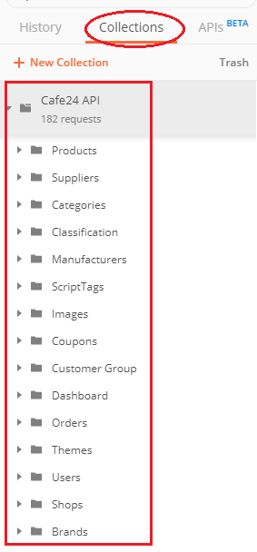

---

### - 환경변수 설정

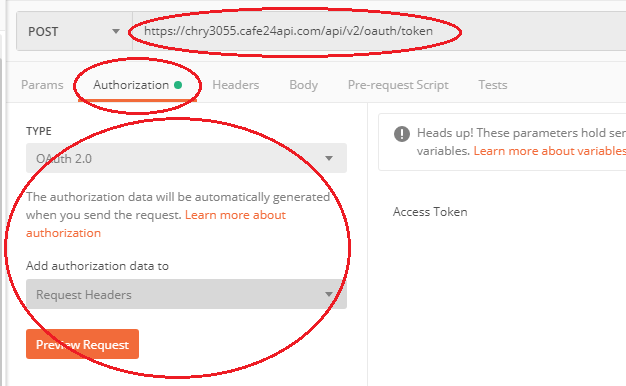

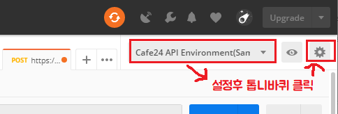

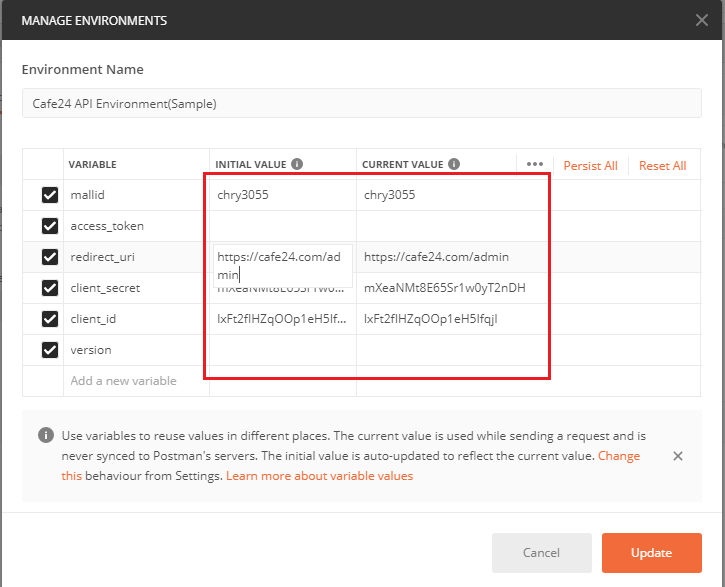

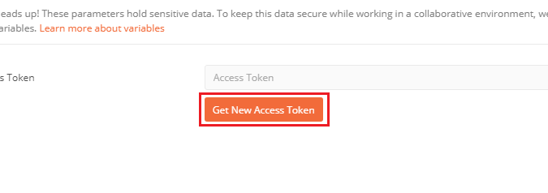

---

### - Access Token 발급받기 (api 호출받을 토큰)

> 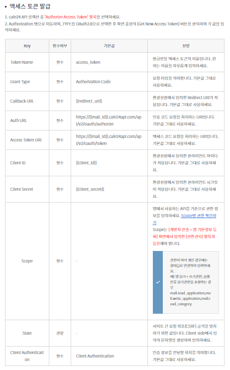


**요청**

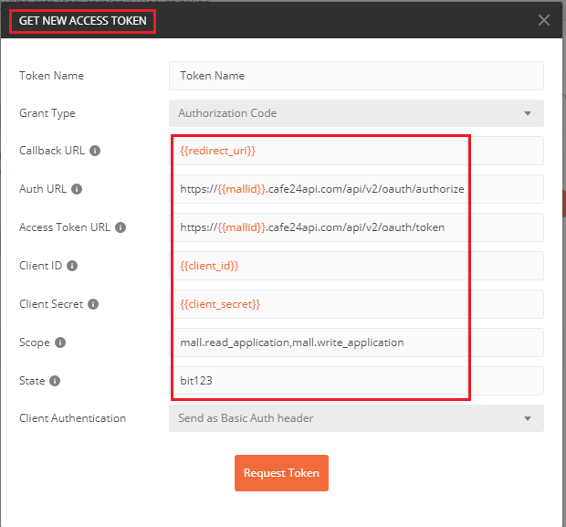


**로그인하기**

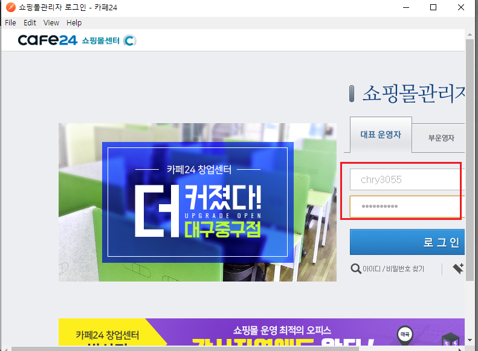


**요청 성공!**


> api를 호출할 수 있는 access token을 발급받음

---


---

## 6 App 정보 확인

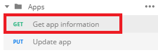

**Get app infomation** 에서 토큰 재발급 후 user token 클릭!

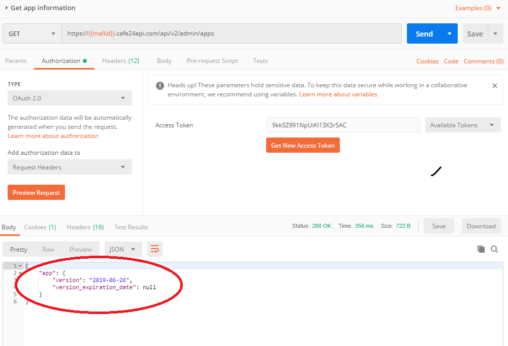

---


---

## 7 스크립트 태그 확인

토큰 발급 후 use token 후 send

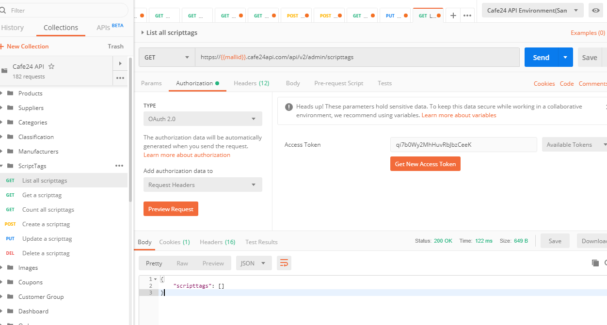

현재는 스크립트 태그가 0개

```
{
    "scripttags": []
}
```

