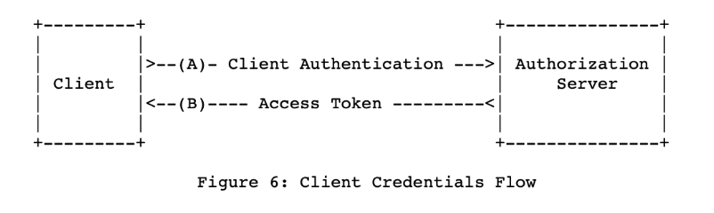
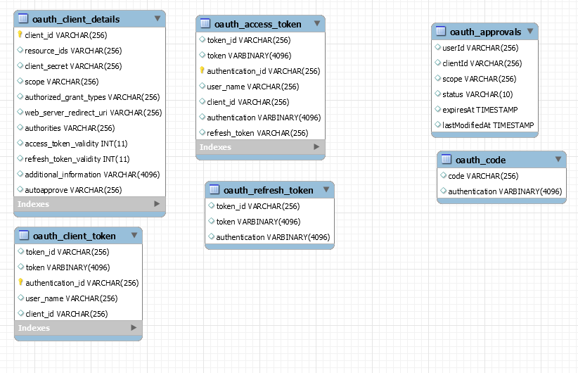
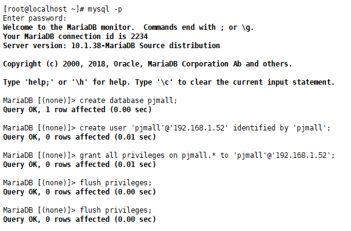
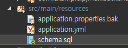
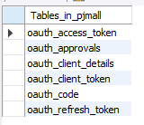

[TOC]

---

# oAuth2

- **Client Credentials Grant** 

  > 애플리케이션이 리소스 소유자의 리소스 대신 자체적인 리소스에 대한 접근이 필요할 때 사용할 수 있는 그랜트 타입이다. 
  >
  > 이전에는 서드파티 애플리케이션이 리소스 소유자 대신 리소스 소유자의 리소스에 접근하는 형태였지만, 클라이언트 자격증명 그랜트 타입은 인증서버에 등록된 클라이언트이기만 하면 리소스에 접근할 수 있는 특별한 형태의 그랜트 타입이다. 
  >
  > 또한 사용자와의 연관이 존재하지 않기 때문에 리프레시 토큰을 발급하지 않는다. 토큰이 만료되면 자체적으로 새로운 액세스 토큰을 발급받는다. 



[참고 블로그](https://coding-start.tistory.com/m/158?category=738631)

---


---

## 구성

Frontend 구성 : Controller -> Service -> Provider

- Provider가 RestTemplate을 주입받아 backend와 통신 -> 굳이!?

- Provider를 생략하고 Service에서 RestTemplate을 주입받아 통신해도 무관

---


---

## 1. git clone

git에서 프로젝트를 clone해온다. -> https://github.com/jungeunlee95/pjmall.git

---

<br>

---

## 1-2 접근권한 설정

**ResourceServerConfig.java**

```java
@Override
public void configure(HttpSecurity http) throws Exception {
    http.headers().frameOptions().disable();

    // 자원 서버 접근 권한 설정
    http
        .authorizeRequests()
        .antMatchers("/hello").access("#oauth2.hasScope('read')")
        .antMatchers("/hello2").access("#oauth2.hasScope('read')")
        .anyRequest().permitAll();
}

@Override
public void configure(ResourceServerSecurityConfigurer resources) throws Exception {
    resources.resourceId("pjmall_api");
}
```

---

<br>

---

## 2. Schema 확인

인증에 필요한 스키마 확인



- oauth_client_details

  > client별 어떻게 토큰을 발급할 것인지

- oauth_client_token

- oauth_access_token

  > 실제 발급 받는 토큰

- oauth_refresh_token

  > 새로 발급받는 토큰

- oauth_approvals

- oauth_code

---

<br>

---

## 3 db 생성

`mysql -p`

`create database pjmall;`

`create user 'pjmall'@'192.168.%' identified by 'pjmall';`

`grant all privileges on pjmall.* to 'pjmall'@'192.168.%';`

`flush privileges;`

> 

---

<br>

---

## 4 프로젝트 db 설정

**application.yml**

```yaml
spring:

		...... 생략 .......
		
       datasource:
                  driver-class-name: org.mariadb.jdbc.Driver
                  url: jdbc:mariadb://192.168.1.52:3307/pjmall
                  username: pjmall
                  password: pjmall
```




**schema.sql**

```sql
-- Table OAUTH_CLIENT_DETAILS
DROP TABLE IF EXISTS oauth_client_details;

create table oauth_client_details (
  client_id               VARCHAR(255) PRIMARY KEY,
  resource_ids            VARCHAR(256),
  client_secret           VARCHAR(256),
  scope                   VARCHAR(256),
  authorized_grant_types  VARCHAR(256),
  web_server_redirect_uri VARCHAR(256),
  authorities             VARCHAR(256),
  access_token_validity   INTEGER,
  refresh_token_validity  INTEGER,
  additional_information  VARCHAR(4096),
  autoapprove             VARCHAR(256)
);

-- Table OAUTH_CLIENT_TOKEN
DROP TABLE IF EXISTS oauth_client_token;

create table oauth_client_token (
  token_id          VARCHAR(256),
  token             VARBINARY(4096),
  authentication_id VARCHAR(255) PRIMARY KEY,
  user_name         VARCHAR(256),
  client_id         VARCHAR(256)
);

-- Table OAUTH_ACCESS_TOKEN
DROP TABLE IF EXISTS oauth_access_token;

create table oauth_access_token (
  token_id          VARCHAR(256),
  token             VARBINARY(4096),
  authentication_id VARCHAR(255) PRIMARY KEY,
  user_name         VARCHAR(256),
  client_id         VARCHAR(256),
  authentication    VARBINARY(4096),
  refresh_token     VARCHAR(256)
);

-- Table OAUTH_REFRESH_TOKEN
DROP TABLE IF EXISTS oauth_refresh_token;
create table oauth_refresh_token (
  token_id VARCHAR(256),
  token VARBINARY(4096),
  authentication VARBINARY(4096)
);

-- Table OAUTH_CODE
DROP TABLE IF EXISTS oauth_code;
create table oauth_code (
  code VARCHAR(255), authentication VARBINARY(4096)
);

-- Table OAUTH_APPROVALS
DROP TABLE IF EXISTS oauth_approvals;
create table oauth_approvals (
	userId VARCHAR(256),
	clientId VARCHAR(256),
	scope VARCHAR(256),
	status VARCHAR(10),
	expiresAt TIMESTAMP,
	lastModifiedAt TIMESTAMP
);

-- customized oauth_client_details table
-- DROP TABLE IF EXISTS ClientDetails;
-- create table ClientDetails (
--  appId VARCHAR(256) PRIMARY KEY,
--  resourceIds VARCHAR(256),
--  appSecret VARCHAR(256),
--  scope VARCHAR(256),
--  grantTypes VARCHAR(256),
--  redirectUrl VARCHAR(256),
--  authorities VARCHAR(256),
--  access_token_validity INTEGER,
--  refresh_token_validity INTEGER,
--  additionalInformation VARCHAR(4096),
--  autoApproveScopes VARCHAR(256)
-- );
```

**서버 실행 후 테이블 생성 확인!**



 **schema.sql -> schema.sql.back 으로 이름 변경**

---

<br>

---

## 5 inMemory()

> db는 나중에 사용, 지금은 inMemory로 test

**AuthorizationServerConfig.java**

```java
@Override
public void configure(ClientDetailsServiceConfigurer clients) throws Exception {
    clients.inMemory() 
        .withClient("pjmall")
        .authorizedGrantTypes("password", "client_credentials")
        .authorities("ROLE_CLIENT")
        .scopes("read", "write", "trust")
        .resourceIds("pjmall_api")
        .secret("1234");
}
```

> [db 사용시]
>
> - resourceIds : db oauth_client_details에 저장 되어있어야함

------

<br>

------

## 6 test

**HelloControllerTest.java**

**토큰 받는 코드**

```java
private String accessToken;  //= "ec9d4b8c-2d03-4ba3-9968-13967318d7ac";

@Before
public void setUp() throws Exception {
    mockMvc = MockMvcBuilders.webAppContextSetup(this.webApplicationContext).addFilter(springSecurityFilterChain).build();

    // Access Token
    if(accessToken != null) {
        return;
    }

    MultiValueMap<String, String> params = new LinkedMultiValueMap<>();

    params.add("grant_type", "client_credentials");
    params.add("scope", "read");
    params.add("scope", "write");

    ResultActions result = mockMvc
        .perform( post("/oauth/token")
                 .params(params)
                 .header("Authorization", "Basic " + new String(Base64.encode(("pjmall:1234").getBytes())))
                 .accept("application/json; charset=UTF-8")
                 .contentType(MediaType.APPLICATION_JSON))
        .andDo(print())
        .andExpect(status().isOk());            	

    String resultString = result.andReturn().getResponse().getContentAsString();

    JacksonJsonParser jsonParser = new JacksonJsonParser();
    accessToken = jsonParser.parseMap(resultString).get("access_toke" + "n").toString();
} 
```

**테스트 코드**

```java
// GET 방식
@Test
public void testGetAuthorized() throws Exception {
    mockMvc
        .perform(MockMvcRequestBuilders
                 .get("/hello")
                 .header("Authorization", "Bearer " + accessToken)
                )
        .andDo(print())
        .andExpect(status().isOk());
}

// POST 방식
@Test
public void testPostAuthorized() throws Exception {
    User user = new User(1L, "kickscar@gmail.com", "Hello1234");

    mockMvc
        .perform(
        MockMvcRequestBuilders
        .post("/hello2")
        .header("Authorization", "Bearer " + accessToken)
        .contentType(MediaType.APPLICATION_JSON)
        .content(new Gson().toJson(user)))
        .andDo(print())
        .andExpect(status().isOk());
}
```


------

<br>

------

## 7 frontend - OAuth2RestTemplate

**OAuth2ClientConfig.java**

- SqlSessionFactory와 같은 역할
- 어떤식으로 토큰을 받을건지, 토큰 url이 무엇인지
- OAuth2RestTemplate : mapping하는 기능

```java
package com.example.pjmall.frontend.config.app;

@Configuration
@EnableOAuth2Client
public class OAuth2ClientConfig {

    @Bean
    public OAuth2ProtectedResourceDetails resourceDetails() {
        ClientCredentialsResourceDetails resourceDetails = new ClientCredentialsResourceDetails();

        resourceDetails.setAccessTokenUri("http://localhost:8888/v1/oauth/token");
        resourceDetails.setClientId("pjmall");
        resourceDetails.setClientSecret("1234");
        resourceDetails.setGrantType("client_credentials");
        resourceDetails.setScope(Arrays.asList("write", "read"));
        resourceDetails.setAuthenticationScheme(AuthenticationScheme.header);

        return resourceDetails;
    }

    @Bean
    public OAuth2RestTemplate oauth2RestTemplate() {


        OAuth2RestTemplate restTemplate = new OAuth2RestTemplate( resourceDetails(), new DefaultOAuth2ClientContext() );

        restTemplate.setMessageConverters(Arrays.asList(new MappingJackson2HttpMessageConverter()));
        System.out.println("access token: " + restTemplate.getAccessToken());

        return restTemplate;		
    }
}
```

------

<br>

------

## 8 frontend - JSONResult 수정

**JSONResult.java** : 받는용

```java
public class JSONResult<T> {
    private String result; // success, fail
    private String message; // if fail, set
    private T data; // if success, set
    
    .... 생략 ....
        
}
```

<br>

**JSONResult2.java** : 보내는 용

```java
// 보내는 용
public class JSONResult2 {
    private String result; // success, fail
    private String message; // if fail, set
    private Object data; // if success, set data

    public static JSONResult2 success(Object data) {
        return new JSONResult2("success", null, data);
    }

    public static JSONResult2 success(Object data, String value) {
        return new JSONResult2("success", value, data);
    }

    public static JSONResult2 fail(String message) {
        return new JSONResult2("fail", message, null);
    }
    
    ..... 생략 .....

}
```


------

<br>

------

## 9 Service

**GoodsService.java**

```java
@Service
public class GoodsService {

    @Autowired
    private OAuth2RestTemplate restTemplate;


    public Goods getList(Long no){

        String endpoint = "http://localhost:8888/v1/hello";
        JSONResultGoods jsonResult = restTemplate.getForObject(endpoint, JSONResultGoods.class);

        System.out.println( jsonResult );

        return jsonResult.getData();
    }

    public List<Goods> getList(){

        String endpoint = "http://localhost:8888/v1/hello";
        JSONResultGoodsList jsonResult = restTemplate.getForObject(endpoint, JSONResultGoodsList.class);

        System.out.println( jsonResult );

        return jsonResult.getData();
    }

    // DTO Class
    private class JSONResultGoods extends JSONResult<Goods>{
    }
    private class JSONResultGoodsList extends JSONResult<List<Goods>>{
    }
}
```


------

<br>

------

## 10 CustomUrlAuthenticationSuccessHandler

**CustomUrlAuthenticationSuccessHandler.java**

```java
JSONResult2 jsonResult = JSONResult2.success( securityUser );
```


------

<br>

------

## 11 GoodService 수정

```java
public String getList(){

    String endpoint = "http://localhost:8888/v1/hello";
    JSONResultGoodsList jsonResult = restTemplate.getForObject(endpoint, JSONResultGoodsList.class);

    System.out.println( jsonResult );

    return jsonResult.getData();
}

// DTO Class
private class JSONResultGoods extends JSONResult<Goods>{
}
private class JSONResultGoodsList extends JSONResult<String>{
}
```

---

<br>

---

## 12 Test

**GoodsController.java**

```java
@Controller
@RequestMapping("/goods")
public class GoodsController {

    @Autowired
    private GoodsService goodsService;

    @ResponseBody
    @RequestMapping("/list/{page}")
    public String list(@PathVariable("page") Integer page) {
        goodsService.getList();
        return "ok";
    }
}
```

**GoodsService.java**

```java
public String getList(){

    String endpoint = "http://localhost:8888/v1/hello";
    JSONResultGoodsList jsonResult = restTemplate.getForObject(endpoint, JSONResultGoodsList.class);

    System.out.println( jsonResult );

    return jsonResult.getData();
}
private class JSONResultGoodsList extends JSONResult<String>{
}
```

<br>

#### 결과

Backend Boot 서버 실행  - 왼쪽

Frontend Spring 서버 실행 - 오른쪽

> 

`<http://localhost:8080/pjmall-frontend/goods/list/2>` url 접근

**ERROR**

> ```
> 12:03:04.053 [http-nio-8080-exec-16] WARN  o.s.w.s.m.s.DefaultHandlerExceptionResolver - Failed to read HTTP message: org.springframework.http.converter.HttpMessageNotReadableException: Could not read document: Cannot construct instance of `com.example.pjmall.frontend.service.GoodsService$JSONResultGoodsList` (although at least one Creator exists): can only instantiate non-static inner class by using default, no-argument constructor
>  at [Source: (PushbackInputStream); line: 1, column: 2]; nested exception is com.fasterxml.jackson.databind.exc.MismatchedInputException: Cannot construct instance of `com.example.pjmall.frontend.service.GoodsService$JSONResultGoodsList` (although at least one Creator exists): can only instantiate non-static inner class by using default, no-argument constructor
>  at [Source: (PushbackInputStream); line: 1, column: 2]
> ```

<br>

**ERROR 해결**


