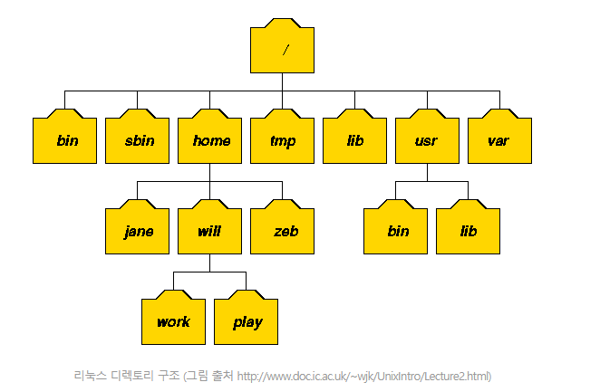

  리눅스의 디렉토리 혹은 파일 시스템 구조는 윈도우와는 조금 다른 구조를 가지고 있습니다. 기본적으로 디렉토리를 구분하는 '/'(슬래시)는 리눅스에서 사용하고 윈도우는 반대인 '\'(역슬래시)를 사용하죠. 디렉토리 또한 그 명칭을 리눅스에서는 디렉토리(directory), 윈도우에서는 폴더(folder)라고 불리웁니다.

### 리눅스 파일 시스템 구조

리눅스 시스템의 디렉토리 구조는 전체적으로 역 트리(tree) 구조를 하고 있습니다. 그리고 명령어의 종류와 성격, 사용권한등에 따라 각각의 디렉토리들로 구분됩니다. 리눅스 배포판들은 '리눅스 파일시스템 표준' 인 **FSSTND(LINUX FILE System Standard)** 라는 표준을 준수하므로 대부분의 리눅스 배포판들은 그 기본 골격이 같습니다.

#### /(루트)

최상의 디렉토리인 **루트** 디렉토리를 의미하며, 리눅스의 모든 디렉토리들의 시작점이다. 즉, 모든 디렉토리들을 절대경로로 표기할 때에 이 디렉토리로부터 시작해야 한다.

#### /bin

기본적인 명령어가 저장된 디렉토리. 즉, 리눅스 시스템사용에 있어 가장 기본적이라고 할 수 있는 mv, cp, rm 등과 같은 명령어들이 이 디렉토리에 존재하며 root 사용자와 일반사용자가 함께 사용할 수 있는 명령어 디렉토리이다.

#### /boot

리눅스 부트로더(Boot Loader)가 존재하는 디렉토리. 즉, GRUB 과 같은 부트로더에 관한 파일들(grub.conf 등)이 이 디렉토리에 존재한다.

#### /dev

시스템 디바이스(device)파일을 저장하고 있는 디렉토리. 즉, 하드디스크 장치파일 /dev/sda, CD-ROM 장치파일 /dev/cdrom 등과 같은 장치파일들이 존재하는 디렉토리이다.

#### /etc

시스템의 거의 모든 설정파일이 존재하는 디렉토리. /etc/sysconfig(시스템 제어판용 설정파일), /etc/passwd(사용자관리 설정파일), /etc/named.conf(DNS 설정파일) 등과 같은 파일들이 존재한다.

#### /etc/mai/

sendmail.cf 나 access 파일등의 sendmail 의 설정파일들이 존재하는 디렉토리.

#### /etc/ssh/

SSH 서비스, 즉 sshd 데몬에서 사용하는 각종 설정파일들이 존재하는 디렉토리.

#### /etc/squid/

squid 프락시서버의 설정파일들이 저장된 디렉토리.

#### /etc/samba/

삼바관련 설정파일들이 저장된 디렉토리

#### /etc/skel/

계정사용자 생성시의 초기화파일들이 저장된 디렉토리(useradd 에서 사용함)

#### /etc/rc.d/

부팅레벨별 부팅스크립트파일들이 존재하는 디렉토리.

#### /etc/rc.d/init.d/

시스템 초기화 파일들의 실제파일들이 존재함.

#### /etc/pam.d/

PAM 설정 정보파일들이 저장된 디렉토리.

#### /etc/httpd/

RPM 으로 설치된 아파치 설정파일(httpd.conf 등)들이 저장된 디렉토리.

#### /etc/cron.d/, /etc/cron.daily/, /etc/cron.hourly/, /etc/cron.monthly/, /etc/cron.weekly/

모두 크론설정파일이 존재하는 디렉토리임.

#### /etc/xinetd.d/

xinetd 수퍼데몬에 의해 서비스되는 서비스설정파일이 존재함.

#### /home

사용자의 홈디렉토리, useradd 명령어로 새로운 사용자를 생성하면 대부분 사용자의 ID와 동일한 이름의 디렉토리가 자동으로 생성됨.

#### /lib

커널모듈파일과 라이브러리파일 즉, 커널이 필요로하는 커널모듈파일들과 프로그램(C, C++ 등)에 필요한 각종 라이브러리 파일들이 존재하는 디렉토리.

#### /media

DVD, CD-ROM, USB 등과 같은 탈부착이 가능한 장치들의 마운트포인트로 사용되는 디렉토리.

#### /mnt

/media 디렉토리와 비슷한 용도로 탈부착이 가능한 장치들에 대하여 일시적인 마운트포인트로 사용하는 디렉토리.

#### /proc

일명 "가상파일시스템" 이라고 하는 곳으로 현재 메모리에 존재하는 모든 작업들이 파일형태로 존재하는 곳이다. 디스크상에 실제 존재하는 것이 아니라 메모리상에 존재하기 때문에 가상파일시스템이라고 부른다. 실제 운용상태를 정확하게 파악할 수 있는 중요한 정보를 제공하며 여기에 존재하는 파일들 가운데 현재 실행중인 커널(kernel)의 옵션 값을 즉시 변경할 수 있는 파라미터파일들이 있기 때문에 시스템 운용에 있어 매우 중요한 의미를 가진다.

#### /root

시스템 최고관리자인 root 사용자의 개인 홈디렉토리.

#### /sbin

ifconfig, e2fsck, ethtool, halt 등과 같이 주로 시스템 관리자들이 사용하는 시스템관리자용 명령어를 저장하고 있는 디렉토리.

#### /tmp

일명 "공용디렉토리" . 시스템을 사용하는 모든 사용자들이 공동으로 사용하는 디렉토리. mysql 에서 사용하는 mysql.sock 등과 같은 소켓파일, 또는 아파치에서 사용하는 세션파일등이 생성되기도 한다. 웹해킹에 사용되기도 해서 주의를 요망.

#### /usr

시스템이 아닌 일반사용자들이 주로 사용하는 디렉토리. 즉, c++, chsh, cpp, crontab, du, find등과 같이 일반사용자들용 명령어들은 /usr/bin 에 위치한다.

#### /usr/bin/

일반 사용자들이 사용가능한 명령어 파일들이 존재하는 디렉토리.

#### /usr/X11R6/

X 윈도우 시스템의 루트 디렉토리.

#### /usr/include/

C 프로그램에 필요한 헤드파일(*.h) 디렉토리.

#### /usr/lib/

/lib 에 들어가지 않은 라이브러리 디렉토리.

#### /usr/sbin/

/bin 에 제외된 명령어와 네트워크관련 명령어가 들어있는 디렉토리.

#### /usr/src/

프로그램 소스(주로 커널소스)가 저장되는 디렉토리.

#### /usr/local/

MySQL, Apache, PHP 등과 같은 어플리케이션들을 소스로 컨파일설치할 때 사용되는 장소.

#### /usr/share/man/

명령어들의 도움말을 주는 메뉴얼(manual)페이지 디렉토리. 즉, 이 디렉토리에는 시스템에서 사용하는 모든 맨페이지파일(man page)이 존재함.

#### /var

시스템운용중에 생성되었다가 삭제되는 데이터를 일시적으로 저장하기 위한 디렉토리. 거의 모든 시스템로그파일은 /var/log 에 저장되고, DNS 의 zone 설정파일은 /var/named 에 저장되고, 메일파일은 /var/spool/mail 에 저장되며, 크론설정파일은 /var/spool/cron 디렉토리에 각각 저장됨.

#### /var/tmp/

/tmp 디렉토리와 같은 공용디렉토리. 즉, /tmp 디렉토리와 /var/tmp 디렉토리의 퍼미션은 1777 로서 sticky bit 가 설정되어 있는 공용디렉토리이다. 리눅스 시스템에서 공용디렉토리는 /tmp 와 /var/tmp 둘뿐이다.

#### /var/log/

시스템로그파일(messages, secure, xferlog 파일등)이 저장되는 디렉토리.

#### /var/ftp/

vsftp 등과 같은 FTP 서비스를 위한 다운로드될 파일들 즉, FTP 홈디렉토리.

#### /var/named/

BIND 즉, DNS 에서 사용하는 zone 파일들이 저장되는 디렉토리.

#### /var/spool/mail/

각 계정사용자들의 메일파일이 저장되는 디렉토리.

#### /var/spool/lpd/

프린트를 하기 위한 임시 디렉토리(스풀링 디렉토리).

#### /var/spool/mqueue/

발송을 위한 메일 일시저장 디렉토리.

#### /var/spool/cron/

각 사용자들의 cron 설정파일들이 저장된 디렉토리.

#### /var/spool/at/

atd 즉, 예약작업에 관한 파일들이 저장되는 디렉토리.

#### /lost+found

최상위 디렉토리인 / 디렉토리에만 존재하는 것이 아니라 파일시스템마다 존재할 수 있는 디렉토리임. 이 디렉토리는 fsck 또는 e2fsck 등과 같은 파일시스템 체크 및 복구유틸리티 실행후에 주로 생성이 되는 것으로서 복구되지 않은 채로 블록(block)만 존재하는 파일 즉, 연결이 끊어진 inode 들이 숫자파일형태로 존재하는 곳임. 숫자형태로 존재하는 파일들은 mv 명령어로 파일이름만 바꾸면 바로 복구될 수 있다.

출처 :리눅스 서버관리 실무 바이블 v3.0

출처: 

https://webdir.tistory.com/101

 [WEBDIR]

출처: 

https://webdir.tistory.com/101

 [WEBDIR]

출처: 

https://webdir.tistory.com/101

 [WEBDIR]