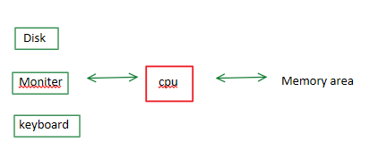
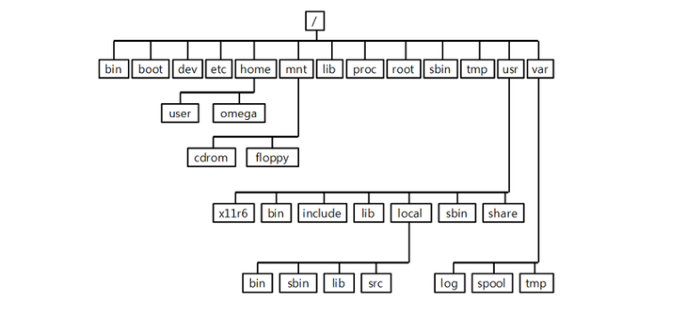

# 2019-04-23

### 1 리눅스 소개

#### * 들어가기

>  AT&T , Bell Lab
>
> Dennis Ritchie : Unix 개발  [https://ko.wikipedia.org/wiki/%EB%8D%B0%EB%8B%88%EC%8A%A4_%EB%A6%AC%EC%B9%98](https://ko.wikipedia.org/wiki/데니스_리치)

---

### * Unix OS 계열

> unix system v
>
> - HP-UX
>
> - IBM AIX
>
> - IRIX
>
> BSD
>
> - FreeBSD, open BSD
> - Sun OS (oracle)
>   - solaris
> - NeXTSTEP 
>   - Darwin
>   - Mac OSX
>     - IOS
> - MS/SCO 
>   - MINIX OS
>     - MS Windows

**IBM PC** : DOS

> MS-DOS -> OS 2

---

#### 리눅스는 어떻게 나왔을까 (ppt참조)

- 1991년 핀란드 헬싱키 대학생이었던 **리누스 토발즈**가 취미로 개발하던 커널을 인터넷에 공개 하였다.(버전 0.1)

- 타넨바움의 교육용 운영체제 **미닉스(MINIX)커널**을 기반으로 제작되었다.

- 1994년에 안정적인 리눅스 커널 1.0이 발표 

- 1996년에 리눅스 커널 2.0이 발표

- 2.0 부터는 IBM, 컴팩, 오라클 같은 서버와 데이터베이스 회사들의 전폭적인 지원 속에 급성장을 이루었다. 

**특징**

- 오픈 소스로 개발되는 운영체제이다.

- GNU/Linux 라 불리만큼 GNU 도구를 사용해서 개발된다.

- POSIX(Portable Operating System Interface)를 지원하기 때문에 유닉스와 100% 호환된다.

- 따라서 유닉스의 명령어 뿐만 아니라 **X 윈도우, BSD 소켓, IPC, POSIX Thread**도 함께 지원하며 개발 환경과 방식도 UNIX와 별 차이가 없다.

- 많은 아키텍처와 다양한 디바이스에 포팅 되고 있다.

- 1990년 대 말까지는 서버 시장을 석권 하였는데(IMF), 유닉스(비쌈)와 윈도우 서버를 대체하는 서버 운영체제로 각광 받고 있다.

- 2003년 출시된 리눅스 커널 2.6부터는 기본적으로 임베디드를 지원해서 임베디드 시장 뿐만 아니라 안드로이와 같은 모바일에서도 보다 폭넓게 채택되고 있다.

- UNIX 운영체제의 특징을 모두 가지고 있다.(멀티 유저, 멀티 프로세스, 멀티 프로세서, 멀티 스레드)

- 여러 사용자가 하나의 시스템을 사용하기 때문에 계정과 비밀번호 그리고 홈 디렉토리로 사용자를 구분 하며 계정별  권한과 제약을 두어 시스템 보안을 제공한다.

---

#### * GNU

**"GNU's Not Unux"** 

> [리눅스 커널](https://ko.wikipedia.org/wiki/리눅스_커널)이 포함된 GNU 패키지로 구성되어 동작하며 기능적인 [유닉스 계열](https://ko.wikipedia.org/wiki/유닉스_계열) 시스템을 만들어준다

---

### * Linux 

kernel[^컴퓨터의 운영체제의 핵심이 되는 컴퓨터 프로그램, 시스템의 모든 것을 완전히 통제]

- Red Hat
  - Fedora(desk top)
  - RHEL(상용) =(100%호환)= centOS  6, 7
- Debian
  - Ubuntu

---

## 리눅스 구조 --> file system

System call : 어떤 시스템을 실행시키기 위한 함수들의 모임

> **시스템 호출**(system call)은 [운영 체제](https://ko.wikipedia.org/wiki/운영_체제)의 [커널](https://ko.wikipedia.org/wiki/커널)이 제공하는 [서비스](https://ko.wikipedia.org/wiki/서비스)에 대해, [응용 프로그램](https://ko.wikipedia.org/wiki/응용_프로그램)의 요청에 따라 커널에 접근하기 위한 [인터페이스](https://ko.wikipedia.org/wiki/인터페이스_(컴퓨팅))이다.

- 주요 directory

   

