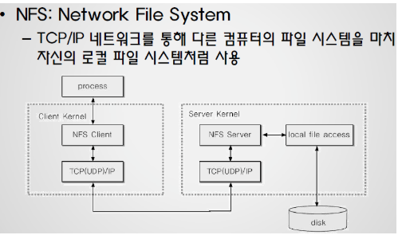

# 리눅스 파일 시스템

## VFS(Virtual File System)

### VFS의 역할 및 구조

  ### VFS가 지원하는 파일 시스템

 **■ 디스크 기반 파일 시스템**
  : 로컬 디스크 파티션의 기억 장소 또는 디스크를 흉내내는 몇 가지 다른 장치(USB 플래시 드라이브 같은)를 관리

>  Ext2, Ext3, Ext4, MS-DOS, FAT, NTFS, SYSV 등

 **■ 네트워크 파일 시스템**
  : 네트워크로 연결된 다른 컴퓨터의 파일 시스템을 쉽게 접근가능하게 함

> NFS(Network File System), AFS(앤드류 파일 시스템) 등
>
> 

   **■ 특수 파일 시스템**  : /proc 파일 시스템, /tmp 파일 시스템 등

> 

---

###  **VFS 메커니즘**

- **공통 파일 모델 (Common File Model)**

   : VFS의 핵심 개념은 지원하는 모든 파일 시스템을 표현할 수 있는 공통 파일 모델을 도입 하는 것
   : 각각의 특정 파일 시스템을 구현 하려면 반드시 자신의 물리적인 구성을 VFS의 공통 모델로 변환해야 함
   -> 예를 들어 몇몇 비 유닉스 계열의 디스크 기반 파일 시스템은 각 파일의 위치를 저장한 파일 할당 테이블(FAT)를 사용 -> 이런 파일 시스템에서 디렉토리는 파일이 아님
   -> VFS의 공통 파일 모델을 따르도록 하기 위해 실행 중에 디렉토리에 대응 하는 파일을 생성, 이렇게 생성한 파일을 커널 메모리 객체에 만듦
   **=> 공통 파일 모델을 구현하기 위한 자료구조(object)**
     : 슈퍼 블록 객체, 아이노드 객체, 파일 객체, 디엔트리 객체

- **프로세스와 VFS 객체의 상호작용**

  

- **공통 파일 모델 객체**

    **■ 슈퍼 블록 객체**
    : 마운트 된 파일 시스템에 대한 정보를 저장, 전체 파일 시스템을 나타냄
   **■ 아이노드 객체**
    : 특정 파일에 대한 일반 정보를 저장. 디스크에 저장한 파일 제어 블록 (FCB, 리눅스에서는 아이노드)에 대응, 각 아이노드 객체에는 아이노드 번호가 할당)
   **■ 파일 객체**
    : 열린 파일과 프로세스 사이의 상호 작용과 관련한 정보를 저장. 각 프로세스가 열린 파일을 가지는 동안 커널 메모리에만 존재
   **■ 디엔트리 객체**
    : 디렉토리 항목(특정 파일 이름과 아이노드)과 이에 대응하는 파일의 연결에 대한 정보를 저장.

---

devfs

procfs

