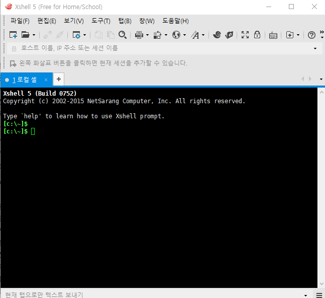

### Dummy Terminal

---

`ps` : 현재 쉘에서 실행한 process 보기

`ps -ef` : 전체 process 보기

모든 프로세스는 standard in/out 을 가지고 있음

특정 process 찾기 : `ps -ef | grep {}`

> 

**Xshell 설치 후 실행** --> 공유자료에 있음 

## ->> shell과 리눅스와 연결

linux 에서 `ifconfig`로 ip확인

->>확인한 ip로 Xshell 에서 연결 : `ssh root@192.168.1.50`  

연결 성공 !!

---

### CUI, GUI 차이   : CUI에 익숙해져야함

1 - CUI : Character User Interface

컴퓨터하고 사용자하고 글자로 명령을 주고 받는 방식

작동방식 : main에서 출발하여 순차적으로 알아서 쭈욱 실행되는 형태

2 - GUI : Graphic User Interface

그래픽 화면에서 버튼을 누르거나 해서 컴퓨터에게 일을 시키는 방식

작동방식 : 사용자가 버튼을 누르거나 어떤 명령을 내릴때까지 기다리다가 명령을 받으면 해당 처리를 하는 방식  ==>  이벤트 드리븐 방식

