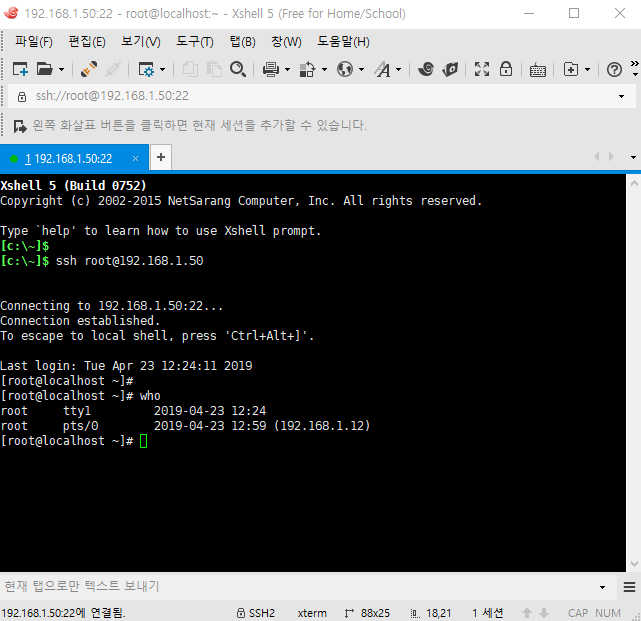
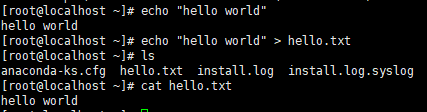
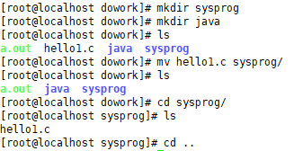

기본으로 콘솔에 출력 : `echo`

>  `#` : 입력, `>` : 출력

```shell
# echo "hello world"
> hello world
```

```shell
# echo "hello world" > hello.txt
# cat hello.txt
> hello world
```

 --> txt파일로 만듦



---

기본 리눅스 driver에 출력하려면

연결된 곳을 찾아서 쓰면됨

```
# who
> root tty1 ... ... ... 
# echo "hello world" > /dev/tty1
```


​								 Xshell                                                                           linex server에 출력


---

## vi 사용해서 c 파일 출력해보기

```shell
# mkdir dowork
# cd dowork/
# ls
# vi hello1.c
```

```shell
-------- vi hello1.c 실행 ------- i : Insert mode로 
#include <stdio.h>

int main()
{
        char* str = "Hello World";
        printf("%s\n",str);
}

---나올 땐 :wq
```

```shell
# gcc hello1.c
# ls
> a.out  hello1.c        // a.out이 실행파일임!!!!
# ls -l
```

근데 a.out을 바로 실행 못해 

환경변수 값 출력 : `echo $PATH` 로 찾으면 없잖아.

```shell
[root@localhost dowork]# echo $PATH
> /usr/local/sbin:/usr/local/bin:/sbin:/bin:/usr/sbin:/usr/bin:/root/bin
```

절대 경로로 실행해줘야함

```shell
[root@localhost dowork]# /root/dowork/a.out 
> Hello World
```

---

---

**파일 이동 명령어** `mv {파일} {dir}`



```shell
# mkdir sysprog
# mkdir java
# mv hello1.c sysprog/
# mv a.out sysprog/
# cd sysprog/
```

---

---

**파일 복사** :  `cp {복사할 파일} {새로만들 파일 이름}`

```shell
# cp hello1.c hello2.c
# ls
> a.out  hello1.c  hello2.c
```


`vi hello2.c` 수정

```c
#include <string.h>

int main()
{
        char* str = "Hello World\n";
        write(1, str, strlen(str));
        return 0;
}
```

c 컴파일 : `gcc -c hello2.c`

```shell
# gcc -c hello2.c
# ls
> a.out  hello1.c  hello2.c  hello2.o
# gcc -o hello2 hello2.o
# ./hello2
> Hello World
```

---

---

---

txt 파일 open하기

```shell
# cp hello2.c hello3.c
# vi hello3.c
```

```c
#include <string.h>
#include <fcntl.h>
#include <stdio.h>

int main()
{
        char* str = "Hello World\n";

        int fd = open("./hello.txt", 0_CREAT|0_RDWR);
                   // 0_CREAT : 파일 없으면 만들고, 0_RDWR : 쓰기 읽기 모드로 열기
        write(fd, str, strlen(str));
        close(fd);

        printf("---> %d\n", fd);
        return 0;
}
```

```shell
# gcc -o hello3 hello3.c
# ./hello3
----> 3
```

---

---

마우스 커서 대고 dd 하면 지워짐

```shell
# cp hello3.c hello4.c
# vi hello4.c
```

```c
#include <stdio.h>

int main()
{
        const char* str = "Hello World\n";
                
        FILE* fp = fopen("./hello4.txt", "w");
        fputs(str, fp);
        fclose(fp);
        
        return 0;
}
```

```shell
# rm -f hello4.txt
# gcc -o hello4 hello4.c
# cat hello4.txt
> Hello World
```


