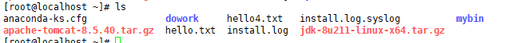
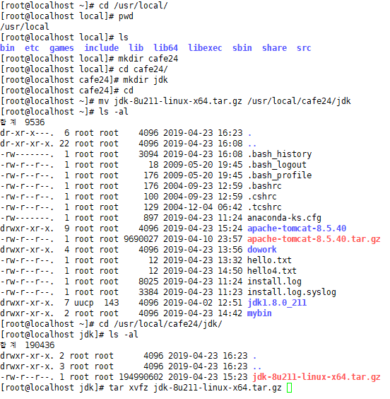
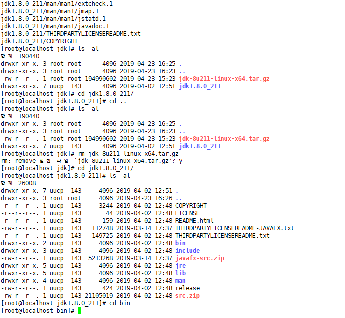
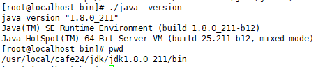
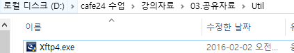
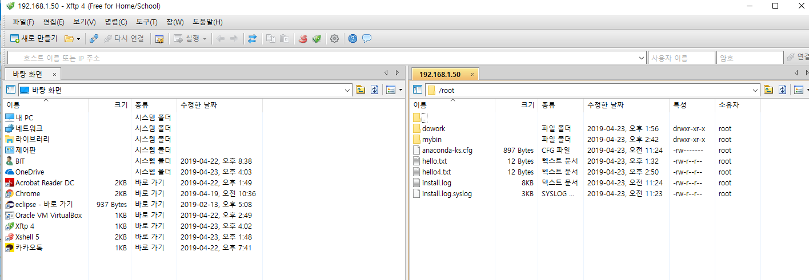

### Xftp로 java download

원래는 tar파일 주소 복사해서 wget {{주소}} 해야하는데 oracle 아이디 필요하니까 일단 xftp로

일단 자바 파일을 다운로드!!!!! 




그럼 이렇게 들어옴!!!

`# tar xvfz jdk-8u211-linux-x64.tar.gz`    ===> 압축 풀기!!


다운 완료 ^--^

---

`# vi /etc/profile` 


directory 만들고 압축 풀기



압축 해제!



`./java`

`./java -version`

> 

update-alternatives --set java /usr/local/cafe24/jdk/jdk1.8.0_211/bin/java;

update-alternatives --set java /usr/local/cafe24/jdk/jdk1.8.0_211/bin/javac;

update-alternatives --set java /usr/local/cafe24/jdk/jdk1.8.0_211/bin/javws;

> 

---

##  Linux Java -> "Hello World" 출력

```shell
[root@localhost dowork]# cd java/
[root@localhost java]# ls
HelloWorld.class  HelloWorld.java
[root@localhost java]# vi Hello.java
[root@localhost java]# vi Hello.java
[root@localhost java]# javac Hello.java 
[root@localhost java]# java Hello
안녕!!
[root@localhost java]# 

```

**Hello.java**

```java
public class Hello{
        public static void main(String[] args){
                System.out.println("안녕!!");
        }
}
```


------

### wget으로 linux tomcat 다운


링크 주소 복사!!!!!

`# wget http://apache.tt.co.kr/tomcat/tomcat-8/v8.5.40/bin/apache-tomcat-8.5.40.tar.gz`


다운로드 끝!!

>  **Xftp로도 해봐야하니까 다시 지워야징** -> 원래! wget으로 하는게 맞는거임
>
> `# rm -f apache-tomcat-8.5.40.tar.gz `

---

### Xftp로 tomcat 다운



​																			다운로드

​																				↓↓↓↓




local 파일 -> 옮기고

`tar xvfz apache.....`

------


