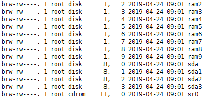
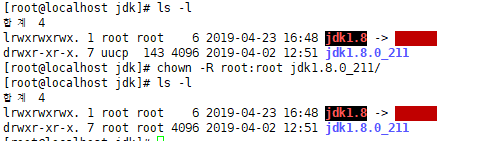
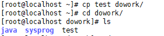
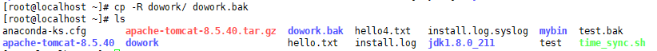
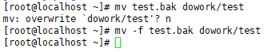

**block nonblock** : block : 요청이 처리될때까지 다른 실행 X

​								non : 요청 받고 처리 안돼도 다른 동장 수행 O

---

## 파일관리

파일의 종류

- 유닉스에서 프로그램들은 주변의 장치(device)를 파일로 인식하기 때문에 여러 종류의 파일이 존재 한다.

- ls 명령을 사용한 결과를 보면, 각 각의 파일들을 타입 별로 구분해 놓은 정보가 있다.


**파일의 구분**  : `ls -al` 쳤을 때 

\-           : 일반(보통) 파일

b           : 블록 디바이스 파일

c           : 문자열 디바이스 파일

d           : 디렉토리

l            : 심볼릭 링크  

p 또는 = : 명명된 파이프(named pipe) / FIFO

s           : 소켓(socket)

---

`# cd dev`   : device 를 파일로 보기

`# ls -l`


​				--> 파일 구분! 

`# ls -l | grep br`

> 


---

## 파일 소유자와 그룹

\-  유닉스의 모든 파일(디렉터리 포함)에는 소유자와 그룹이 있다.

\- 대부분 파일을 처음 생성한 계정과 그 계정이 속한 그룹이 그 파일의 소유자와 그룹이 되지만 **chown** **명령**을 이용하면 소유 계정과 그룹을 바꿀 수 있다.

`# pwd`

`> /usr/local/cafe24/jdk.1.8`

`# chown `




---

## 파일 권한

리눅스 기본 관리 ppt 31


---


---


---

## touch - 파일 시간 정보 변경

파일이 없는 경우 현재 시간으로 생성만 

**옵션**

- c : 현재 시간으로 파일 시간을 변경한다. (파일이 존재하지 않으면 생성하지 않는다.)

- d 시간 :  현재 시간 대신 지정한 시간으로 파일 시간을 변경한다. ($ touch ‘2016-02-05 12:00:30’ test)

- r  파일 :  현재 시간 대신 지정한 파일 시간으로 파일 시간을 변경한다.

- t MMDDHHMM[[CC]YY][.SS]: 현재 시간대신 지정한 시간으로 변경한다.


### touch는 언제 사용? ex ) make, makefile

<https://bowbowbow.tistory.com/12>  <- 참고

`make`는

> 파일 간의 종속관계를 파악하여 **Makefile( 기술파일 )**에 적힌 대로 컴파일러에 명령하여 SHELL 명령이 순차적으로 실행될 수 있게 함.

```
makefile 
어떤 app에서 파일이 여러개 있을 때
app(실행) 
	|- a.c
	|- b.c
	|- c.c
	|-  
이렇게 구성이 되어있을때, 컴파일 하려면
    gcc -c a.c -> a.o
    gcc -c b.c -> b.o
    gcc -c c.c -> c.o
    gcc -c app a.o b.o c.o 
이렇게 하는데, b.o 파일만 수정했을 때 전체를 다시 컴파일 할 순 없잖아(파일이 엄청 많으면)
app(실행) 
	|- a.c
	|- b.c
	|- c.c
	|- makefile (java spring에서 pom.xml같은 느낌) 
**makefile ↓↓↓↓↓↓↓↓↓↓
    gcc -c a.c -> a.o
    gcc -c b.c -> b.o
    gcc -c c.c -> c.o
    gcc -c app a.o b.o c.o 
    -----makefile 은 아래처럼 작성-----
    a.o:a.c
    b.o:b.c
    c.o:c.c
makefile 실행할 때 쭈~ 욱 파일 검색하고, 날짜를 비교함.
오른쪽 날짜(.c파일) 가 가 더 크면 그의 왼쪽(.0파일)만 다시 컴파일 하고 build
```

---


---

## cp - 파일 복사 (기본적으로 -i가 붙어있음)

원본 cp : `/bin/cp 원본 사본` : 사본이 있는 파일이여도 안물어보고 덮어버림

​				cp -f : 안먹힘 왜냐면 `cp -i -f` 이렇게 있는거라 i가 이김! -> 무조건 물어봄 

**사용법** : `cp [옵션] 원본 사본`

**옵션**

- a : 원본 파일의 속성, 링크 정보들을 그대로 유지하면서 복사한다.

- i : 만약 복사 대상에 같은 이름의 파일이 존재하면 사용자에게 물어 본다.

- f : 만약 복사 대상에 같은 이름의 파일이 존재하면 강제로 지우고 복사한다.

- R : 디렉토리를 복사할 경우 그 안에 포함된 모든 하위 디렉터리와 파일들을 모두 복사한다.


**있는 파일 이름이면 덮어쓸거냐고 물어봄**


**파일이름이 아니라 directory면 그 해당 dir안에 복사해줌**




**다른 사용자로도 복사 가능**

`# cp test /home/webmaster`


**디렉토리를 복사할수도**  : -R



---


---

## mv - 파일 이동, 파일 이름 바꿀 때도 사용

**사용법**    :    `mv [옵션] 원본 목적지`

**옵션**

- b : 덮어 쓰게 되는 경우 백업 파일을 만들고 파일을 만든다.  

- i : 덮어 쓸 때 사용자에게 물어 본다.

- f : 덮어 쓸 때 물어 보지 않는다.


**이름 바꿈 **  `mv [옵션] 원본 이름`


**파일 위치 이동** `mv [옵션] 원본 목적지(dir)`


**해당 위치에 파일 이름이 있으면?** 정말 덮을꺼니?


**강제성 먹힘!**  -f가 이김




---


---

## rm - 파일 삭제(복구 불가능!)


