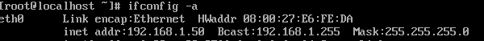
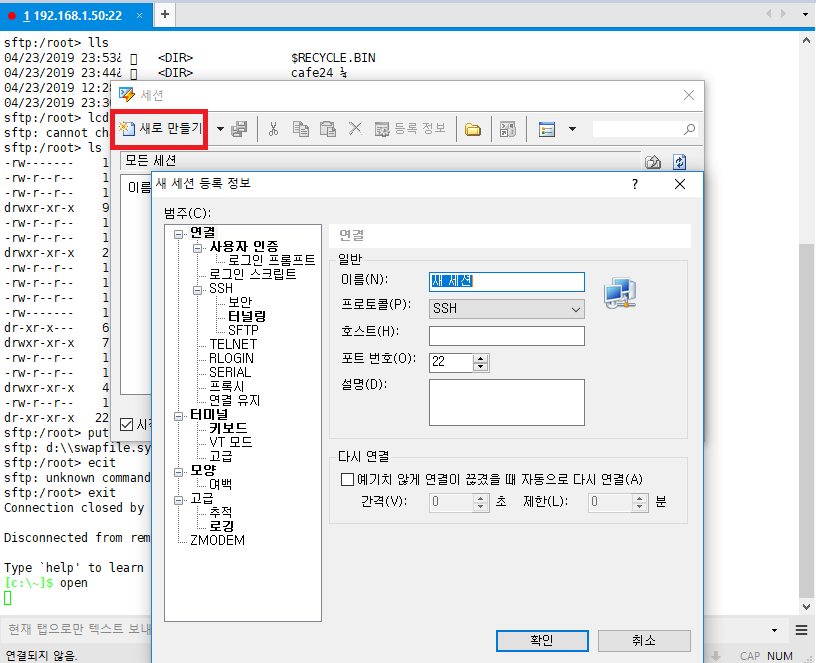
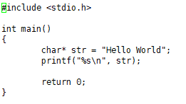
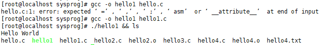
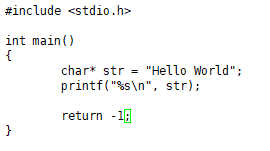
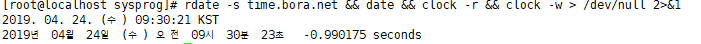
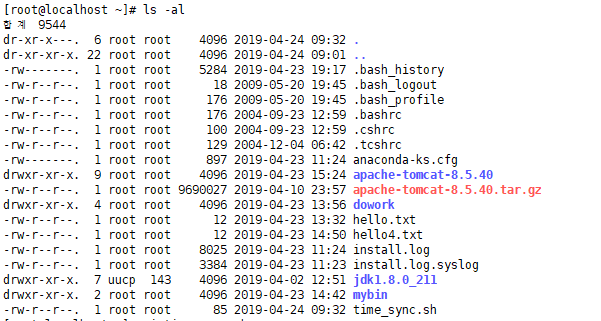
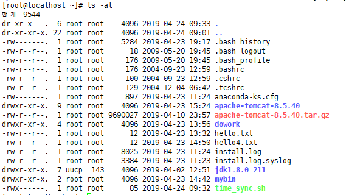
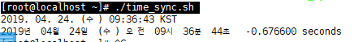
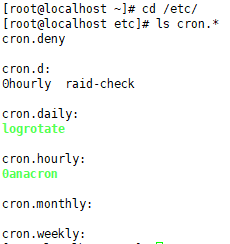

# 2019-04-24

Xshell

```
# sftp root@192.168.1.50
# pwd
# lpwd
# lcd d:\
(..?)
# exit
```

---

> **ip 확인**
>
> 

---

**ssh root@{{ip}}** ==> gui를 이용해서 연결해보기

`open`  : 창 열기



---

---

#### && 연산도 됨

**성공** : 앞 수행 후 뒤 수행

`vi hello1.c`  : return 0 만 true로 봄 !



​															↓↓↓↓↓↓↓↓↓↓↓↓↓↓↓↓↓↓↓↓↓



**실패** : 앞만 수행



​															↓↓↓↓↓↓↓↓↓↓↓↓↓↓↓↓↓↓↓↓↓


---

화면에 내용 출력 X, 에러는 화면에 출력 : `# java HelloWorld > /dev/null 2>&1`

---

### 시간 설정하기

`# date` : 날짜

`rdate -s time.bora.net && date && clock -r && clock -w > /dev/null 2>&1`



---

```
# vi time_sync.sh
```




> **r w x d .. 등등 권한이 다 있음** 

---

`# chmod 700 time_sync.sh ` -> rwx 권한 모두 부여 



---

실행해보기

`# ./time_sync.sh`



`cd /etc/`

`ls cron.*`  : cron으로 시작하는 모든 파일

> 

`# cp /root/time_sync.sh /etc/cron.hourly/`  : 매 시간마다

