# /boot

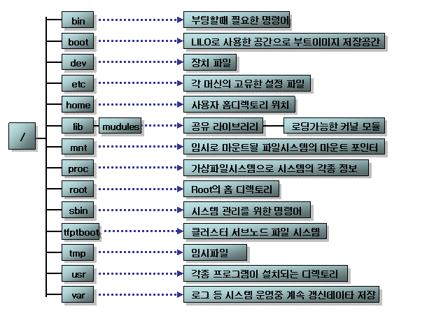

BIOS  - bootstrap loader

​		   - boot loader(GRUB[^**GRand Unified Bootloader**])[<https://ko.wikipedia.org/wiki/GRUB>]

/boot --> 하위 디렉토리들 등 기능 찾아보자!!

---

`cd /boot`

`ls -l`


---


## 기본 명령어

`ssh web@{{ip}}` : 연결

`pwd` : 현재 위치

`cd ./home` : 현재 디렉토리의 /home으로 이동 == `cd /home/webmaster/home`

> `cd /etc/`
>
> `cd sysconfig`
>
> `cd network-scripts`
>
> `cd ..` : 바로위
>
> `cd` : home
>
> `cd ./network-scripts` == 상대경로로 이동 가능 `cd /etc/sysconfig/network-scripts/`

---

`su -`  : root로 

`useradd -D` 

> 

---

`yum install mail` : mail 설치

`mail` :  mail system --> exit : ctrl+z

---


---

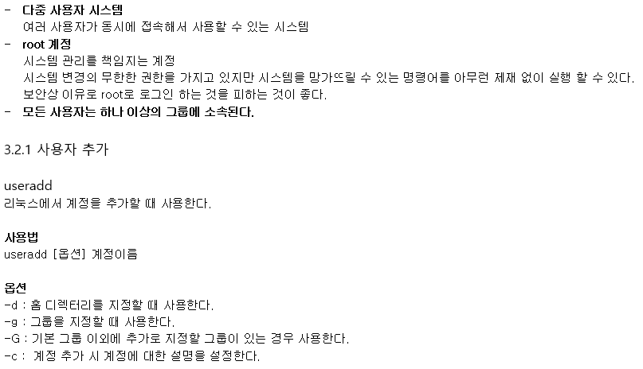


---

그냥 아무사용자 추가 : `useradd user`  : user1이라는 사용자 추가

`cd /home`

`cd user1`

`ls -a`

> 

`# vi /etc/passwd`

>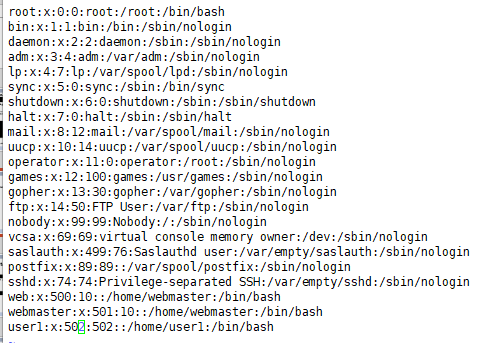

이번엔 설명 달고 유저 만들기

```shell
[root@localhost user1]# useradd -c testuser user2
[root@localhost user1]# vi /etc/passwd
```

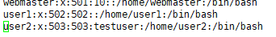


`vi /etc/group`

>

`vi /etc/shadow`

> 

```shell
useradd -g usets user3
vi /etc/passwd
```

> 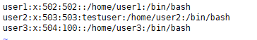


`useradd -M tomcat` : -M : 홈 디렉토리 생성없이 계정추가

`cd /home`

`vi /etc/passwd`

> tomcat은 실행을 위한거니까 로그인 못하게 ! sbin/nologin
>
> 

---

### userdel

-r 안하면 안지워짐!

> 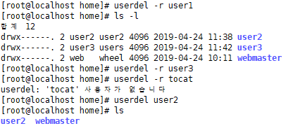
>
> user2는 직접 지워주자!
>
> `rm -rf user2 `   : rm 지우기 `f`: 응!!! 지워!! (강제성 부여)
>
> > 


`cat /etc/group` 도 지워진걸 확인할수있음

>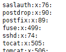
>
>

---

### groupadd

**옵션**

- g GID: 특정 GID번호로 설정한다.

- r : 0~1000 번대 사이로 GID를 자동으로 설정한다.

`# groupadd group1`

`# cat /etc/group`

> 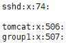

`# groupadd -r group2`

`# cat /etc/group`

> 

`# groupadd -g 1100 group3`

> 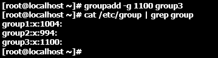

`# groupdel group1`  : 그룹 삭제

`# groups root` : root의 그룹 확인

>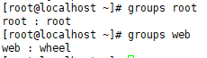

---

### ls

**옵션**

- l  : 파일에 대해서 권한이나 생성 시간처럼 보다 자세한 내용을 출력한다. (long)

- a : 숨긴 파일이나 디렉터리 등의 현재 디렉터리의 모든 내용을 출력한다. (all)

- h : 파일 크기를 k, m, g 와 같이 사람이 읽기 편한 단위로 출력한다. (human readable)

- F : 실행 파일이나 디렉터리 등이 쉽게 구분 될 수 있도록 출력한다.

- R : 하위 디렉터리의 내용들도 함께 출력한다.  

`ll` : 명령어 아님 ls -l 의 alias임! 

> 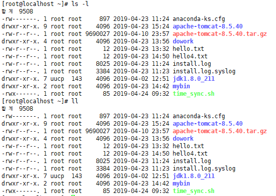

---

`# last` : 접근 했던 로그 확인

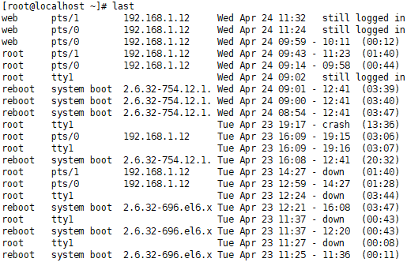

---

---

### mkdir - dir 생성

**옵션**

- m : 디렉터리의 권한을 지정할 수 있다. 기본값은 755이다.

- p :  상위 디렉터리가 존재하지 않으면 상위 디렉터리도 만든다.

```shell
[root@localhost ~]# mkdir -p test1/test2/test3
```


---

### rmdir - 비어있는 dir 삭제

**옵션**

- p :  상위 디렉터리도 지운다. 상위 디렉터리도 비어 있어야 한다

`[root@localhost ~]# rmdir test1/test2/test3` : test3삭제

`[root@localhost ~]# rmdir -p test1/test2`   : 부모도 삭제 단, 비어있으면

한번에 지우기 대신 위험함

`# rm -r test1`  : 지울꺼야? y/N뜸

`# rm -rf test1`  : 그냥 바로 싹 지워버림

---

### cd - 현재 위치(dir) 이동


​									**항상 현재 어디에 있는지 잘 확인하고 잘 아는 것이 중요함!**

---

[실습과제]

1.현재 접속 계정의 홈 디렉토리로 이동 한다. `# cd`

2.현재 경로를 알아본다. `# pwd`

3.현재 디렉토리의 내용을 확인한다.  `# ls`

4.test01 디렉토리를 생성한다.  `# mkdir test01`

5.디렉토리 생성을 확인한다.  `# ls`

6.test01 디렉토리로 이동한다.  `# cd test01`

7.현재 경로를 알아본다.  `# pwd`

8.test011 디렉토리를 생성한다.  `# mkdir test011`

9.디렉토리 생성을 확인한다.  `# ls`

10.test012 디렉토리를 생성한다.  `# mkdir test012`

11.디렉토리 생성을 확인한다.  `# ls`

12.심볼을 사용해서 계정 홈 디렉토리로 이동한다.  `# cd ~`  심볼 : ~

13.한 번에  test02/test021 디렉토리를 생성한다.  `# mkdir -p test02/test021`

14.test02 디렉토리 생성을 확인해본다   `# ls`

15.한 번에  test02/test022 디렉토리를 생성한다.  `# mkdir test02/test022`

16.상대 경로로 test02/test022 디렉토리로 이동 한다.  `# cd test02/test022`

17.현재 경로를 확인해 본다.  `# pwd`

18.절대 경로로 접속계정의 홈 디렉토리로 이동한다.  `# cd /root`

19.실습용으로 만든 모든 디렉토리를 삭제 한다.  `# rm -rf test01` `# rm -rf test02`


