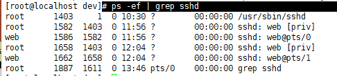

### pipe - IPC 에서 PIPE 를 간단하게 설명한다면, 

​			 		[ **여러개의 프로세스가 공통으로 사용하는 임시공간** ]

<https://www.joinc.co.kr/w/Site/system_programing/Book_LSP/ch08_IPC> <- 참고

리다이렉션은 프로세스의 입력이나 출력을 파일로 사용하는 것이라면 파이프[^pipe]는 프로세스간 사용하는 것입니다. 리눅스에서는 특수 기호로 `|`를 사용합니다. 일반적으로 **"A | B"** 처럼 사용하는데,       ` |`를 기준으로 A에 있는 커맨드의 표준 출력을 B에 있는 커맨드의 표준 입력으로 사용합니다.

프로세스의 출력 스트림을 다른 프로세스의 입력 스트림으로 사용할 때 리다이렉션 기호를 쓰면 오류가 납니다. 아마도 일치하는 파일이 없거나 디렉토리가 없다고 오류 메시지가 나올겁니다. 이런 경우엔 파이프 기호를 씁시다.

다음과 같은 코드를 보면 자연스럽게 파이프를 사용하고 있었다는 것을 알 수 있습니다.

```sh
$ ls | grep ls.txt
```

`ls` 명령어의 출력 스트림을 `grep` 커맨드의 입력 스트림으로 보내고 `grep` 커맨드의 인자값으로 `ls.txt`를 준 것입니다. 현재 디렉토리에 `ls.txt` 파일이 있으면 결과를 콘솔에 출력할 겁니다. `grep` 명령어는 원래 다음처럼 사용합니다.

```
$ grep [-option] [pattern] [file or directory name] 
```

`grep` 키워드 이후 옵션과 패턴, 그리고 파일이나 디렉토리 이름을 써주면 됩니다. 패턴은 정규식Regular Expression으로 사용 가능합니다. 이러한 일반적인 `grep` 사용법 외에 `grep`을 파이프로 입력 스트림을 주는 경우엔 필터처럼 동작합니다. 파일이나 디렉토리명을 써주지 않더라도 입력 스트림으로 받은 내용과 패턴을 바탕으로 `grep` 명령어를 시행합니다.

간단히 요약하면 **프로세스간의 입력, 출력을 연결하고 싶으면 파이프 기호를 이용**합시다.

---

`# ps -ef | grep sshd`

> 

```
< ssh sshd >
하나의 컴퓨터 안에서도 process끼리 서로 통신할 수 있음 : **IPC**
** IPC :  IPC 는 프로세스간 서로 데이터를 주고 받는 경로를 뜻함


ssh < -- 두 프로세스 간 네트워크를 통해 통신 --> sshd(서버)

근데 이 둘이 1:1하면 다른 클라이언트 응답을 sshd에서 해줄수가 없잖아

그래서 ssh가 꽂히는 순간 sshd가 다른 프로세스(?)를 포크(파이프를만듦)해서 만들어서

ssh와 그 포크된 소켓fd?가 연결됨.

그럼 다른 클라이언트가 또 들어오면 sshd가 또 다른 프로세스 포크해서(만들어서) 연결해주고

-> 그니까 sshd가 엄마?같은 역할로 클라이언트 요청이 있을때마다 도플갱어(자신복제품?같은느낌) 만들어서  클라이언트랑 연결해준다는 것 같음....

==> 근데 이건 비쌈, 그리고 자바는 이런 모델(여러 프로세스끼리 통신하는) 못씀

cuz : OS위에 JVM이 있는데 sshd를 만들었을 때 OS입장에서는 [JVM sshd]가 통쨰로 프로세스기 때문에 포크를 할 수 없는 상황이 됨 (sshd입장에서는 jvm이 os인데, 통째로 프로세스가 돼서 안됨)

 	--> 그래서 자바는 thread를 쓰는거임 -> main thread에 여러 thread를 돌리는 거
```

-> OS 입장에서는 [JVM이랑 sshd(리눅스에서 돌고있는 프로그램)랑 각각 프로그램] => 하나의 프로세스로 봄!

​     JVM도 c로 짜여진 프로그램이고, sshd도 c로 짜여진 프로그램이잖아? -> 즉, 둘이 같은 위치에 있음

​	**그래서 pipe로 통신이 불가능.. (근데 같은 위치에 있으면 왜 안됨?...ㅎ... 찾아보자)**

---


