# eclipse설치 - zip

<https://www.eclipse.org/downloads/download.php?file=/technology/epp/downloads/release/2019-03/R/eclipse-jee-2019-03-R-win32-x86_64.zip>

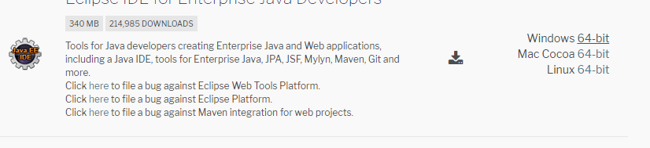

**이클립스 설정!**

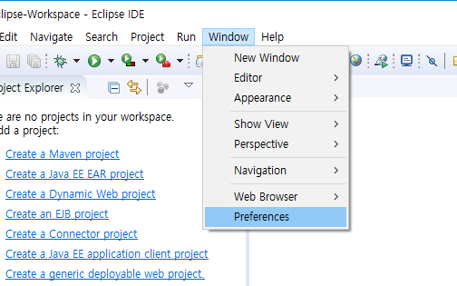

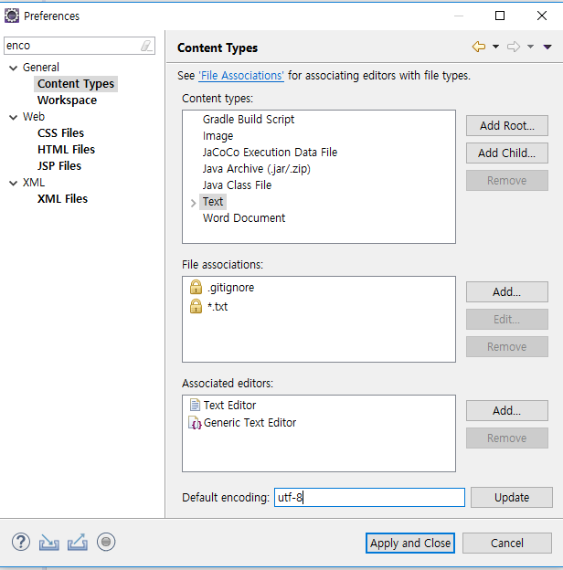


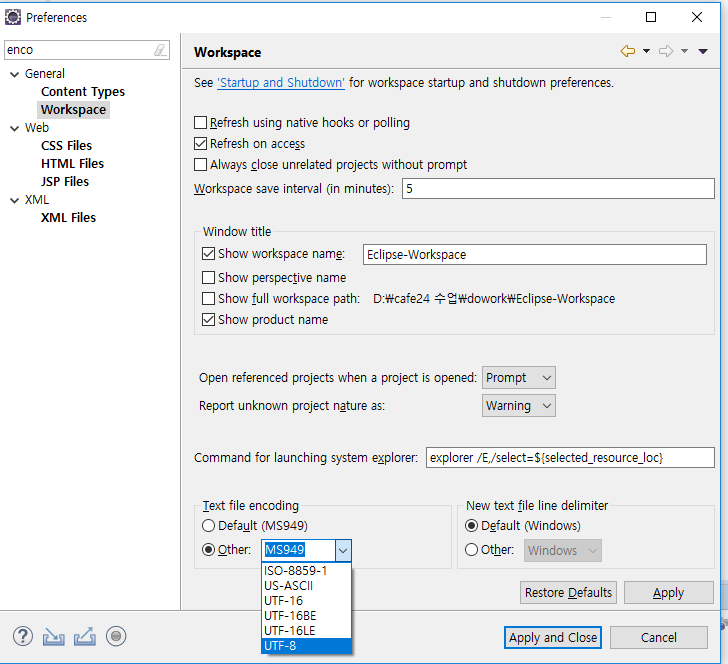

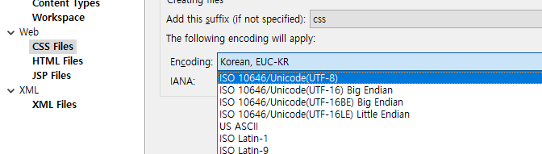

왼쪽 모두 다 utf-8로 바꾸기


**spelling 설정**

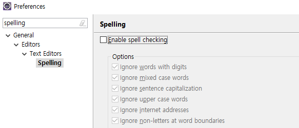

**서버 설치**

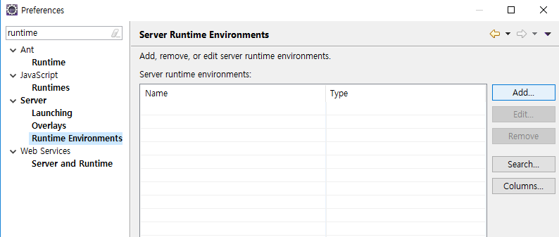


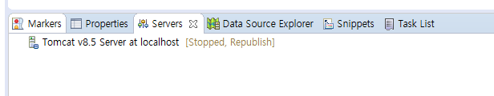


## 프로젝트 만들기

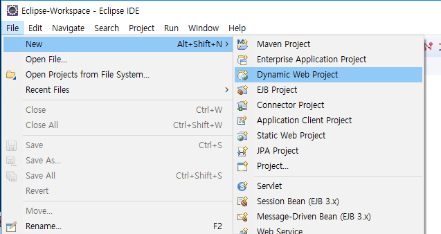

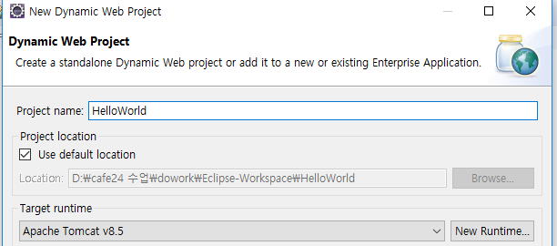


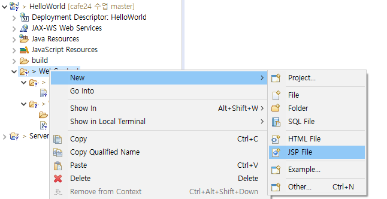

**index.jsp**

```jsp
<body>
	<h1>Hello World</h1>
</body>
</html>
```

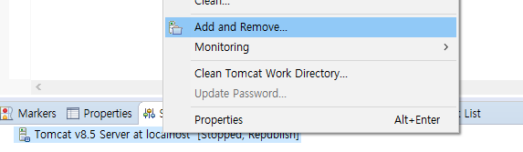

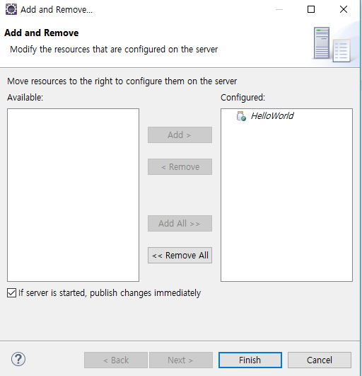

서버 실행 ! 

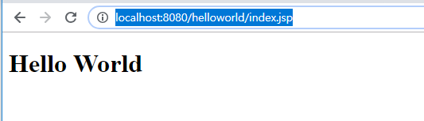


**압축하기**


