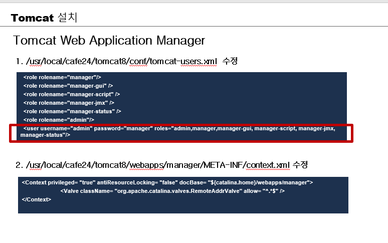
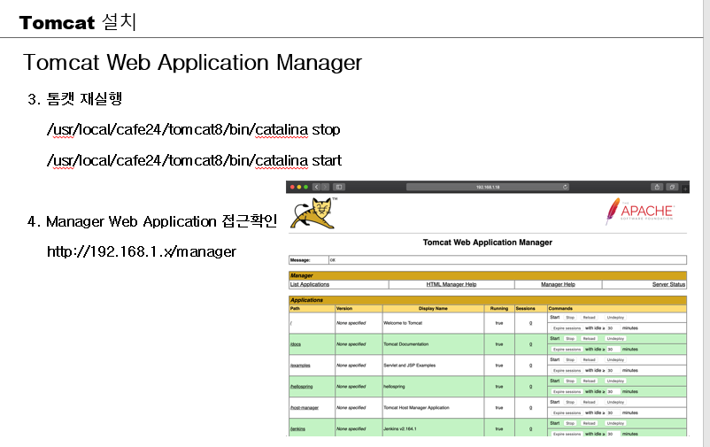
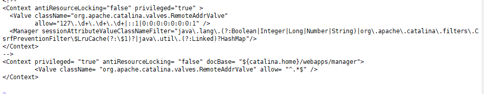
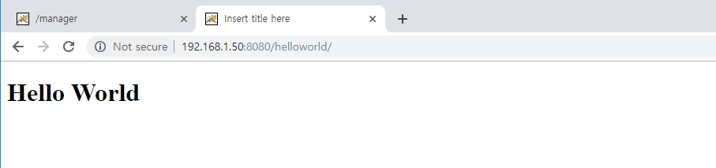
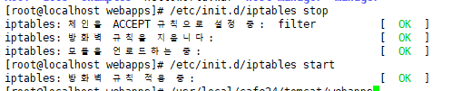
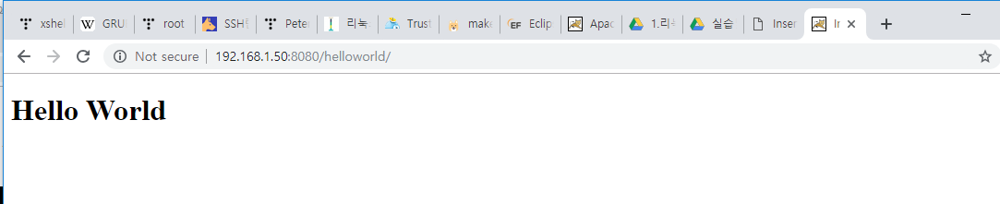

---


### 들어가지나 확인 :  <http://192.168.1.50:8080/>


----


# Tomcat에 war 배포

## 1번째 방법

`[root@localhost webapps]# vi /usr/local/cafe24/tomcat/conf/tomcat-users.xml  `

> 

`[root@localhost webapps]# vi /usr/local/cafe24/tomcat/webapps/manager/META-INF/context.xml `

> 기존 context주석 처리하고 추가
>
> 

**서버 재실행**

```shell
[root@localhost webapps]# /usr/local/cafe24/tomcat/bin/catalina.sh stop
Using CATALINA_BASE:   /usr/local/cafe24/tomcat
Using CATALINA_HOME:   /usr/local/cafe24/tomcat
Using CATALINA_TMPDIR: /usr/local/cafe24/tomcat/temp
Using JRE_HOME:        /usr/local/cafe24/jdk
Using CLASSPATH:       /usr/local/cafe24/tomcat/bin/bootstrap.jar:/usr/local/cafe24/tomcat/bin/tomcat-juli.jar
[root@localhost webapps]# /usr/local/cafe24/tomcat/bin/catalina.sh start
Using CATALINA_BASE:   /usr/local/cafe24/tomcat
Using CATALINA_HOME:   /usr/local/cafe24/tomcat
Using CATALINA_TMPDIR: /usr/local/cafe24/tomcat/temp
Using JRE_HOME:        /usr/local/cafe24/jdk
Using CLASSPATH:       /usr/local/cafe24/tomcat/bin/bootstrap.jar:/usr/local/cafe24/tomcat/bin/tomcat-juli.jar
Tomcat started.
```

{{ip}}:8080/manager 들어가면

id : admin

pw : manager


choose file해서 올리면 됨!




---


## 2번째 방법

1. war파일 가져오기

   > 

2. `/usr/local/cafe24/tomcat/webapps` 로 war파일 옮기기

   > `# mv /home/webmaster/helloworld.war /usr/local/cafe24/tomcat/webapps/`

3.  서버 재실행

   > 





