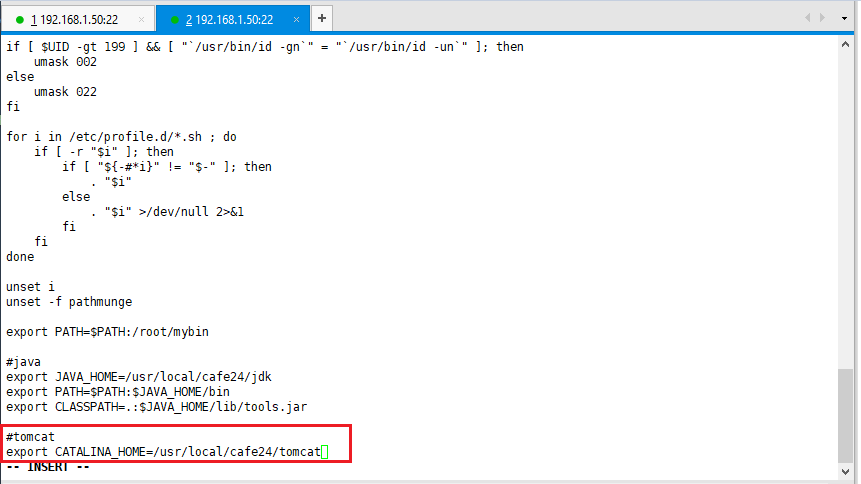
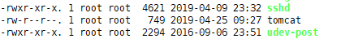
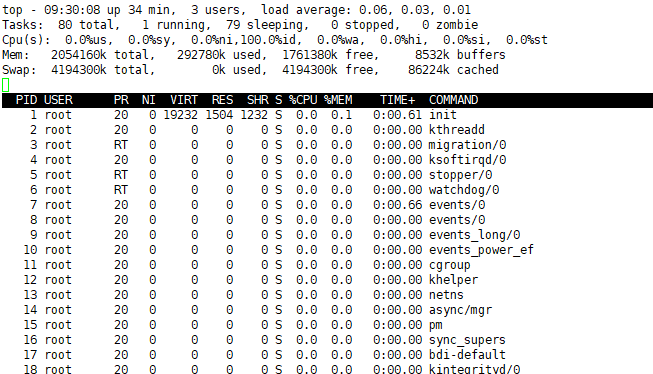
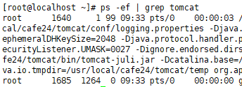
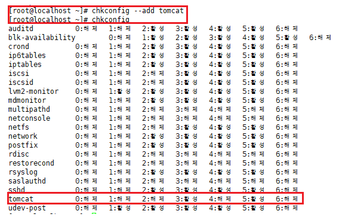
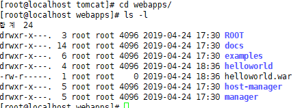

`cd /etc/init.d`

`vi tomcat` 에 아래 붙여넣기

`/etc/init.d` **<- 찾아보기**

```
#!/bin/sh 
# 
# Startup script for Tomcat for HMO
# 
# chkconfig: 35 85 35 
# description: Start Tomcat 
# 
# processname: tomcat 
# 
# Source function library. 

. /etc/rc.d/init.d/functions 

export JAVA_HOME=/usr/local/cafe24/jdk
export CLASSPATH=.:$JAVA_HOME/lib/tools.jar
export CATALINA_HOME=/usr/local/cafe24/tomcat
export PATH=$PATH:$JAVA_HOME/bin

case "$1" in 

	start) 

		echo -n "Starting tomcat: " 
		daemon $CATALINA_HOME/bin/startup.sh 
		touch /var/lock/subsys/tomcat
		echo
		;; 
	stop) 
		echo -n "Shutting down tomcat: " 
		daemon $CATALINA_HOME/bin/shutdown.sh 
		rm -f /var/lock/subsys/tomcat
		echo 
		;; 
	restart) 
		$0 stop
		sleep 2 
		$0 start 
		;; 
	*) 
		echo "Usage: $0 {start|stop|restart}" 
		exit 1 
esac 
exit 0

```

---

다른 사용자로

ssh @webmaster:{{ip}}

`su -`

`vi /etc/profile`

```shell
#tomcat
export CATALINA_HOME=/usr/local/cafe24/tomcat
```



저장 : `# source /etc/profile`

확인 : `# echo $CATALINA_HOME`

---

root

`ls -l`

> 

`chmod 755 tomcat`

> 

`cd`

`# ps -ef | grep tomcat`

`# /etc/init.d/tomcat start`

`# ps -ef | grep tomcat`

> 


`top` : 현재 프로세스들 확인

> 


`# /etc/init.d/tomcat stop`

`# ps -ef | grep tomcat`

`# /etc/init.d/tomcat start`

`# ps -ef | grep tomcat`

`# /etc/init.d/tomcat restart`

**--process 죽여보기**

`# ps -ef | grep tomcat`     1640:process id

> 

`kill -l`   : 시그널 번호들 중, 9번을 보내야함

> 

`kill -9 16040` : tomcat 죽이기

`killall java` : java라는 이름의 프로세스 다 한번에 죽이기

`ps -ef | grep tomcat`  : 죽었나 확인

**다시 띄우기**

`# /etc/init.d/tomcat start`

`# ps -ef | grep tomcat`

---

`chkconfig`

> 

`chkconfig --add tomcat`  : 등록해주기

> 

---

**<http://192.168.1.50:8080/manager> 에서 올린 war파일이 어디에 있을까?**

`# cd /usr/local/cafe24/tomcat`

`# cd webapps/`

> 


