## 리눅스 명령어2

`cd`

`touch test`

`rm test`   : 삭제할거야? -  y

`touch test`

`rm -f test`   : 안물어보고 삭제

```shell
[root@localhost ~]# mkdir dowork
[root@localhost ~]# cp -R dowork dowork2     : dowork 복사
[root@localhost ~]# rm -rf dowork2			 : 안물어보고 삭제
```

`cd /`

`pwd`


---

### cat - 파일의 내용 화면에 출력

**옵션**

- n : 줄 번호를 표시한다.  

- b : 빈 행은 제외하고 줄 번호를 표시한다.  

- E : 각 행마다 끝에 $ 문자를 출력한다.

`# cat -n /etc/profile`    : 줄 번호(라인) 나옴


---

### more -화면 단위로 분할해서 내용 출력

**사용법**

more [옵션] 파일이름

**옵션**

- d : 스페이스나 q키를 누르라는 안내 메시지를 화면에 나타낸다.  

- s : 연속되는 빈 공백 행을 하나의 행으로 출력한다.


---

### find - 다양한 조건으로 특정 파일 찾기

**사용법**

**find** [시작 디렉터리] [조건]

[시작 디렉터리]부터 시작해서 하위 디렉터리의 모든 파일을 [조건]에 맞는 파일을 검색한다.

[시작 디렉터리]를 / 로 지정하면 시스템 내의 모든 파일을 검색하게 된다.

[조건]은 다양하게 줄 수 있다.


**–name “문자열”**

파일 이름이 문자열과 일치하는 파일을 찾는다. 문자열에는 다음과 같은 형식으로 지정할 수 있다.

“log” : 파일이름이 log인 파일을 찾는다.

“*log” : 파일 이름이 log로 끝나는 모든 파일을 찾는다.

“log*” : 파일 이름이 log로 시작하는 모든 파일을 찾는다.

“*log*” : 파일 이름 중간에 log가 들어가 있는 파일을 찾는다.

“?log” : 파일 이름에서 첫 글자는 어떤 문자라도 상관없고 log로 끝나는 4개 문자 이름의 파일

“log??” : 파일 이름 시작이 log로 시작하고 끝의 두 문자가 어떤 것이어도 상관없는 5개 문자 이름의 파일


 **–user “유저이름”**

특정 유저가 소유한 파일들을 모두 찾는다.


**–perm “퍼미션”**

명시된 퍼미션으로 된 파일을 찾을 때 사용한다.


**–type ?**

? 형태의 파일을 찾는다.

> 그밖에  -size 파일크기, -atime 날짜,-newer 파일 등으로 파일을 찾을 수 있다.


**var 밑의 .log로 끝나는 파일 찾아**


**파일 위치 찾기**

`# whereis ls`

`# find / -user "webmaster" -print 2>/dev/null`   

​																	:   2>/dev/null -> error가 생기면 출력을 딴데로 보내는 것

> 
>
> process 정보도


`# find /root -perm 755 -print`


`# find / -type s -print 2>/dev/null`

> 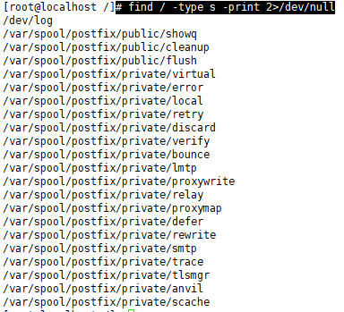

`# find / -type p -print 2>/dev/null`

> 


`df -h`

> 


---

### grep - 파일 내 or 입력 값으로부터 특정 패턴 검색

`# ps -ef | grep sshd`

> 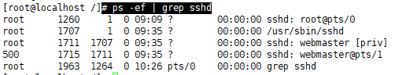
>
> > 맨 밑에는 방금 실행 명령어
> >
> > `ps -ef | grep -v sshd`   : sshd가 없는 명령어
> >
> > 그럼 위에서 grep만 빼고 보고 싶으면
> >
> > `# ps -ef | grep sshd | grep -v grep`
> >
> > 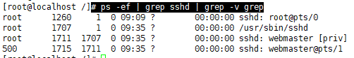


`# grep root /var/log/secure`   : root로 뭔가를 접근/시도 했던 흔적 보기

> 

`# grep -c root /var/log/secure`   : count


`# grep alias /etc/profile.d/*`    : alias 검색

`# grep -n alias /etc/profile.d/*`    : alias 검색 몇번째 줄에 있는지 까지 

> 


---

### pipe  - 입력과 출력을 연결

프로그램의 실행결과를 다른 프로그램의 입력으로 연결한다. 둘 이상의 명령을 함께 사용하고, 한
명령어의 출력결과를 다른 명령어의 입력으로 전환하는 것을 **파이프(pipe)**라 한다.

`# grep root /var/log/secure | less`

`# grep root /var/log/secure | cat`

​			왼쪽 결과를 오른쪽으로 받는 것


---

### redirection(>) - 출력을 다른 device, file로 보냄

리다이렉션을 이용하면 명령의 출력을 변경할 수 있다. 명령어의 결과는 기본적으로 터미널(stdout) 이다. 리다이렉션을 이용하면 파일에 기록할 수 있다.

**연산자**

명령어 > 파일 : 파일이 없으면 생성하고, 있다면 기존의 내용을 지운다. 

명령어 >> 파일 : 파일이 없다면 생성하고, 있다면 기존의 내용에 추가한다.

명령어 < 파일 : 파일에서 표준 입력(stdin)을 받는다.

> 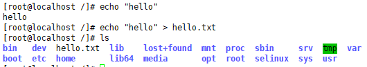

**append(>>)**

> 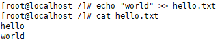

`vi hello.txt`

> 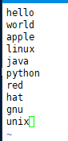
>
> 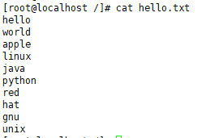

**sort 가능**

> 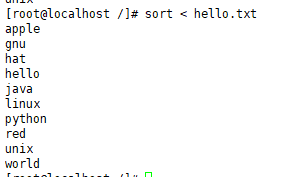

**sort된 것을 파일로**

> 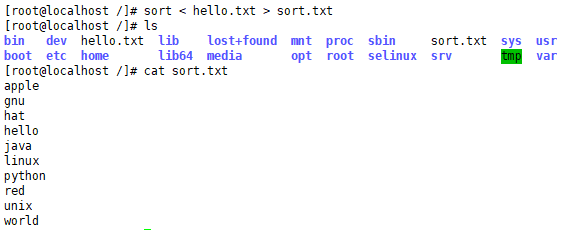


---

### chown - 파일 소유자, 소유그룹 변경

**사용법**

chmod [옵션] 소유자:소유그룹 파일명


**옵션**

-R : 경로와 그 하위 파일들을 모두 변경한다.

--help : 도움말을 출력한다.

--version : 버전 정보를 보여준다.


`cd ~webmaster`

`cd`

`# chown webmaster:root hello.txt`  : 소유자는 변경, 그룹은 그대로

> 


---

### tar(압축 유틸리티)

압축 유틸리티 중 가장 많이 사용하는 것은 tar, gzip, bzip2 이다.

tar 기본적으로 압축을 하지 않고 묶어 주는 역할(아카이브, archive)을 한다.

**사용법**

묶을 때 :  tar [옵션] 생성파일.tar 묶을 파일

해제할 때 : tar [옵션] 파일.tar 

**옵션**

-c : 새 저장 파일을 만든다. 즉 묶을 때 사용하는 옵션이다.

-x : 묶인 파일을 해제 한다. 

-v : 처리 중인 파일을 자세하게 보여준다. 

-f : 파일을 지정한다.

`cd /`

`# tar cvf root.tar /root`   :  파일 묶기 root.tar이름으로 /root를

`# gzip root.tar`   : root.tar를 압축하기

> 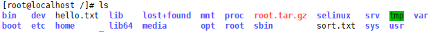

**압축풀기**

> 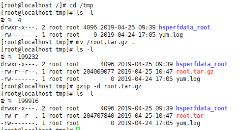
>
> 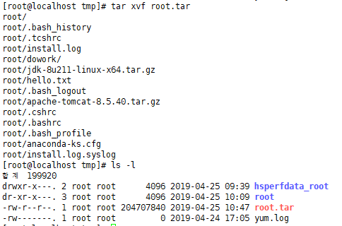


**다시 한번에 풀어볼까? tar xvfz 파일**


`# rm -rf root`

`# gzip root.tar`

> 

> 


