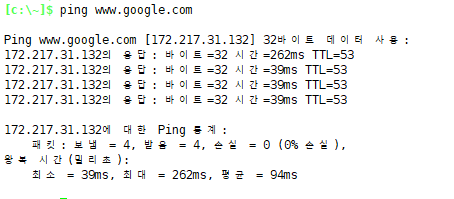
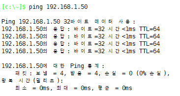
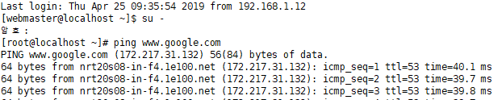
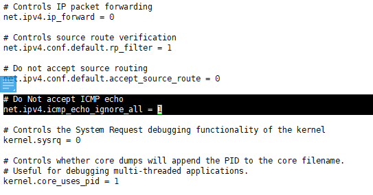
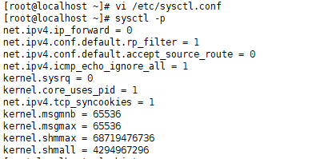
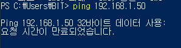
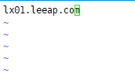
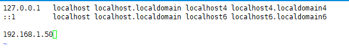

### ping

---

---

---

> **TTL ?**
>
> pc에서 google로 다이렉트로 가는게 아님.
>
> pc의 packet이 네트워크를 막 떠돌아다님  -> ping은 이걸 막기 위함임
>
> 64값이 기본값임 = 내 ip치면 64
>
> 근데 다른 네트워크를 거칠 때 마다 -1씩 뺌.
>
> google에는 11개를 거쳐서 간 것 임
>
> 
>
> `ssh webmaster@{{ip}}`
>
> `ping www.google.com`
>
> > 
> >
> > ttl = 53
>
> `yum -y install traceroute`
>
> `traceroute www.google.com`
>
> >
> >
> >> 마지막에 11이잖아
> >>
> >> 그럼 위에 ttl이랑 더하면 == 64 == google은 linux라는 뜻! (os마다 값이 달라)

----

ping 막아보기!

**막기전 powershell**

> 

**linux**

`# vi /etc/sysctl.conf`

> 

`# sysctl -p`    : 잘 됐는지 확인

> **막은 후 power shell  -> 이제 ping못받음**
>
> 

---

### nslookup - 해당 도메인 ip 주소 확인

---

---

### **host name 변경해보기**  lx = linux

> lx01 -> centOS6
>
> lx02 -> centOS7

`vi /etc/hostname/`

>

---

`exit`

`exit`

**다시 로그인**

`ssh webmaster@192.168.1.50`

`su -`

---

`ping localhost`   :  나한테 다시 돌아오는 ip  == 127.0.0.1

> 

`vi /etc/hosts`

> 

---

`C:\windows\system32\drivers\etc\` 파일 수정

-> 메모장 관리자 권한으로 실행, 위의 주소 입력, 모든파일보기 hosts 선택!

> 192.168.1.50 lx01 
>
> 192.168.1.50 www.leeap.com 
>
> 

**왼쪽 ip를 오른쪽이름으로 alias하는 느낌?..**

**이제 로그인 할 때** 

`ssh root@192.168.1.50` **이렇게 안하고**

`ssh root@lx01` **<<- 이렇게 할 수 있음!**

