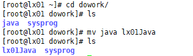
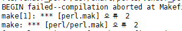
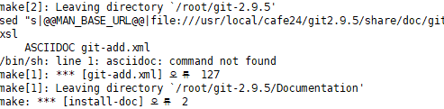
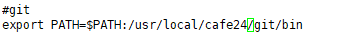

### git 에서 repository 만들기

---

**sysporg 밑의 *.c 파일 업로드하기**

---

`cd`

/root 위치에!!

**1 의존성 라이브러리 설치**
`yum install curl-devel expat-devel gettext-devel openssl-devel zlib-devel`

**2 소스 다운로드**
<  https://mirrors.edge.kernel.org/pub/software/scm/git/  >
`wget https://mirrors.edge.kernel.org/pub/software/scm/git/git-2.9.5.tar.gz`

**3 컴파일 및 설치**
`tar xvfz git-2.9.5.tar.gz`

`cd git-2.9.5`

`make configure`

`./configure --prefix=/usr/local/cafe24/git2.9.5`    

​							 -> prefix = 설치위치, 빌드할수있는 환경 조사

`make all doc info`

> 오류 발생!!!
>
> 
>
> `# yum -y install perl-devel`
>
> 다시 `make all doc info`
>
> > 
> >
> > 이건 필요 없는 기능이라 그냥 무시!

`make install install-doc install-html install-info`

> 
>
> 이것도 괜ㅊ낳아

**3-2 링크 달아주기**

**4 PATH 설정**
`vi /etc/profile`

>  

**5 설치 확인**
`git --version`

> 

**6 Git 최초 설정**
`git config --global user.name "jungeunlee95"`
`git config --global user.email "leeap1004@gmail.com"`

`git config --list`

**7 Git 저장소로 만들기**
`git init`

**8 최초 커밋**
`git add *.c`
`git commit -m 'init commit'`

**9 리모트 저장소 추가하기**
`git remote add origin {내 레포지토리 주소}`

**10 push 하기**
`git push -u origin master`

---

