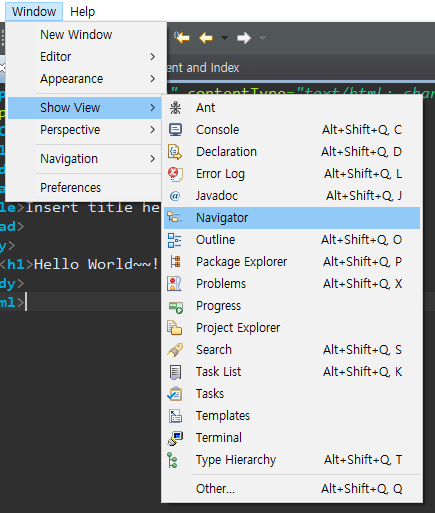
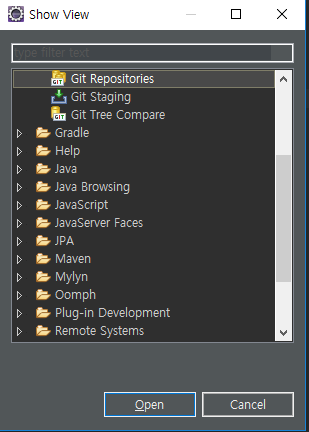
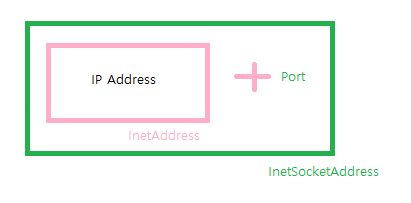
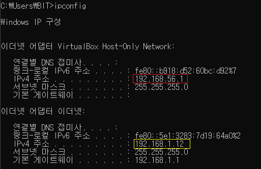

## 네트워크와 소켓의 이해 ppt

프로그램 -- 연결 -- 키보드

프로그램 -- 연결 -- 파일 I/O

프로그램 -- 연결 -- 소켓

---

#### Eclipse - Net Project




> 프로젝트 논리적으로 보기

**깃 레포지토리**

> 


---


IP Address -> **InetAddress** 클래스 ! 

InetSocketAddress -> **InetAddress + Port**



---

**< pacakage 구성 >**

​    test package : address 등 오늘 수업

​	http package : 웹

​	chat package : 과제

​	echo package : echo 짜보기

​	util : 오늘 숙제 - nslookup 만들기

​	udp : udp 간단하게 짜볼거

​	thread : 간단한 연습

​	io : stream 연습


---

#### 1 - test / Localhost

**Localhost.java**  - 컴퓨터 name, ip주소 확인해보기

```java
package test;

import java.net.InetAddress;
import java.net.UnknownHostException;

public class Localhost {

	public static void main(String[] args) {
		
		try {
			// 1. ip 주소 가져오기
			InetAddress inetAddress = InetAddress.getLocalHost();
			// 2. pc 이름, ip 주소
			String hostname = inetAddress.getHostName();
			String hostAddress = inetAddress.getHostAddress();
			System.out.println(hostname + " : " + hostAddress);
		} catch (UnknownHostException e) {
			e.printStackTrace();
		}

	}

}

```

**출력**

```
DESKTOP-SN9BBRH : 192.168.56.1   
```

**현재 network가 두개라서, virtualBox ip주소가 잡힘** 

> 
>
> > ​												**빨간색 말고 노란색이 잡혀야함!!!**

**Localhost.java** - 내 ip 주소 잡기

```java
    InetAddress[] inetAddresses = InetAddress.getAllByName(hostname);
    for(InetAddress addr : inetAddresses) {
        System.out.println(addr.getHostAddress());
    }
```

 **출력**

```
192.168.56.1
192.168.1.12
fe80:0:0:0:b918:d52:60bc:d92%7
fe80:0:0:0:5e1:3283:7d19:64a0%2
```


---


**Localhost.java** - ip byte로 출력

```java
			byte[] addresses = inetAddress.getAddress();
			for(byte address : addresses) {
				System.out.println(address);
			}
```

**출력**  -> 2의 보수로 출력

```
-64
-88
56
1
```

**Integer로**  - > 비트 연산으로 원래값 찾기

```java
			byte[] addresses = inetAddress.getAddress();
			int cnt = 0;
			for(byte address : addresses) {
				cnt ++;
				System.out.print(address & 0x000000ff);
				if (cnt != addresses.length) {
					System.out.print(".");
				}
			}
```

**출력**

```
192.168.56.1
```


**Localhost.java 전체코드**

```java
package test;

import java.net.InetAddress;
import java.net.UnknownHostException;

public class Localhost {

	public static void main(String[] args) {
		
		try {
			// 1. ip 주소 가져오기
			InetAddress inetAddress = InetAddress.getLocalHost();
			
			// 2. pc 이름, ip 주소
			String hostname = inetAddress.getHostName();
			String hostAddress = inetAddress.getHostAddress();
			System.out.println(hostname + " : " + hostAddress);

			byte[] addresses = inetAddress.getAddress();
			int cnt = 0;
			for(byte address : addresses) {
				cnt ++;
				System.out.print(address & 0x000000ff);
				if (cnt != addresses.length) {
					System.out.print(".");
				}
			}
			
//			System.out.println("----------------------");
//			InetAddress[] inetAddresses = InetAddress.getAllByName(hostname);
//			for(InetAddress addr : inetAddresses) {
//				System.out.println(addr.getHostAddress());
//			}
			
		} catch (UnknownHostException e) {
			e.printStackTrace();
		}

	}

}

```


---


