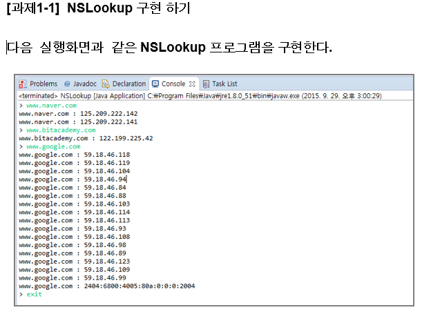

   **1. Scanner와nextLine()**  **메소드를 사용해서  계속 입력받은 도메인을 입력 받는다**.

   **2.** **입력받은  도메인의** **IP** **주소를  출력한다**.

   **3. “exit”** **를 입력 받아  프로그램을 종료할  때 까지 계속  프로그램을 실행한다**.

   **4. InetAddress**의  **static** **메서드**  **getAllByName( String host ) 를 사용한다.**


### NSlookup

**util/ NSlookup.java**

```java
package util;

import java.net.InetAddress;
import java.net.UnknownHostException;

public class NSlookup {

	public static void main(String[] args) {
		
		try {
			String hostname = "www.naver.com"; // scanner
			
			InetAddress[] inetAddresses = InetAddress.getAllByName(hostname);
			for(InetAddress addr : inetAddresses) {
				System.out.println(addr.getHostAddress());
			}
			
		} catch (UnknownHostException e) {
			e.printStackTrace();
		}
		

	}

}

```

**출력**

```
125.209.222.141
125.209.222.142
```

---

---


완료

**util/NSlookup.java**

```java
package util;

import java.io.BufferedReader;
import java.io.IOException;
import java.io.InputStreamReader;
import java.net.InetAddress;
import java.net.UnknownHostException;

public class NSlookup {

	public static void main(String[] args) {
		
		while(true) {
			try {
				String hostname = "";
				System.out.print("> ");
				InputStreamReader isr = new InputStreamReader(System.in);
				BufferedReader br = new BufferedReader(isr);
				
				try {
					hostname = br.readLine();
					if(hostname.equals("exit")) {
						break;
					}
				} catch (IOException e) {
					e.printStackTrace();
				}
				
				InetAddress[] inetAddresses = InetAddress.getAllByName(hostname);
				for(InetAddress addr : inetAddresses) {
					System.out.println(hostname + " : " + addr.getHostAddress());
				}
				
			} catch (UnknownHostException e) {
				e.printStackTrace();
			}

		}

	}

}

```

**출력**

```
> www.naver.com
www.naver.com : 210.89.160.88
www.naver.com : 125.209.222.142
> www.bitacademy.com
www.bitacademy.com : 122.199.225.42
> www.google.com
www.google.com : 172.217.25.100
> exit
```

