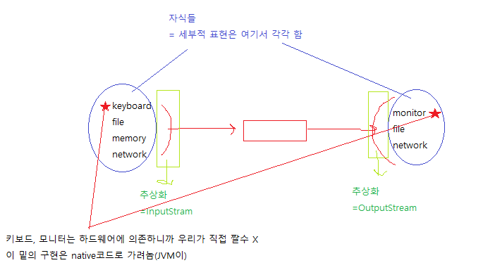
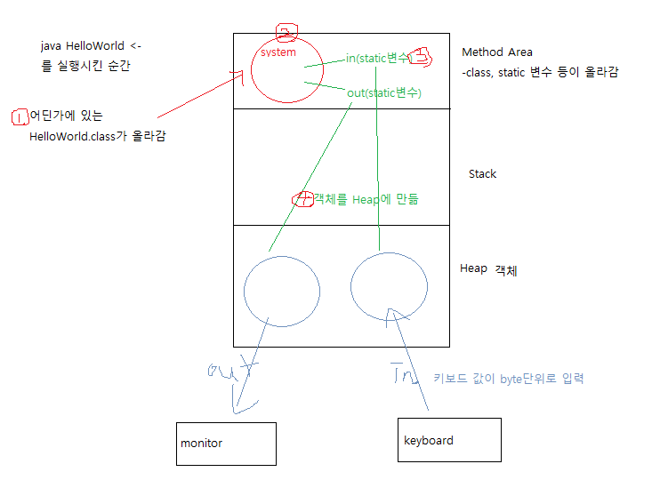
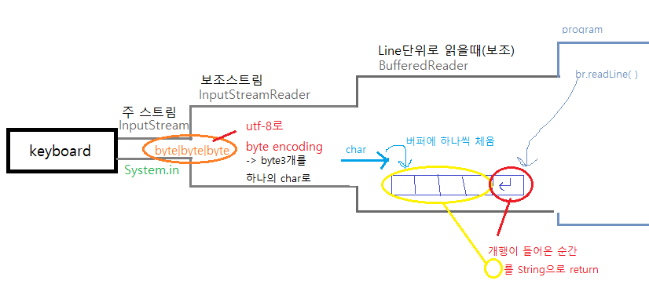

### java.io - io관련 개발할 때 예외처리 필수 

"안녕"은 실제로 utf-8코드와 같이

안 - 3byte

녕 - 3byte  

총 6byte가 저장됨

byte단위는 하나씩 읽음 = 6번 읽어옴

char단위는 3bye씩 읽음 = 2번 읽어옴

> 


> 세부적 구현은 자식에서 함
>
> 

> **프로그램 실행 시키면 JVM이** 
>
> 

---


---

## 시작하기 전

#### ex)

```java
byte[] data = {56,17,32} 
	// 가 있을때 이 3개의 숫자를 "안"으로 표현하고 싶음
String s = new String(data, 3, "utf-8")
    // utf-8코드로 변경
```

> 생성자의 객체를 받아 객체기능확장(decoration)하는 거임(기능확장인데 상속은 아님!!!)

> 

외전)

io를 줄일 때 = Buffered

FileOutput의 경우

write를 1byte씩 쓸 때

bufferedoutputStream에서

1byte씩 버퍼에 저장 -> 내부 버퍼가 찰 때까지 disk로 안넘김

---


---

**io/KeyboardTest.java** 

```java
package io;

import java.io.BufferedReader;
import java.io.IOException;
import java.io.InputStreamReader;

public class KeyboardTest {

	public static void main(String[] args) {
		
		BufferedReader br = null;
		try {
			// 기반스트림(표준입력, 키보드, System.in 등.. 주스트림에 꽂을 수 있는 애)
			
			// 보조스트림1. 보조 스트림 연결 
			//    byte|byte|byte ==> char
			InputStreamReader isr = new InputStreamReader(System.in, "utf-8");
			
			// 보조스트림2
			//	  char1|char2|char3|\n ==> "char1char2char3" String으로
			br = new BufferedReader(isr);
			
			// read
			String line = null;
			while((line = br.readLine()) != null) {
				if("exit".equals(line)) {
					break;
				}
				System.out.println(">>" + line);
			}
			

		} catch (IOException e) {
			System.out.println("error:" + e);
			e.printStackTrace();
		} finally {
			try {
				if (br != null) {
					br.close();
				}
			} catch (IOException e) {
				e.printStackTrace();
			}
		}

	}

}

```

**출력**

```
Hello
>>Hello
World
>>World
exit
```
