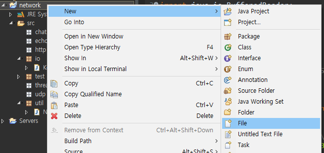

### FileInputStream

/ 에 파일 



**phone.txt**

```
둘리	000 0000 0000
마이콜	111 1111 1111
또치	222 2222 2222
```

**io/PhoneList01.java**

```java
package io;

import java.io.BufferedReader;
import java.io.FileInputStream;
import java.io.IOException;
import java.io.InputStreamReader;
import java.util.StringTokenizer;

public class PhoneList01 {

	public static void main(String[] args) {
		
		BufferedReader br = null;
		
		try {
			//기반스트림 (File에 직접 꽂음)
			FileInputStream fs = new FileInputStream("phone.txt");
			
			//보조스트림(bytes->char)
			InputStreamReader isr = new InputStreamReader (fs, "UTF-8");
			
			br = new BufferedReader(isr);
			
			String line = null;
			while((line = br.readLine()) != null ) {
//				System.out.println(line);
				StringTokenizer st = new StringTokenizer(line, "\t ");
				
				int index = 0;
				while(st.hasMoreElements()) {
					String token = st.nextToken();
					System.out.print(token);
					if(index == 0) {
						System.out.print(" : ");						
					}else if(index == 1 || index==2) {
						System.out.print("-");
					}
					index++;
				}
				System.out.println("");
				
				
			}
			
		} catch (Exception e) {
			e.printStackTrace();
		} finally {
			try {
				if(br != null) {
					br.close();
				}
			} catch (IOException e) {
				e.printStackTrace();
			}
		}

	}

}

```

**출력**

```
둘리 : 000-0000-0000
마이콜 : 111-1111-1111
또치 : 222-2222-2222
```


---

---

**io/PhoneList02.java**  = Scanner 사용!

```java
package io;

import java.io.File;
import java.util.Scanner;

public class PhoneList02 {
	
	public static void main(String[] args) {	
		
		Scanner scanner = null;
		
		try {	
			scanner = new Scanner(new File("Phone.txt"));
			 while(scanner.hasNextLine()) {
				 String name = scanner.next();
				 String phone01 = scanner.next();
				 String phone02 = scanner.next();
				 String phone03 = scanner.next();
				 System.out.println(name+" : "+phone01+"-"+phone02+"-"+phone03);
			 }		
		} catch (Exception e) {
			e.printStackTrace();
		} finally {
			if(scanner != null) {
				scanner.close();
			}
		}
	}
}

```

**출력**

```
둘리 : 000-0000-0000
마이콜 : 111-1111-1111
또치 : 222-2222-2222
```

