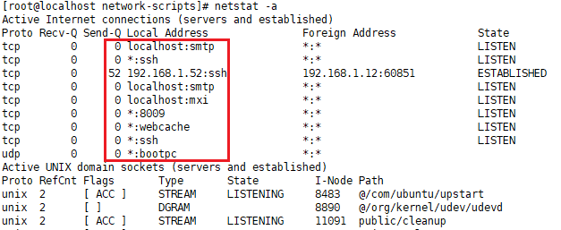
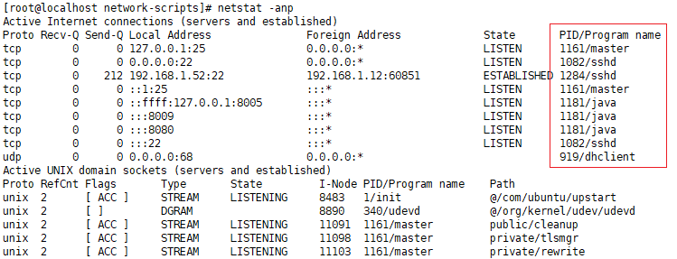
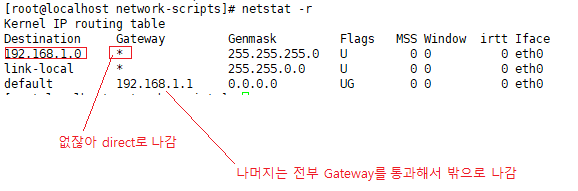
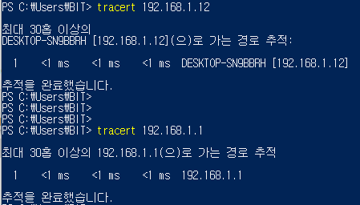

#### 네트워크관리 ppt 24

------

**포트의 종류**

​    (1)      1 - 255      : 잘 알려진 인터넷 서비스 포트( Well-Known Port)

​    (2)   256 - 1023    : 그 밖의 인터넷 서비스

​    (3) 1024 - 4999    :  시스템 예약 

​    (4) 5000 - 65535  :  사용자 사용

**유명한 port 확인하는 페이지**

 http://www.iana.org/assignments/service-names-port-numbers/service-names-port-numbers.xhtml

------

---

#### 네트워크 상태 확인

`netstat -a`  : ip 이름으로 나옴

> 

`netstat -an`  : ip address로 나옴

> 
>
> IP Address : 부산항
>
> Port : 적절한 선착장
>
> 위의 두가지가 Packet이라는 한 단위의 정보로 전송되는 것

`netstat -anp` : PID/Program name이 나옴

> 

`netstat -r` : 나가는 경로

> 
>
> 경로 추적  - linux에선 `traceroute {ip}`
>
> > 

