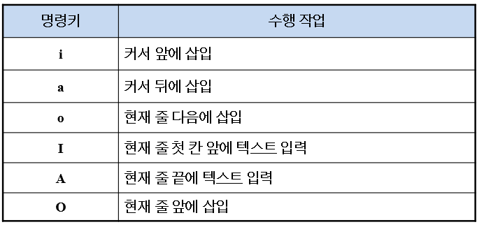
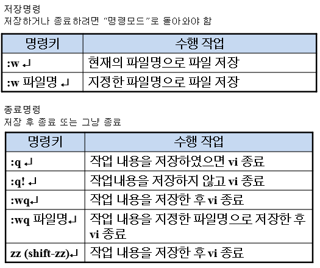
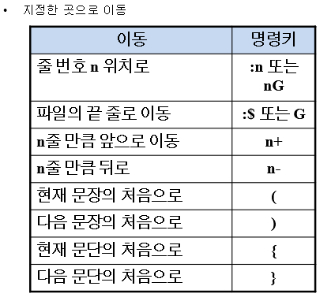

### linux vi 에디터 연습

맨뒤로 : shift + g

맨앞으로 : gg

복사: yy

붙여넣기:  p, P

삭제 :dd

방금 수행 되돌리기 : u

해당 줄 수행 되돌리기 : shift + u

줄 지우기 : dd

단어 지우기 : dw

현재줄과 다음줄 연결 : shift + j

---

**INSERT**

> 

**종료**

> 

**커서**

> 
>
> 

**취소/ 삭제**

> 

**복사 / 잘라내기 / 붙이기**

> 

**검색**

> 

**기타**

> 
>
> 
>
> 

`:q!`    :  작성중 틀리면 저장안하고 빠져나옴

mkdir vitest

> 

