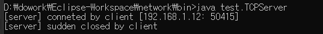

# 2019-04-29

#### 들어가기 전

BSDSocket(API, c , unix)

<--> Win Socket API(c) 

<--->MFS(c++)

<---> Socket(java)  : 요즘은 java계열로 많이 씀

<---> daemon(c)

---

**빅데이터**

서버에서 Hadoop(소프트웨어 프로그램)에 데이터 보내면(네트워크상으로)

하둡에서 데이터를 분산해서 저장함, 데이터 요청이 들어오면 찾아서 다시 전송

---

Mencashed - 캐시서버

Redis

---

**TCPServer.java** - 25

```java
serverSocket.bind(new InetSocketAddress("0.0.0.0", 5000)); 
```

> 모든 ip허용- 클라이언트가 찌를 때 하나 선택해서 찌름, 연결되면 실제 ip로 변경

---


### 지난주 과제 고칠점

**util/NSloopup.java**

```java
//if(hostname.equals("exit")) { // NullPointException날수있음
if("exit".equals(hostname)) { // 이게 더 안전함 
    break;
}
```

```java
String s = new String("exit"); // 객체가 몇개 생길까? 찾아보기
```


---

### Client 쪽 code 짜보기

**test/TCPClient.java**

1. socket 생성
2. final변수로 IP, Port 지정
3. 서버 연결
4. IOStream 받아오기
5. 쓰기
6. 읽기

---

```java
package test;

import java.io.IOException;
import java.net.InetSocketAddress;
import java.net.Socket;

public class TCPClient {
	
	// 2. final변수로 IP,Port 지정
	private static final String SERVER_IP = "192.168.1.52";
	private static final int SERVER_PORT = 5000;
	
	public static void main(String[] args) {
		
		try {
			// 1. socket 생성
			Socket socket = new Socket();
			
			// 3. 서버 연결
			socket.connect(new InetSocketAddress(SERVER_IP, SERVER_PORT));
            System.out.println("[client] conndected");
			
			
		} catch (IOException e) {
			e.printStackTrace();
		}
	}

}
```

**test - cmd에서 서버 실행하기**

```shell
D:\dowork\Eclipse-Workspace\network\bin>cd
D:\dowork\Eclipse-Workspace\network\bin

D:\dowork\Eclipse-Workspace\network\bin>java test.TCPServer
```

**eclipse = test/TCPClient.java 실행**

> 

> **갑작스런 종료 debugging - test/TCPServer.java** - 63번줄 
>
> ```java
> ...
> }catch(SocketException e) { 
>     System.out.println("[server] sudden closed by client");
> }catch(IOException e) { // 정상종료 안하고 확 꺼버린 ..!
>     e.printStackTrace();
> }finally {
>     ...
>                         
> ```

**서버와 클라이언트 연결 후 종료**

> 

---


---

### IO Stream 받아오기

**TCPClient.java**  - 4, 5, 6 finally

```java
package test;

import java.io.IOException;
import java.io.InputStream;
import java.io.OutputStream;
import java.net.InetSocketAddress;
import java.net.Socket;

public class TCPClient {
	
	// 2. final변수로 IP,Port 지정
	private static final String SERVER_IP = "192.168.1.12";
	private static final int SERVER_PORT = 5000;
	
	public static void main(String[] args) {
		Socket socket = null;
		try {
			// 1. socket 생성
			socket = new Socket();
			
			// 3. 서버 연결
			socket.connect(new InetSocketAddress(SERVER_IP, SERVER_PORT));
			System.out.println("[client] conndected");
			
			// 4. IOStream 받아오기
			InputStream is = socket.getInputStream();
			OutputStream os = socket.getOutputStream();
			
			// 5. 쓰기
			String data = "Hello World\n";
			os.write(data.getBytes("utf-8"));
			
			// 6. 읽기
			byte[] buffer = new byte[256];
			int readByteCount = is.read(buffer); // blocking
			if(readByteCount == -1) {
				System.out.println("[client] closed by server");
			}
			
			data = new String(buffer, 0, readByteCount, "utf-8");
			System.out.println("[client] received : " + data);
			
		} catch (IOException e) {
			e.printStackTrace();
		} finally {
			try {
				if(socket != null && socket.isClosed() == false) {
					socket.close();
				}
			} catch (IOException e) {
				e.printStackTrace();
			}
		}
	}

}
```

> **RUN Server !!!**
>
> 


