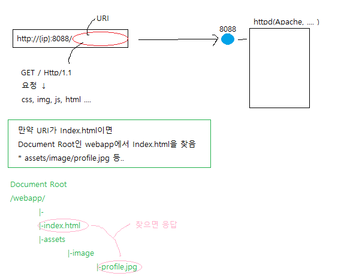
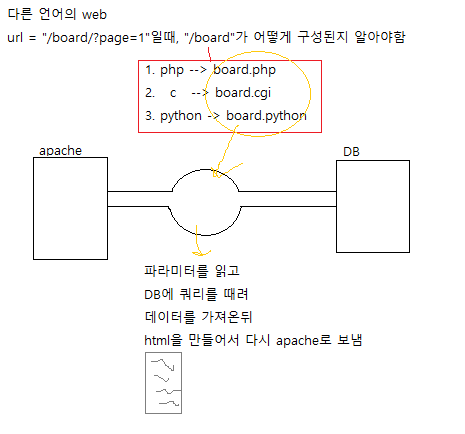
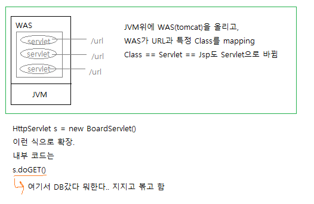
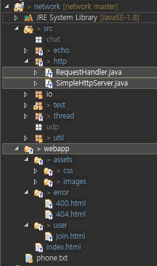

## 시작하기 전

#### URI를 만났을 때



---

#### 다른 언어에서의 동작



---

#### java



---


---

### 실습!

> 


**http/SimpleHttpServer.java**

```java
package http;
public class SimpleHttpServer {
	private static final int PORT = 8088;

	public static void main(String[] args) {

		ServerSocket serverSocket = null;

		try {
			// 1. Create Server Socket
			serverSocket = new ServerSocket();
			   
			// 2. Bind
			serverSocket.bind( new InetSocketAddress( "0.0.0.0", PORT ) );
			consolLog("httpd starts at" + PORT);

			while (true) {
				// 3. Wait for connecting ( accept )
				Socket socket = serverSocket.accept();

				// 4. Delegate Processing Request
				new RequestHandler(socket).start();
			}

		} catch (IOException ex) {
			consolLog("error:" + ex);
		} finally {
			// 5. 자원정리
			try {
				if (serverSocket != null && serverSocket.isClosed() == false) {
					serverSocket.close();
				}
			} catch (IOException ex) {
				consolLog("error:" + ex);
			}
		}
	}

	public static void consolLog(String message) {
		System.out.println("[HttpServer#" + Thread.currentThread().getId()  + "] " + message);
	}
}
```

**RequestHandler.java**

```java
package http;

public class RequestHandler extends Thread {
	private Socket socket;
	
	public RequestHandler( Socket socket ) {
		this.socket = socket;
	}
	
	@Override
	public void run() {
		try {
			// get IOStream
			OutputStream outputStream = socket.getOutputStream();

			// logging Remote Host IP Address & Port
			InetSocketAddress inetSocketAddress = ( InetSocketAddress )socket.getRemoteSocketAddress();
			consoleLog( "connected from " + inetSocketAddress.getAddress().getHostAddress() + ":" + inetSocketAddress.getPort() );
					
			// 예제 응답입니다.
			// 서버 시작과 테스트를 마친 후, 주석 처리 합니다.
			// 					Header 시작
			outputStream.write( "HTTP/1.1 200 OK\r\n".getBytes( "UTF-8" ) );
			outputStream.write( "Content-Type:text/html; charset=utf-8\r\n".getBytes( "UTF-8" ) );
			outputStream.write( "\r\n".getBytes() ); // 브라우저는 /r(빈 개행)이 나온순간 이 다음은 Body구나! 하고 암
			outputStream.write( "<h1>이 페이지가 잘 보이면 실습과제 SimpleHttpServer를 시작할 준비가 된 것입니다.</h1>".getBytes( "UTF-8" ) );

		} catch( Exception ex ) {
			consoleLog( "error:" + ex );
		} finally {
			// clean-up
			try{
				if( socket != null && socket.isClosed() == false ) {
					socket.close();
				}
				
			} catch( IOException ex ) {
				consoleLog( "error:" + ex );
			}
		}			
	}

	public void consoleLog( String message ) {
		System.out.println( "[RequestHandler#" + getId() + "] " + message );
	}
}
```

> 

---


---

IO Stream

**RequestHandler.java**

```java
...
    
    // get IOStream
    OutputStream outputStream = socket.getOutputStream();
	BufferedReader br = new BufferedReader(new 		InputStreamReader(socket.getInputStream(),"utf-8"));

	while(true) {
    // request Header를 line단위로 읽을거
    String line = br.readLine();

    // 브라우저가 연결을 끊으면..
    if(line == null) {
        break;
    }
    consoleLog("reveiced :" + line );
}

...
```


