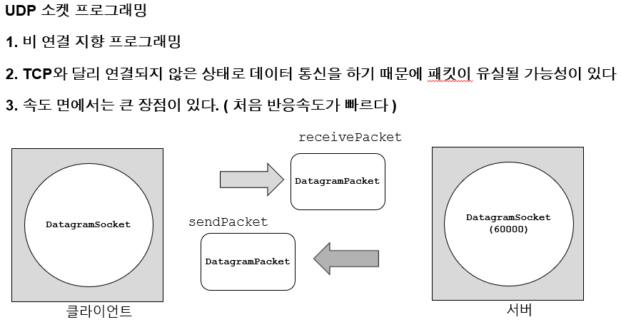
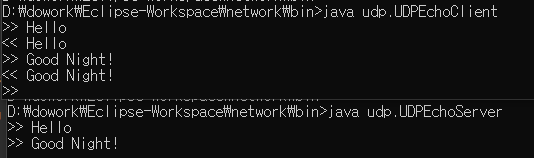
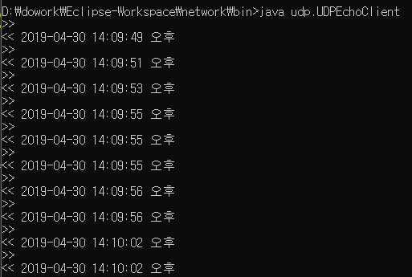

[TOC]

UDP Time Server 만들어보기! 

---



---

## UDP 서버

**udp/UDPEchoServer.java**

```java
package udp;

public class UDPEchoServer {

	public static final int PORT = 7000;
	public static final int BUFFER_SIZE = 1024;
	
	public static void main(String[] args) {
		DatagramSocket socket = null;
		try {
			// 1. socket 생성
			socket = new DatagramSocket(PORT);
			
			while(true) {
				// 2. 데이터 수신 
				DatagramPacket receivePacket = new DatagramPacket(new byte[BUFFER_SIZE], BUFFER_SIZE);
				socket.receive(receivePacket);
				
				byte[] data = receivePacket.getData();
				int length = receivePacket.getLength();
				String message = new String(data, 0, length, "UTF-8");
				
				System.out.println(">> " + message);
				
				// 3. 데이터 전송 
				byte[] sendData = message.getBytes("utf-8");
				DatagramPacket sendPacket = 
						new DatagramPacket(
								sendData, 
								sendData.length, 
								receivePacket.getAddress(), 
								receivePacket.getPort()
								);	
				socket.send(sendPacket);
			}
		} catch (SocketException e) {
			e.printStackTrace();
		} catch (IOException e){
			e.printStackTrace();
		}finally {
			if(socket != null & socket.isClosed()==false) {
				socket.close();
			}
		}

	}

}

```


**udp/UDPEchoClient.java**

```java
package udp;

public class UDPEchoClient {

	private static final String SERVER_IP = "192.168.1.12";
	private static final int SERVER_PORT = 7000;

	public static void main(String[] args) {

		Scanner scanner = null;
		DatagramSocket socket = null;

		try {
			// 1. Scanner 생성(표준입력 연결)
			scanner = new Scanner(System.in);
			// 2. socket 생성
			socket = new DatagramSocket();

			while (true) {
				// 3. 키보드 입력받기
				System.out.print(">> ");
				String line = scanner.nextLine();
				if ("quit".contentEquals(line)) {
					break;
				}

				// 4. 데이터 쓰기
				byte[] sendData = line.getBytes("utf-8");
				DatagramPacket sendPacket = 
						new DatagramPacket(
								sendData, 
								sendData.length, 
								new InetSocketAddress(SERVER_IP, UDPEchoServer.PORT)
								);	
				socket.send(sendPacket);

				// 5. 데이터 읽기
				DatagramPacket receivePacket = 
						new DatagramPacket(new byte[UDPEchoServer.BUFFER_SIZE], UDPEchoServer.BUFFER_SIZE);
				socket.receive(receivePacket);
				
				String message = new String(receivePacket.getData(), 0, receivePacket.getLength(), "utf-8");

				// 8. 콘솔 출력
				System.out.println("<< " + message);
			}

		} catch (IOException e) {
			e.printStackTrace();
		} finally {
			if (scanner != null) {
				scanner.close();
			}
			if (socket != null && socket.isClosed() == false) {
				socket.close();
			}
		}
	}

	public static void log(String log) {
		System.out.println("[client] " + log);
	}

}

```

> 


---

## UDPTimeClient 짜기

> 

**udp/UDPTimeServer.java**

```java
package udp;

public class UDPTimeServer {

	public static final int PORT = 7000;
	public static final int BUFFER_SIZE = 1024;
	
	public static void main(String[] args) {
		DatagramSocket socket = null;
		try {
			// 1. socket 생성
			socket = new DatagramSocket(PORT);
			
			while(true) {
				// 2. 데이터 수신 
				DatagramPacket receivePacket = new DatagramPacket(new byte[BUFFER_SIZE], BUFFER_SIZE);
				socket.receive(receivePacket);
				
				// 3. 데이터 전송 
				SimpleDateFormat format = new SimpleDateFormat( "yyyy-MM-dd HH:mm:ss a" );
				String date = format.format( new Date() );
				byte[] sendData = date.getBytes("utf-8");
				
				DatagramPacket sendPacket = 
						new DatagramPacket(
								sendData, 
								sendData.length, 
								receivePacket.getAddress(), 
								receivePacket.getPort()
								);	
				socket.send(sendPacket);
			}
		} catch (SocketException e) {
			e.printStackTrace();
		} catch (IOException e){
			e.printStackTrace();
		}finally {
			if(socket != null & socket.isClosed()==false) {
				socket.close();
			}
		}
	}
}
```

> 