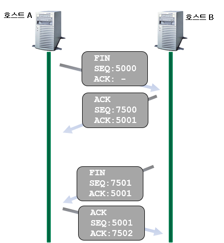
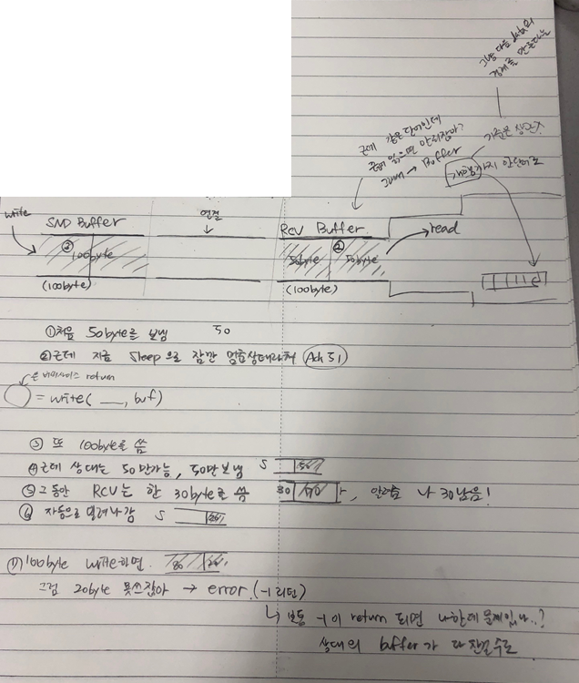

[TOC]

---

## TCP 연결 과정


- TCP 소켓 연결설정 과정에서 총 3번의 대화를 주고받음(3-Way HandShaking)

- 과정

  1. **[SYN]  SEQ:1000,  ACK:  - ** 

  - 연결 요청에 사용되는 메시지     
  - 동기화메시지(SYN)
  - “이패킷에 1000번이라는 번호를 부여하니, 잘 받으면  다음에1001번을 보내달라고 요청해라”

  

  2. **[SYN + ACK] SEQ:2000, ACK:1001**

  - 동기화 메세지(SYN) + 응답 메세지(ACK)
  - "이패킷에 2000번이라는 번호를 부여하니, 잘 받으면 다음에 2001번을 보내달라고 요청해라"
  - "요청한 1000번 패킷은 잘 받았으니 다음에는 SEQ가 1001인 패킷을 보내라"

  

  3. **[ACK] SEQ:1001, ACK:2001**

  - 응답 메세지(ACK)
  - "요청한 2000번 패킷은 잘 받았으니 다음에는 SEQ가 2001인 패킷을 보내라"

> 참고 : [TCP 네이글 알고리즘](<https://ozt88.tistory.com/18>)

---

## 연결종료



- 연결종료에서는  바로 뚝!끊지 않는다.  (우아한 종료)

- 상대방이 전송할 데이터가 남아 있을 지 모르니  상호간에 연결종료에 대한 합의과정을 거친다.

- 패킷 안에 FIN은 종료를 알리는 메시지를 뜻한다.

- 상호간에 FIN 메시지를 한 번씩 주고 받는다 (4-Way Handshaking)

---


---

## Sliding Window -> flow control


---

## 소켓 버퍼 사이즈 확인

base64



**test/TCPClient.java**

```java
// 1-1, 소켓 버퍼 사이즈 확인
int receiveBufferSize = socket.getReceiveBufferSize();
int sendBufferSize = socket.getSendBufferSize();
System.out.println(receiveBufferSize + " : " + sendBufferSize);
```

> ``` 
> 65536 : 65536
> ```

변경

```java
// 1-2, 소켓 버퍼 사이즈 변경
socket.setReceiveBufferSize(1024*10);
socket.setSendBufferSize(1024*10);
System.out.println(receiveBufferSize + " : " + sendBufferSize);
```


---

## TCP Close : 4 Way Hand-Shake 


> [출처](<https://simhyejin.github.io/2016/07/13/TIME-WAIT/>) 


## TIME_WAIT

- **Active Close** 즉, 먼저 `close()`를 요청한 곳에서 최종적으로 남게되며, 2 MSL 동안 유지된다.

> [참고](<http://docs.likejazz.com/time-wait/>)


**test/TCPServer.java**

```java
// 1-2. Time-Wait 시간에 소켓에 Port번호 할당을 가능하게 하기 위해서
serverSocket.setReuseAddress( true );

// ... 잠깐 sleep 넣기
// 6. 데이터 쓰기 
try {
    Thread.sleep(2000);
} catch (InterruptedException e) {
    e.printStackTrace();
}
    
```


### Nagle 알고리즘

ACK를 주고 받고 ..  끄기 + time out


**TCPClient.java**

```java
// 1-3, SO_NODELAY(Nagle Algorithm off)
socket.setTcpNoDelay( true );

// 1-4 SO_TIMEOUT
socket.setSoTimeout(1000);

...
} catch (SocketTimeoutException e) {
    System.out.println("[client] time out");	
} 
```

> 


