[TOC]

## maven dir

maven dir 구조

/network

​	|-/src

​		|-/main

​			|-/java

​				|- package (com.cafe24.network.http)

​						|- *.java (SimpleHttpServer.java)

​				|- package

​				|- package

​	|-/src/main/resources

​			|- echo/config/http.xml

​	|-pom.xml

---

> linux에선 maven설치하고 git으로 가져와서
>
> /mvn eclipse project
>
>  .jar파일 실행

---

- 컴파일은 어디서? /bin/com.cafe24.network.http/SimpleHttpServer.class
- resuources는 그대로 복사 /bin/http/config/http.xml


---

### Maven project 만들어보기

- New Project - Maven Project

> 
>
> 

> 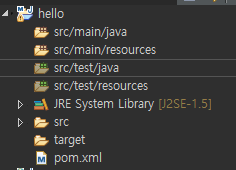

**pom.xml**

> library, build... 등 plugin
>
> maven mariadb connector/j  검색
>
> 이런식으로 하면 mariadb 다운! 

```xml
 <project xmlns="http://maven.apache.org/POM/4.0.0"
	xmlns:xsi="http://www.w3.org/2001/XMLSchema-instance"
	xsi:schemaLocation="http://maven.apache.org/POM/4.0.0 http://maven.apache.org/xsd/maven-4.0.0.xsd">
	<modelVersion>4.0.0</modelVersion>
	<groupId>com.cafe24</groupId>
	<artifactId>hello</artifactId>
	<version>0.0.1-SNAPSHOT</version>

	<dependencies>
		<!-- https://mvnrepository.com/artifact/org.mariadb.jdbc/mariadb-java-client -->
		<dependency>
			<groupId>org.mariadb.jdbc</groupId>
			<artifactId>mariadb-java-client</artifactId>
			<version>2.0.1</version>
		</dependency>
	</dependencies>
</project>
```

> 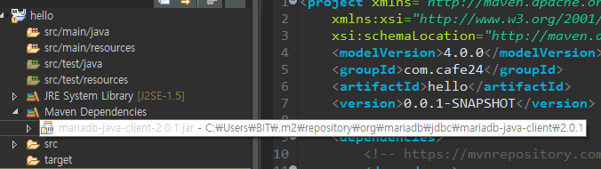

---


---

## 기존 프로젝트 maven으로


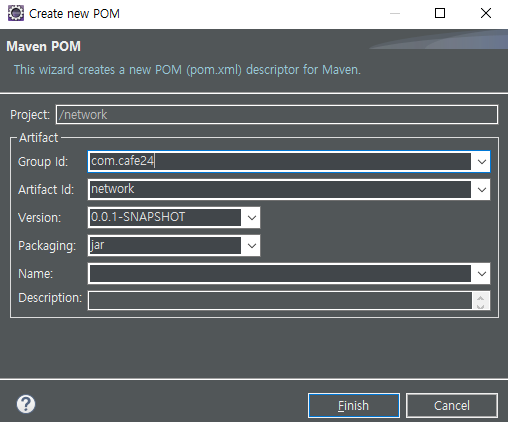

> 문제 ! : webapp도 jar안에 들어가야함!!

**pom.xml**

```xml
<project xmlns="http://maven.apache.org/POM/4.0.0"
	xmlns:xsi="http://www.w3.org/2001/XMLSchema-instance"
	xsi:schemaLocation="http://maven.apache.org/POM/4.0.0 http://maven.apache.org/xsd/maven-4.0.0.xsd">
	<modelVersion>4.0.0</modelVersion>
	<groupId>com.cafe24</groupId>
	<artifactId>network</artifactId>
	<version>0.0.1-SNAPSHOT</version>

	<properties>
		<project.build.sourceEncoding>UTF-8</project.build.sourceEncoding>
	</properties>

	<dependencies>
	</dependencies>

	<build>
		<sourceDirectory>src</sourceDirectory>
		<plugins>
			<plugin>
				<artifactId>maven-compiler-plugin</artifactId>
				<version>3.8.0</version>
				<configuration>
					<source>1.8</source>
					<target>1.8</target>
				</configuration>
			</plugin>
			<plugin>
				<groupId>org.apache.maven.plugins</groupId>
				<artifactId>maven-compiler-plugin</artifactId>
				<configuration>
					<source>1.8</source>
					<target>1.8</target>
				</configuration>
			</plugin>
		</plugins>
	</build>
</project> 
```

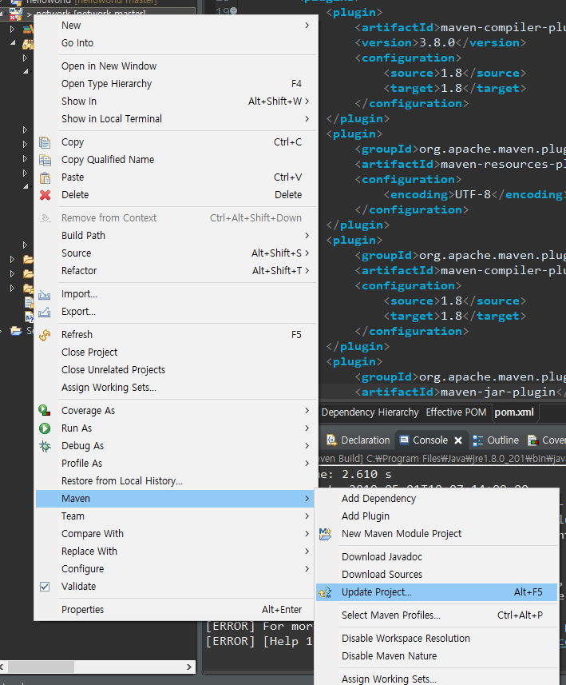

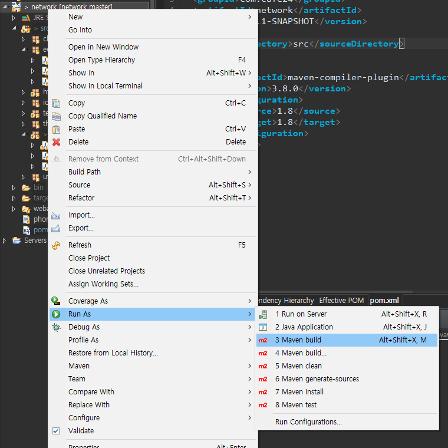

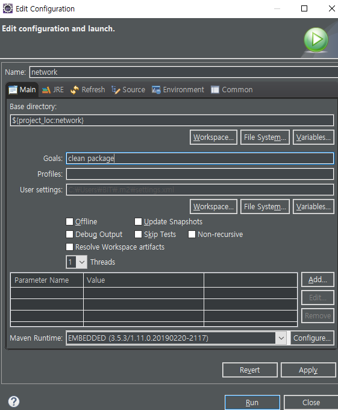

> > **error!** 
> >
> > - Java Build Path Libraries가 jdk가 아니라 jre를 쓰고있음
> >
> > 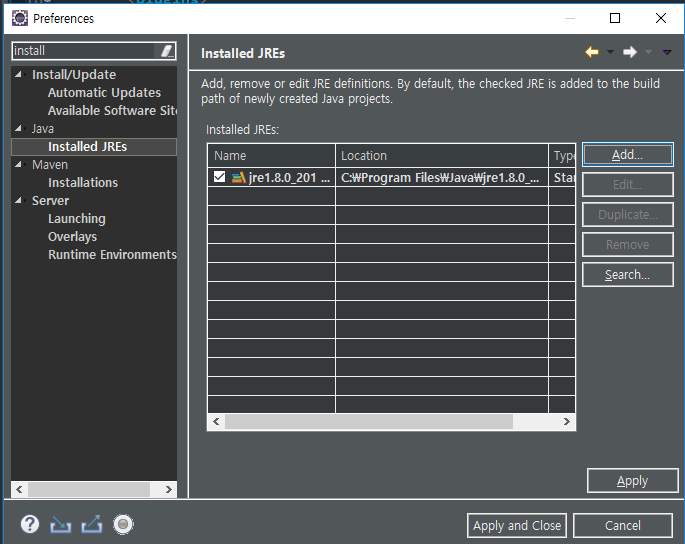
> >
> > > **jre - Edit!**
> > >
> > > 
> >
> > **그래도 error...** 문제가 뭘까..
> >
> > 이클립스 끄고 아래 지우고 다시 해보자!
> >
> > 
> >
> > **그래도 error....** 
> >
> > C:\Users\BIT\.m2\repository\org\apache\maven 지우기
> >
> > **그래도 error..**

## Maven Error 해결!

**pom.xml**

```xml
<project xmlns="http://maven.apache.org/POM/4.0.0"
	xmlns:xsi="http://www.w3.org/2001/XMLSchema-instance"
	xsi:schemaLocation="http://maven.apache.org/POM/4.0.0 http://maven.apache.org/xsd/maven-4.0.0.xsd">
	
	<modelVersion>4.0.0</modelVersion>
	<groupId>com.cafe24</groupId>
	<artifactId>network</artifactId>
	<version>0.0.1-SNAPSHOT</version>

	<properties>
		<project.build.sourceEncoding>UTF-8</project.build.sourceEncoding>
	</properties>

	<dependencies>
	</dependencies> 
 
 <build>
      <sourceDirectory>src</sourceDirectory>
      <plugins>
         <plugin>
            <groupId>org.apache.maven.plugins</groupId>
            <artifactId>maven-compiler-plugin</artifactId>
            <configuration>
               <source>1.8</source>
               <target>1.8</target>
            </configuration>
         </plugin>
      </plugins>
   </build>

</project> 
```

> > 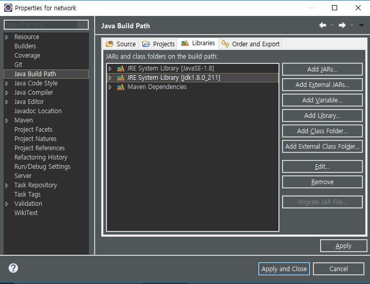
> >
> > > edit
> >
> > 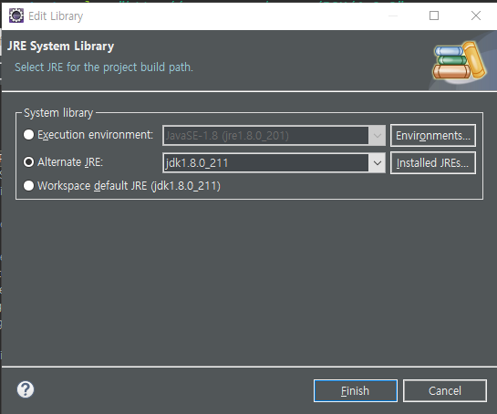
> >
> > > installed JREs
> >
> > 
> >
> > > search  -> C:\Program Files\Java\jdk1.8.0_211 추가 후 check!!!
> >
> > 
> >
> > 다시 build!!!!
> >
> > > 
> > >
> > > 성공~

### 정 안되면 m2-repository 붙여넣기하자

---

임베디드 톰캣. 

jar파일 확인해보기

> D:\dowork\Eclipse-Workspace\network\target

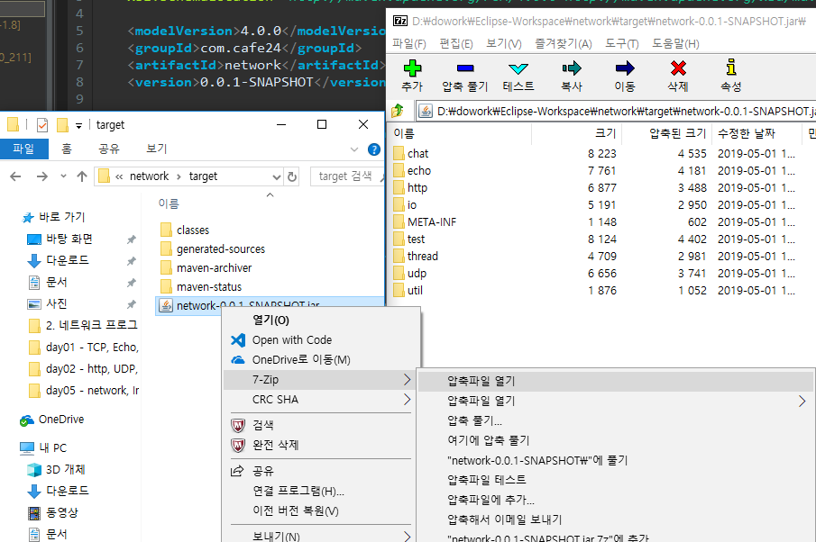

---


## webapp -> resources

-> resources/ webapp로 옮긴 뒤


> 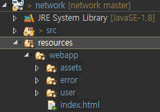

> 근데 이러면 maven엔 문제 없는데 이클립스에서 문제ㅣ 있으니까 다시 ** 삭제!
>
> 

---

**pom.xml** 추가

```xml
		<resources>
			<resource>
				<directory>${project.basedir}/resources</directory>
				<excludes>
					<exclude>**/*.java</exclude>
				</excludes>
			</resource>
		</resources>
```

```xml
			<plugin>
				<groupId>org.apache.maven.plugins</groupId>
				<artifactId>maven-resources-plugin</artifactId>
				<configuration>
					<encoding>UTF-8</encoding>
				</configuration>
			</plugin>
```

> 다시 build하면
>
> 
>
> 에 webapp가 생김!

---

## eclipse의 sever가 안됨!

> 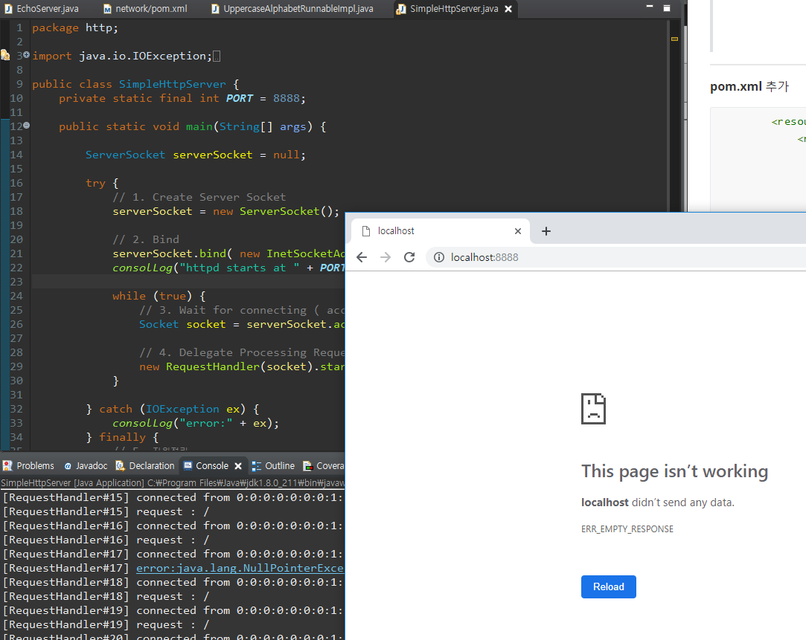


**http/RequestHandler.java**

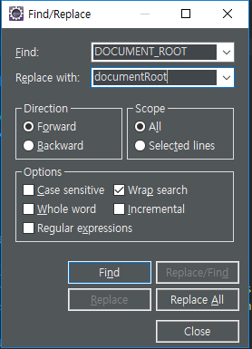

```java
	private static String documentRoot = "";
	static {
		try {
			documentRoot = new File(RequestHandler.class.getProtectionDomain().
					getCodeSource().getLocation().toURI()).getPath();
			
		} catch (URISyntaxException e) {
			e.printStackTrace();
		}	
	}
```

> SimpleHttpServer 실행!

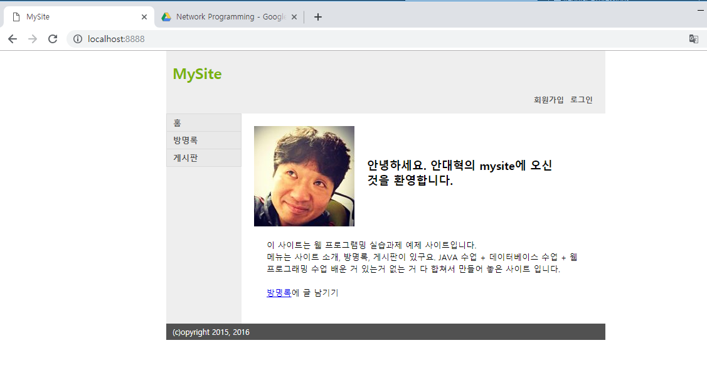

---

## github에서 eclipse

Maven - build  ---> .jar

java run time - D:\dowork\Eclipse-Workspace\network\target\classes


## github에서 linux

**1** /dowork/에서 `git clone`하면

/dowork/network/src

/dowork/network/resources

/dowork/network/pom.xml

**2** `mvn clean package`

---


cmd 에서 서버 띄우기

`D:\dowork\Eclipse-Workspace\network>java -cp target\network-0.0.1-SNAPSHOT.jar`

> 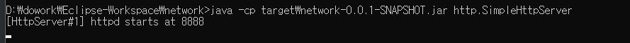

> 실행 안됨
>
> 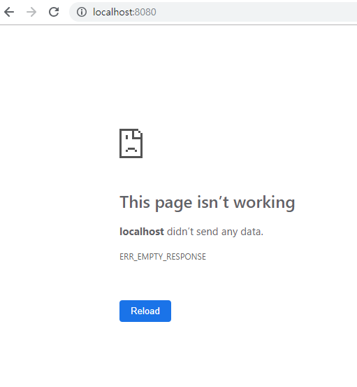
>
> > 실행 위치가 다르기 때문에(?)
> >
> > eclipse에선 띄어짐

**linux - Jenkins**

InputStream is = getClass().getResourceAs

---

**D:\cafe24 수업\강의자료\실습및과제\tomcat\TDD_CI(JUnit_Git_CI).ppt**

## linux에 Maven 설치

`wget http://apache.mirror.cdnetworks.com/maven/maven-3/3.3.9/binaries/apache-maven-3.3.9-bin.tar.gz`

`tar xvfz apache-maven-3.3.9-bin.tar.gz `

`mv apache-maven-3.3.9 /usr/local/cafe24/`

`cd /usr/local/cafe24/`

`mv apache-maven-3.3.9/ maven3.3.9`

`ln -s maven3.3.9/ maven`

`vi /etc/profile`


`source /etc/profile`

`mvn --version`

`cd`

`cd dowork/`

`git clone https://github.com/jungeunlee95/network.git`

`cd network`

`mvn package`


---

-- network에 target 

`mvn clean package`

--> cd 에 .m2폴더 생김!

**서버 실행**

> > linux port 방화벽 풀기
>
> `vi /etc/sysconfig/iptable`
>
> `/etc/init.d/iptables stop`
>
> `/etc/init.d/iptables start`

`# java -cp target/network-0.0.1-SNAPSHOT.jar echo.EchoServer`

> 이건 됨! eclipse의 EchoClient로 들어가면 
>
> 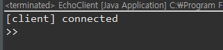


> 이건 에러남! 왜냐면 SImpleHttpServer의 webapp가 jar로 압축돼서 묶여있잖아?
>
> 그래서 볼 수 없는 거야!!


---


MVN Simple project

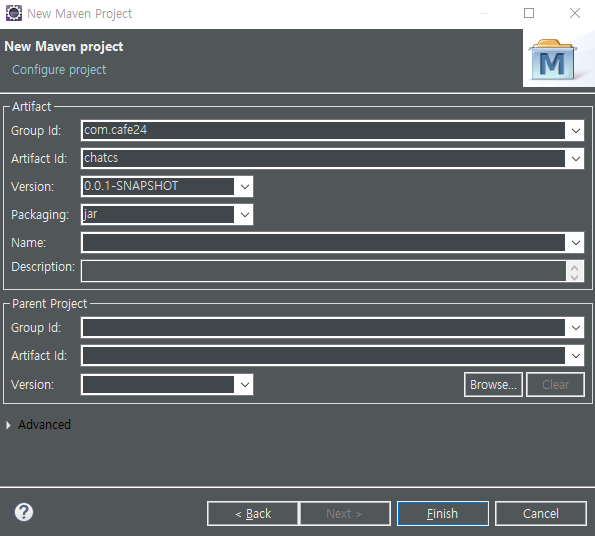

> 채팅 실행
>
> > ChatClient, ChatClientThread
> >
> > CharServer, CharServerThread
>
> cd dowork\Eclipse-Workspace\network\target\classes
>
> 

