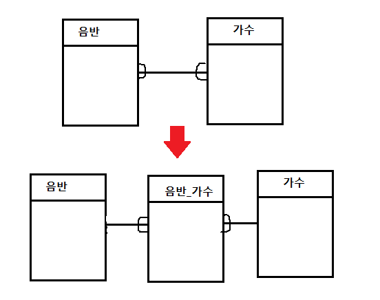

[TOC]

---

# DB

## 데이터 베이스 관리 시스템 [DBMS]

**1) 실시간 접근성(Real-time Accessability)**

​    사용자의 요구를 즉시 처리할 수 있다.

**2) 계속적인 변화(Continuous Evolution)**

​    정확한 값을 유지하려고 삽입·삭제·수정 작업 등을 이용해 데이터를 지속적으로 갱신할 수 있다.

**3) 동시 공유성(Concurrent Sharing)**

​     사용자마다 서로 다른 목적으로 사용하므로 동시에 여러 사람이 동일한 데이터에 접근하고 이용할 수 있다.

**4) 내용 참조(Content Reference)**

​    저장한 데이터 레코드의 위치나 주소가 아닌 사용자가 요구하는 데이터의 내용, 즉 데이터 값에 따라 참조할 수 있어야 한다.

- DDL(데이터 구조 생성, 변경, 삭제 등의 기능) 

  - `CREATE`
  - `DROP`
  - `ALTER`
  - `RENAME`

- DML(데이터 조작어로 검색, 수정을 위한 )

  > `CRUD`  :  R이 가장 중요 

  - `SELECT`
  - `INSERT`
  - `UPDATE`
  - `DELETE`
  - `MERGE`
  - join 필수 중요! 

- DCL(데이터에 대한 권한 관리 및 트랜잭션 제어)

  - `GRANT`
  - `REVOKE`

---

## DBMS 장점

-> 무결성 유지 : 참조하는 데이터가 있으면 삭제하면 안됨! 

-> 데이터 중복 최소화

-> 데이터 보안 보장

> 단점 
>
> - 비쌈
> - 백업 복구 관리 복잡
> - 부분 데이터 손실이 전체 시스템을 정지

---

## RDB = 관계형 데이터 베이스

-> 중복성없이 데이터를 잘 조직화 시키는 것이 주 목표 : 정확성!!!

-> 느릴 수 밖에 없음(하나의 테이블에서 가져올 수 있는걸 조인, 서브쿼리 등을 이용하기에)

- 키와 값들의 간단한 관계를  테이블화 시킨 매우 간단한 원칙의 개념의 데이터베이스

- 일련의 정형화된 테이블로 구성된 데이터 항목들의 집합이며 각 테이블은 데이터의 성격에 따라 여러 개의 컬럼(키)이 포함된다.      

- 사용자는 SQL이라는 표준 질의어를 통해 데이터를 조작 또는 조회 할 수 있다.

## OODB = 객체 지향 데이터 베이스

- 정보를 객체의 형태로 표현하는 데이터베이스

- 객체 모델이 그대로 데이터베이스에도 적용되어 데이터 모델을 그대로 응용프로그램 에 적용,  데이터 변환과 질의 작업이 필요치 않은 장점

## ORDB = 객체 관계형 데이터 베이스

- 관계형 데이터베이스에서 사용하는 데이터를 확장

- 관계형 데이터베이스를 객체 지향 모델링과 데이터를 관리하는 기능을 갖도록 확장한 것 

## NoSQL

- 대용량 데이터의 웹 서비스와 SNS, 클라우드 컴퓨팅의 확대 보급과 대중화로  최근 주목 받는 데이터베이스 기술 

---

# 논리적 데이터 모델링 & 물리적 데이터 베이스

> **ERD - Entity-Relationship Diagram**

## 정규화 ERD

> 엔티티에는 꼭  각각의 데이터를 구별할 수 있는 구분키를 넣어주는 것이 좋음!
>
>  --- > PK 

이번엔 제 1정규화, 2정규화만 알아보고 다음 데이터베이스 시간에 더 알아보기로 ...

### 제 1 정규화

> 엔티티에서 하나의 속성이 복수개의 값을 가지고 있음
>
> -> 하나의 속성이 단일 값을 가지도록 설계를 변경해야함!

혹은 새로운 엔티티를 추가

**제 2정규화**

-> PK가 아닌 속성 중, 주식별자에 종속적이지 않은 컬럼

> 

---

### 엔티티 간 多:多 관계

둘의 공통 테이블 (ex: 노래)를 찾거나, 중간 테이블을 만들어줌

### 1:1 관계일 경우

> A B 테이블이 1:1 관계일 경우 B가 A의 속성일 경우가 있고, 엔티티를 나누지 않아도 됐을 확률이 높으니 확인해보자!

다만 꼭 필요한 경우

ex)

>  사용자 - 블로그

