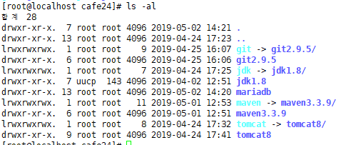
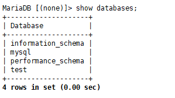
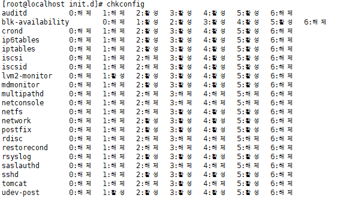
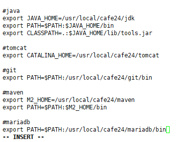
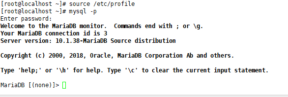

[TOC]


## 들어가기 전 ....


- Execution Plan : SQL 관계형 데이터 베이스 관리 시스템의 데이터 접근에사용되는 순서가 있는 단계별 집합이다.

  **쿼리가 데이터 베이스에 제출되면** 

- Query Optimizer : 쿼리 실행을 위한 각기 다른 가능성 있는 올바른 플랜중 일부를 평가한 다음, 최적의 옵션을 고려할 때 반환.

  - 쿼리 옵티마이저가 불완전 하기 때문에 데이터베이스 사용자와 관리자들은 더 나은 성능을 얻기 위해 옵티마이저가 만들어내는 플랜을 수동으로 검사하고 튜닝해야 하는 경우가 있다!

---

# MariaDB

- 오픈소스

- MySQL과 공통점

  - > 호환 ? 데이터파일, 프로토콜 등이 같은 것

  - 데이터 파일 호환

  - 실행프로그램, 유틸리티 이름이 동일하며 호환

  - 모든 클라이언트 API 프로토콜 호환

  - 파일,포트,경로가 동일

  - MySQL Connector 모두 변경 없이 사용 가능

  - 클라이언트 프로그램을 변경없이 사용 가능

- MySQL과 차이점

  - 라이선스
  - 옵티마이저(조인,서브쿼리,임시테이블&뷰, 디스크읽기,쓰기) 차이
  - 내부 스토리지 엔진(메모리스토리지 ... )에서 MariaDB 10.x부터 차이를 보임


# Linux에 mariaDB설치

**의존 라이브러리 및 유틸리티 설치**

`# yum install -y gcc gcc-c++ libtermcap-devel gdbm-devel zlib* libxml* freetype* libpng* libjpeg* iconv flex gmp ncurses-devel cmake.x86_64 libaio`


**계정생성**

`# groupadd mysql`

`# useradd -M -g mysql mysql`


**소스받기**

```shell
# wget https://downloads.mariadb.org/interstitial/mariadb-10.1.38/source/mariadb-10.1.38.tar.gz 
# tar xvfz mariadb-10.1.38.tar.gz 
# cd mariadb-10.1.38
```


**컴파일 환경 설정**

`\` : 계속 연결해서 쓰겠다!  공백 있으면 안돼

혹시 잘못했으면 지우고 다시 `# rm -f CMakeCache.txt`

```shell
# cmake -DCMAKE_INSTALL_PREFIX=/usr/local/cafe24/mariadb -DMYSQL_USER=mysql -DMYSQL_TCP_PORT=3307 -DMYSQL_DATADIR=/usr/local/cafe24/mariadb/data -DMYSQL_UNIX_ADDR=/usr/local/cafe24/mariadb/tmp/mariadb.sock -DINSTALL_SYSCONFDIR=/usr/local/cafe24/mariadb/etc -DINSTALL_SYSCONF2DIR=/usr/local/cafe24/mariadb/etc/my.cnf.d -DDEFAULT_CHARSET=utf8 -DDEFAULT_COLLATION=utf8_general_ci -DWITH_EXTRA_CHARSETS=all -DWITH_ARIA_STORAGE_ENGINE=1 -DWITH_XTRADB_STORAGE_ENGINE=1 -DWITH_ARCHIVE_STORAGE_ENGINE=1 -DWITH_INNOBASE_STORAGE_ENGINE=1 -DWITH_PARTITION_STORAGE_ENGINE=1 -DWITH_BLACKHOLE_STORAGE_ENGINE=1 -DWITH_FEDERATEDX_STORAGE_ENGINE=1 -DWITH_PERFSCHEMA_STORAGE_ENGINE=1 -DWITH_READLINE=1 -DWITH_SSL=bundled -DWITH_ZLIB=system
```


**컴파일 및 설치**

`# make && make install`

`# cd /usr/local/cafe24`

> 


**설치 디렉토리 권한 변경**

`# cd `

`# chown -R mysql:mysql /usr/local/cafe24/mariadb/`


**위치 설정**

`# cp -R /usr/local/cafe24/mariadb/etc/my.cnf.d/ /etc`


**기본 데이터베이스 생성**

```shell
# /usr/local/cafe24/mariadb/scripts/mysql_install_db --user=mysql --basedir=/usr/local/cafe24/mariadb/ --defaults-file=/usr/local/cafe24/mariadb/etc/my.cnf --datadir=/usr/local/cafe24/mariadb/data
```


**tmp 디렉토리 생성**

```shell
# mkdir /usr/local/cafe24/mariadb/tmp
# chown mysql:mysql /usr/local/cafe24/mariadb/tmp
```


**서버 구동**

`# /usr/local/cafe24/mariadb/bin/mysqld_safe &`


**root 패스워드 설정**

`# /usr/local/cafe24/mariadb/bin/mysqladmin -u root password '비밀번호'`


**데이터 베이스 접속**  -> 아직 안됨! path설정 안함

`# mysql -u -D -p`   

> -u : 유저
>
> -D : 데이터베이스
>
> -p : 패스워드

**root 접속**

`# /usr/local/cafe24/mariadb/bin/mysql -p`

> **접속 성공!**
>
> 

> 


**MariaDB [mysql]**

```mysql
MariaDB [(none)]> use mysql
Reading table information for completion of table and column names
You can turn off this feature to get a quicker startup with -A

Database changed
MariaDB [mysql]> show tables;
+---------------------------+
| Tables_in_mysql           |
+---------------------------+
| column_stats              |
| columns_priv              |
| db                        |
| event                     |
| func                      |
| general_log               |
| gtid_slave_pos            |
| help_category             |
| help_keyword              |
| help_relation             |
| help_topic                |
| host                      |
| index_stats               |
| innodb_index_stats        |
| innodb_table_stats        |
| plugin                    |
| proc                      |
| procs_priv                |
| proxies_priv              |
| roles_mapping             |
| servers                   |
| slow_log                  |
| table_stats               |
| tables_priv               |
| time_zone                 |
| time_zone_leap_second     |
| time_zone_name            |
| time_zone_transition      |
| time_zone_transition_type |
| user                      |
+---------------------------+
30 rows in set (0.00 sec)

MariaDB [mysql]> select * from user;
     유저정보 
     
MariaDB [mysql]> select version();
+-----------------+
| version()       |
+-----------------+
| 10.1.38-MariaDB |
+-----------------+
1 row in set (0.00 sec)

MariaDB [mysql]> quit
Bye
[root@localhost ~]# 
```


---


`[root@localhost ~]# cp /usr/local/cafe24/mariadb/support-files/mysql.server /etc/init.d/mariadb`

`chkconfig`

> 활성화
>
> 
>
> `# chkconfig mariadb on`
>
> 


**path설정**

`vi /etc/profile`

> 


다시 접속해보기!

> 

`use mysql;`

`show tables;`

