[TOC]

---

employees 데이터 restor

---

### 쿼리 파싱 순서 : 

`SELECT ` 	: 4

​	`FROM` 	: 1

​	`WHERE`   : 2

`ORDER BY`  : 3 임시테이블 생성  : 모든 쿼리의 맨 마지막!

`LIMIT`   

---

# MariaDB 연습

### `mysql -p`  :  **접속**


> 


### **여러 쿼리 한번에 실행**

> 


### **취소 : `\c**`

> 


### **데이터 베이스 만들기**

`create database webdb`

> 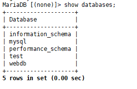


### `use webdb` **webdb사용!**

> 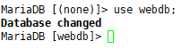


### **테이블 만들기**

> 


### **스키마 보기**

`describe pet`

`desc pet`

> 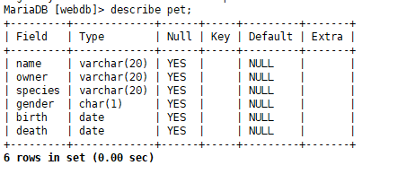


### **테이블 삭제해보기** 

> 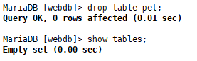


### **데이터 넣기**

`MariaDB [webdb]> insert into pet values('또리', '이정은', '말티즈', 'm', '2009-05-29', null);`

> 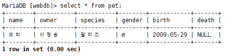


#### **파일 데이터를 넣어보기**

> 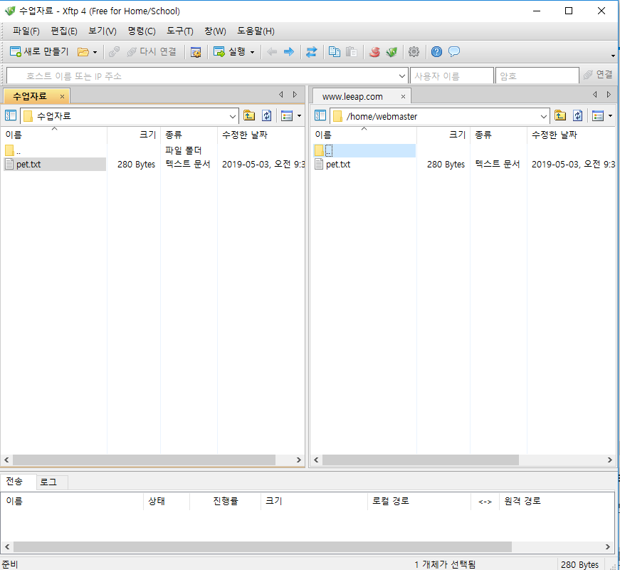

`load data local infile '/home/webmaster/pet.txt' into table pet;`

> 


### **select 연습**

```mysql
MariaDB [webdb]> select * from pet where birth >= '2018-11-11';
Empty set (0.00 sec)

MariaDB [webdb]> select * from pet where birth >= '2008-11-11';
+--------+-----------+---------+--------+------------+-------+
| name   | owner     | species | gender | birth      | death |
+--------+-----------+---------+--------+------------+-------+
| 또리   | 이정은    | dog     | m      | 2009-05-29 | NULL  |
+--------+-----------+---------+--------+------------+-------+
1 row in set (0.00 sec)

MariaDB [webdb]> select * from pet where birth >= '1990-11-11';
+----------+-----------+---------+--------+------------+------------+
| name     | owner     | species | gender | birth      | death      |
+----------+-----------+---------+--------+------------+------------+
| 또리     | 이정은    | dog     | m      | 2009-05-29 | NULL       |
| Fluffy   | Harold    | cat     | f      | 1993-02-04 | 0000-00-00 |
| Claws    | Gwen      | cat     | m      | 1994-03-17 | 0000-00-00 |
| Chirpy   | Gwen      | bird    | f      | 1998-09-11 | 0000-00-00 |
| Whistler | Gwen      | bird    | NULL   | 1997-12-09 | 0000-00-00 |
| Slim     | Benny     | snake   | m      | 1996-04-29 | 0000-00-00 |
+----------+-----------+---------+--------+------------+------------+
6 rows in set (0.00 sec)

MariaDB [webdb]> select * from pet where birth >= '1990-11-11' and owner='gwen';
+----------+-------+---------+--------+------------+------------+
| name     | owner | species | gender | birth      | death      |
+----------+-------+---------+--------+------------+------------+
| Claws    | Gwen  | cat     | m      | 1994-03-17 | 0000-00-00 |
| Chirpy   | Gwen  | bird    | f      | 1998-09-11 | 0000-00-00 |
| Whistler | Gwen  | bird    | NULL   | 1997-12-09 | 0000-00-00 |
+----------+-------+---------+--------+------------+------------+
3 rows in set (0.00 sec)

MariaDB [webdb]> select name, species from pet where birth >= '1990-11-11' and owner='gwen';
+----------+---------+
| name     | species |
+----------+---------+
| Claws    | cat     |
| Chirpy   | bird    |
| Whistler | bird    |
+----------+---------+
3 rows in set (0.00 sec)

```


### **order by**

```mysql
MariaDB [webdb]> select name, birth from pet order by birth asc;
+----------+------------+
| name     | birth      |
+----------+------------+
| Bowser   | 1979-08-31 |
| Buffy    | 1989-05-13 |
| Fang     | 1990-08-27 |
| Fluffy   | 1993-02-04 |
| Claws    | 1994-03-17 |
| Slim     | 1996-04-29 |
| Whistler | 1997-12-09 |
| Chirpy   | 1998-09-11 |
| 또리     | 2009-05-29 |
+----------+------------+
9 rows in set (0.00 sec)

```

`MariaDB [webdb]> select name, birth from pet order by birth desc, name asc;`

> 만약 생일이 같으면 이름으로 정렬해라~


### **Null 다루기**

-> is null

-> is not null

```mysql
MariaDB [webdb]> select name from pet where death is null;
+--------+
| name   |
+--------+
| 또리   |
+--------+
```


### **패턴매칭** 

%w% : 중간에 w

b%  : b로시작

%b : b로 끝나는애

`a_` : a로시작하는 두글자

```mysql
MariaDB [webdb]> select name from pet where name like 'b%';
+--------+
| name   |
+--------+
| Buffy  |
| Bowser |
+--------+

MariaDB [webdb]> select name from pet where name like 'b_____';
+--------+
| name   |
+--------+
| Bowser |
+--------+

```


### **count**

```mysql
MariaDB [webdb]> select count(*) from pet;
+----------+
| count(*) |
+----------+
|        9 |
+----------+

MariaDB [webdb]> select count(gender) from pet;   -> null은 빠짐!!
+---------------+
| count(gender) |
+---------------+
|             8 |
+---------------+

```


---

### **Oracle에서 학습용으로 제공한 dump 데이터 가져오기**

**employees** 데이터 가져오기

> 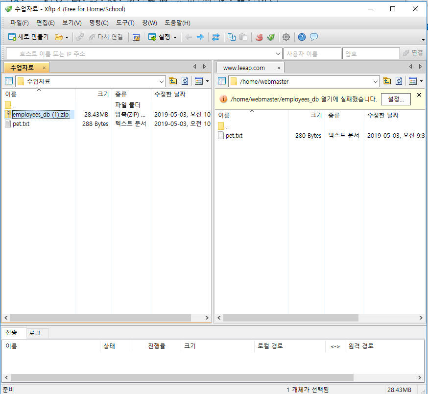

새로운 창에서

`# mv /home/webmaster/employees_db\ \(1\).zip /root/`

`# yum -y install unzip`   : zip 풀 라이브러리 다운!

`# unzip employees_db\ \(1\).zip `

`# cd employees_db`

`# mysql -p < employees.sql`

```mysql
MariaDB [webdb]> show databases
    -> ;
+--------------------+
| Database           |
+--------------------+
| employees          |
| information_schema |
| mysql              |
| performance_schema |
| test               |
| webdb              |
+--------------------+

MariaDB [webdb]> use employees;
Reading table information for completion of table and column names
You can turn off this feature to get a quicker startup with -A

Database changed
MariaDB [employees]> show tables;
+---------------------+
| Tables_in_employees |
+---------------------+
| departments         |
| dept_emp            |
| dept_manager        |
| employees           |
| salaries            |
| titles              |
+---------------------+
6 rows in set (0.00 sec)

MariaDB [employees]> select count(*) from employees;
+----------+
| count(*) |
+----------+
|   300024 |
+----------+
1 row in set (0.12 sec)

```


## 데이터베이스 접근

**외부에서 mysql로 접근**

> 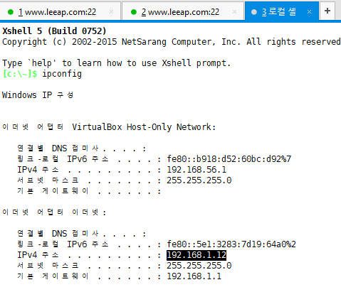
>
> 외부에서 접근
>
> 192.168.1.12에서 접근하는 사용자
>
> `hr @192.168.1.12`


> 내부에서 접근
>
> `hr @localhost`


> 외부에서 (팀프로젝트시) 여러명이 접근해야 할 경우?
>
> `hr @192.168.1.%`


`# vi /etc/sysconfig/iptables`

> 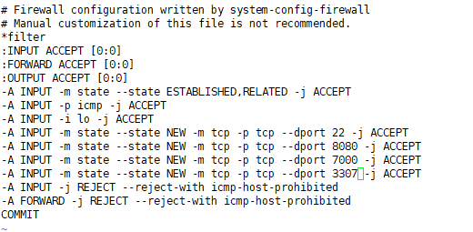

`# /etc/init.d/iptables stop`

`# /etc/init.d/iptables start`


**됐나 찔러보자**

`telnet 3307`


### hr 계정 생성

생성은 반드시 admin에서! `mysql -p`

#### 1 로컬

**로컬 접근 계정**  

> `create user 'hr'@'localhost' identified by 'hr';`
>
> ​                               -->  id                                                     --> pw
>
> 유저 지울 때 :
>
>  `drop user 'hr'@'localhost';`

**권한부여**

>`grant all privileges on employees.* to 'hr'@'localhost';`
>
>`flush privileges;`

**hr로 접근하기**

>`exit` :  db 나오고
>
>`mysql -u hr -D employees -p`
>
>> 비번 : hr

```mysql

```


#### 2 ip

**192.168.* 에서 접근하는 hr 계정**  -> 노트북을 위해! 데탑은 `192.168.1.*` << 해당 ip로 해도됨

> `create user 'hr'@'192.168.%' identified by 'hr';`

**권한부여**

> `grant all privileges on employees.* to 'hr'@'192.168.%'`


### 1번째 workbench 다운

<https://dev.mysql.com/downloads/file/?id=485462>


> store in vault ...   --> hr
>
> **test connection**


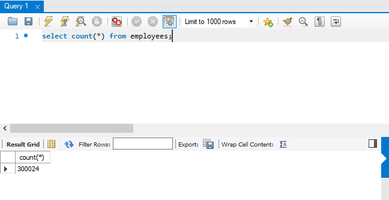

---

#### 2 번째 workbench

<https://www.upscene.com/downloads/dbw>


> **위에 둘 중 원하는 workbench 하나 쓰면 됨!!**
>
> 1번째 워크벤치로!!

---

---


### MySQL Workbench 사용

`select * from employees limit 0, 10;`   : 0개부터 10개까지

> 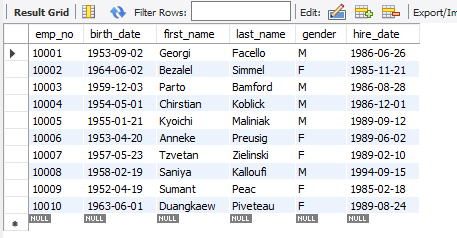


> 스키마 분석
>
> 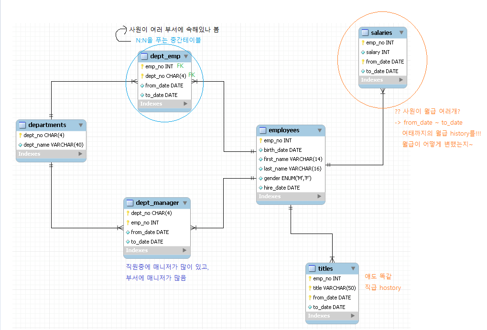


