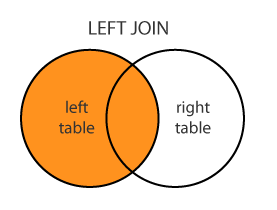
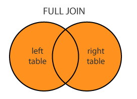

[TOC]

---

# 조인

## 조인의 개념

- 하나 이상의 테이블로부터 연관된 데이터를 검색해 오는 방법

- PK와 FK값의 연관에 의해 JOIN 성립 ( 논리적인 값들의 연관만으로도 성립 가능 )

- 조인의 유형

  - equi join : `=` 연산자,  ( inner join )

  - inner join : 조인 조건을 만족하는 행에 대해서만 결과값이 나옴

  - outer join : 조인 조건을 만족하지 않아도 출력이 가능해야하는 겨로가를 얻을 수 있음

    > left, right, both


### equi join

>  컬럼에 있는 값이 정확하게 일치하는 경우에 `=` 연산자를 사용하여 JOIN


### inner join

- equi join = join on  : 둘의 사용법은 같음 

> ```mysql
> -- join on
> SELECT  a.emp_no,	
>         CONCAT(a.last_name, ' ' , a.first_name) AS name, 		
>         b.title  
> FROM employees a
> JOIN titles b ON (  a.emp_no = b.emp_no  )
> WHERE a.gender = 'f'  
> AND b.title = 'Engineer' ;
> 
> -- natural join   >> 쓸 일 없 음 ! ! ! 
> -- 두 테이블에 공통 칼럼이 있는 경우 별다른 `where`조인 조건 없이 묵시적으로 조인됨
> FROM salaries a 
> JOIN titles b
> -- IN a.emp_no = b.emp_no;   << 생략 가능
> 
> -- using
> FROM salaries a 
> JOIN titles b
> USING emp_no
> ```


### outer join



> **A LEFT OUTER JOIN B 할 경우 A,B 테이블간 조인 조건이 맞지 않는 A와B 테이블의 레코드 중 A테이블 레코드는 무조건 결과값에 포함되어 나오는 것입니다. 왼쪽 테이블은 무조건 나오는 것**


> **A RIGHT OUTER JOIN B 할 경우 A,B 테이블간 조인 조건이 맞지 않는 A와B 테이블의 레코드 중 B테이블 레코드는 무조건 결과값에 포함되어 나오는 것입니다. 오른쪽 테이블은 무조건 나오는 것**



> BOTH 
>
> **A FULL OUTER JOIN B 할 경우 A 기준 LEFT OUTER JOIN 결과와 B 기준 RIGHT OUTER JOIN 2개의 결과를 합친 결과가 나옴**

---


---

## 조인 순서

```mysql
SELECT 
FROM A a, B b
WHERE a.no = b.no
AND
GROUP BY
HAVING
```

> `WHERE` 조인 조건에 맞는 데이터를 모아서
>
> 다른 `AND` 조건이 있으면 그 조건에 따라 데이터를 뽑아
>
> `GROUP BY`해서 테이블을 만들어서
>
> `HAVING` 조건으로 데이터를 뽑음

---


## 연습1

```mysql
-- equi join
-- employees 테이블과 titles 테이블을 join하여 
-- 직원의 이름과 직책을 모두출력하되 여성 엔지니어만 출력
select e.first_name, t.title
from employees e, titles t
where e.emp_no = t.emp_no
and e.gender = 'f';


-- ANSI/ISO SQL 1999 join 문법
-- join ~ on
select a.first_name, b.title, a.gender
from employees a
join titles b 
on a.emp_no = b.emp_no
where a.gender = 'f';

-- natural join
select a.first_name, b.title, a.gender
from employees a
join titles b 
where a.gender = 'f';

-- join ~ using
select a.first_name, b.title, a.gender
from employees a
join titles b 
using (emp_no)
where a.gender = 'f';
```


## 연습2

```mysql
-- 실습문제 1:  현재 회사 상황을 반영한 직원별 근무부서를  
-- 사번, 직원 전체이름, 근무부서 형태로 출력해 보세요.
select a.emp_no, concat(a.first_name, ' ', a.last_name), c.dept_name
  from employees a, dept_emp b, departments c
where a.emp_no = b.emp_no
and b.dept_no = c.dept_no
and to_date = '9999-01-01';

-- left 조인
select concat(a.first_name, ' ', a.last_name), c.dept_name
  from employees a
  left join dept_emp b on a.emp_no = b.emp_no
  join departments c on b.dept_no = c.dept_no
where b.dept_no = c.dept_no
and to_date = '9999-01-01';

-- 실습문제 2:  현재 회사에서 지급되고 있는 급여체계를 반영한 결과를 출력하세요.
-- 사번,  전체이름, 연봉  이런 형태로 출력하세요.    
select a.emp_no, concat(a.first_name, ' ', a.last_name), b.salary
from employees a, salaries b
where a.emp_no = b.emp_no
and b.to_date = '9999-01-01';
```


