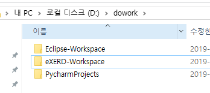
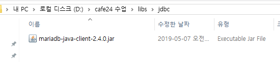
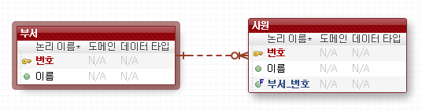
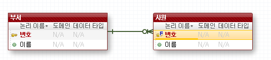
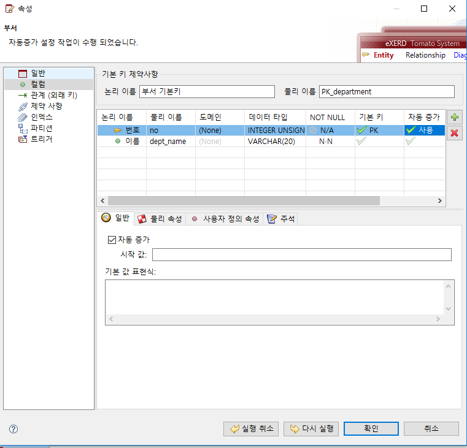
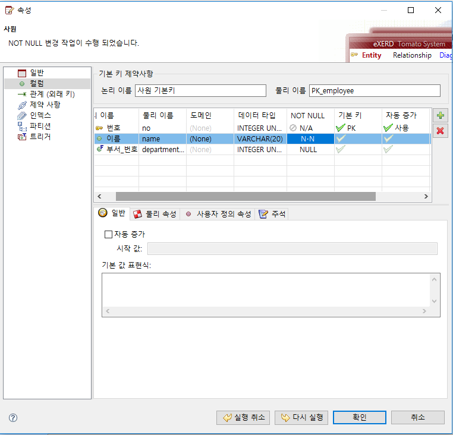
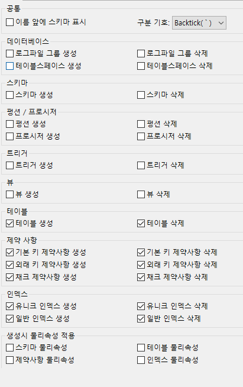
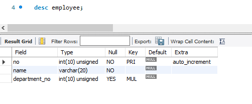
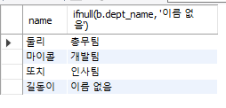
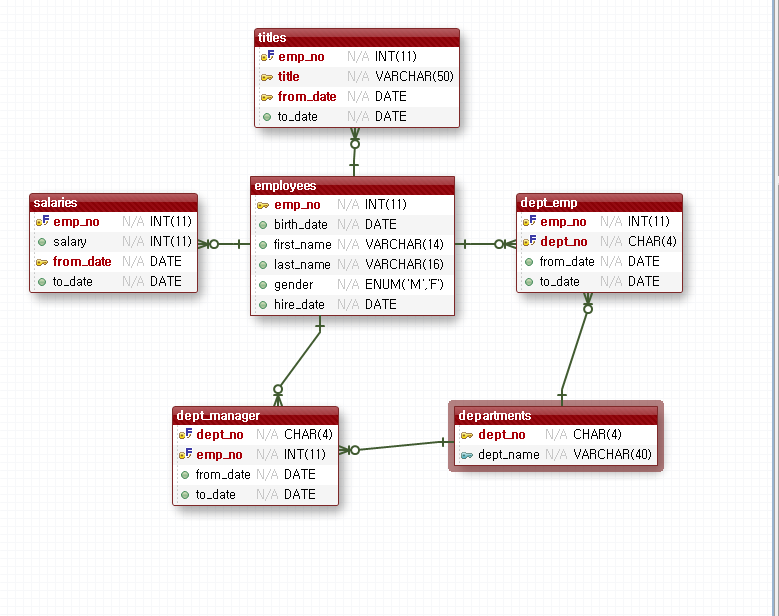

[TOC]

---

# eXERD다운


# mariadb connector 다운

<https://downloads.mariadb.com/Connectors/java/connector-java-2.4.0/>


---





---


## webdb 계정 만들기

`mysql -p`

`create user 'webdb'@'192.168.%' identified by 'webdb';`

`grant all privileges on webdb.* to 'webdb'@'192.168.%' ;`

`flush privileges;`

`exit`


---

## webdb schema 만들기

#### 비식별관계



> 부서 번호를 주키로 안쓰겠당

#### 식별관계



> FK이자 PK, 1:1 관계


---

#### 특성 설정






##  포워드 - DDL 생성




### JDBC 드라이버 선택


#### mysql workbench에서 확인




---


---

## **join 확인 **

### 데이터넣기

```mysql
select * from employee;
select * from department;

-- outer join 
insert into department values(null, '총무팀');
insert into department values(null, '개발팀');
insert into department values(null, '인사팀');
insert into department values(null, '영업팀');

select * from department;

insert into employee values(null, '둘리', 1);
insert into employee values(null, '마이콜', 2);
insert into employee values(null, '또치', 3);
insert into employee values(null, '길동이', null);

select * from employee;
```

### - join ~ on (inner join)

```mysql
-- join ~ on (inner join)
select *
from employee a
join department b
on a.department_no = b.no;
```

> 


### - left join(outer join)

```mysql
-- left join(outer join)
select *
from employee a
left join department b
on a.department_no = b.no;

select a.name, ifnull(b.dept_name, '이름 없음')
from employee a
left join department b
on a.department_no = b.no;
```

> 
>
> 


### - right join(outer join)

```mysql
-- right join(outer join)
select ifnull(a.name,'이름 없음'), b.dept_name
from employee a
right join department b
on a.department_no = b.no;
```

> 


**full join은 mysql/mariadb 에서 지원 안함**

---


---

## 리버스 엔지니어링


