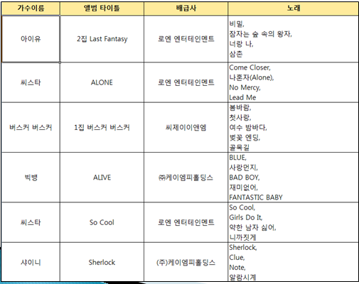
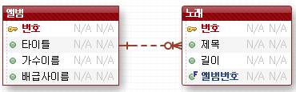
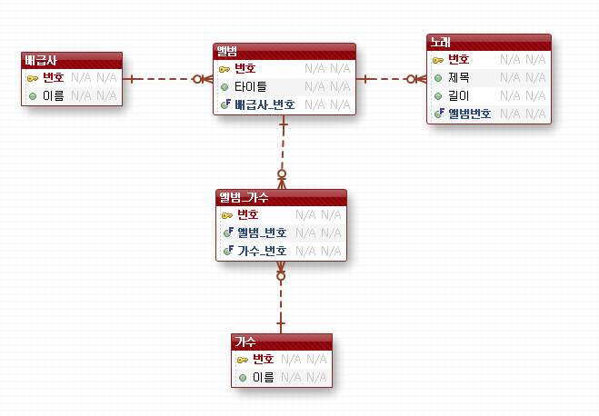
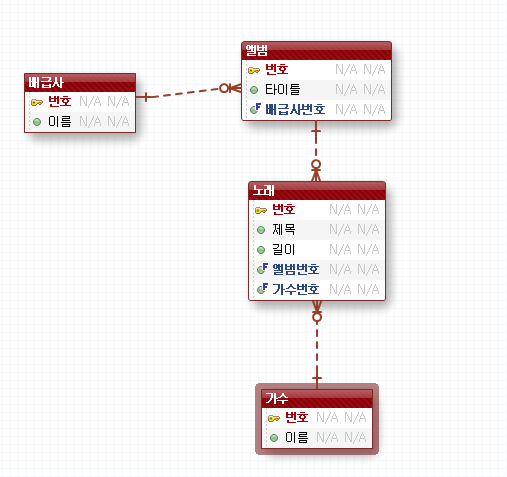
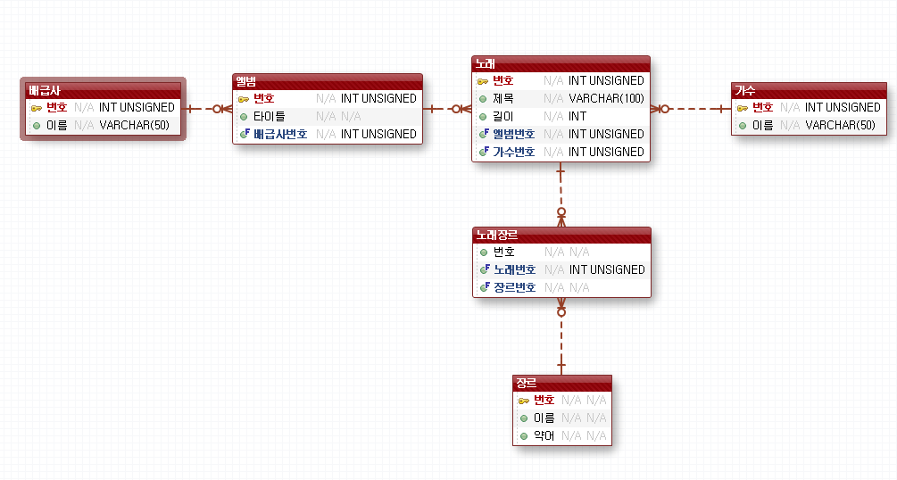
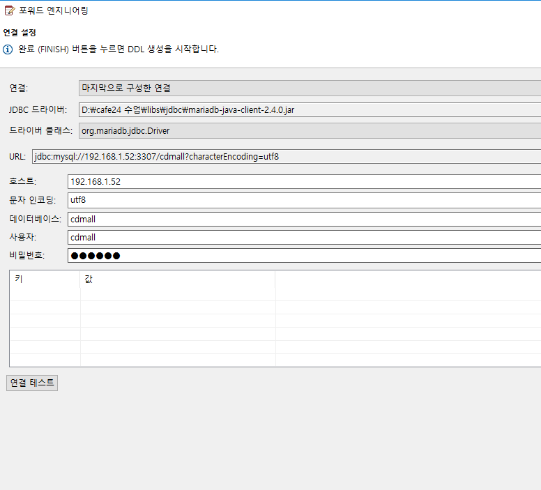

[TOC]

---

**database-모델링.ppt**

> 

---

## 정규화

### 제 1 정규화 (1NF)

> - 하나의 엔티티가 모든 속성들이 하나의 값을 가질 때 “제 1 정규형(1st Normal form)” 이라 한다.
>
> - 각 속성들은 엔티티의 각 인스턴스를 위한 하나의 값을 가지고 있는지 확인
>
> - 중복된 속성을 가진 엔티티는 그 안에 최소한 1개 이상의 다른 엔티티가 존재한다는 것을 의미

-- 노래가 많다 !!!! -> 제1정규형 위반

> 

---

### 제 2 정규화 (2NF)

> - 하나의 엔티티가 이미 1NF로 되어 있고 모든 식별되지 않은 속성들이 엔티티의 유일한 식별자에 종속적이면 “제 2 정규형(2nd Normal form)” 이라 한다.
>
> - 앨범 엔티티의 가수이름은 앨범ID에 완전히 종속적이지 못하다.
>
>      (씨스타는 두 개의 다른 CD의 가수 이름이다)
>
> - “가수이름은 무엇으로 나타나야 하는가?”

> PK아닌 다른 속성이 PK에 종속적이지 않으면 위반!!!

> **다:다 관계 풀기!**

**-- 근데 노래테이블이 중간 테이블 역할을 할 수 있을 것 같음!!!!!!**

> 

---

### 제 3 정규화 (3NF)

> - 하나의 엔티티가 이미 2NF로 되어 있고 식별할 수없는 어떠한 속성도 어떤 다른 식별할 수 없는 속성들에게 종속적이지 않으면 “제 3 정규형(3nd Normal form)” 이라 한다.
> - 식별할 수 없는 다른 속성들에게 종속적인 속성들은 종속적인 속성과 새로운 엔티티에 종속적인 속성으로 이동

> 설명을 위해 노래 테이블에 장르 속성을 추가
>
> 

---

특성 설정

포워드 

