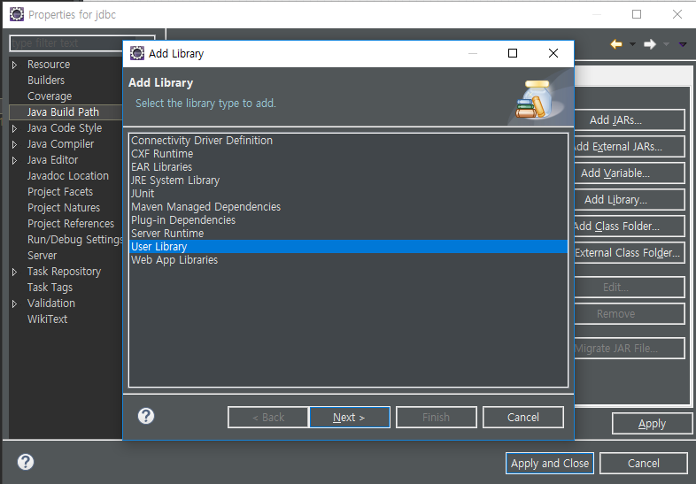
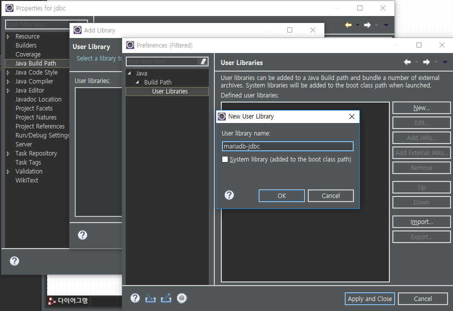
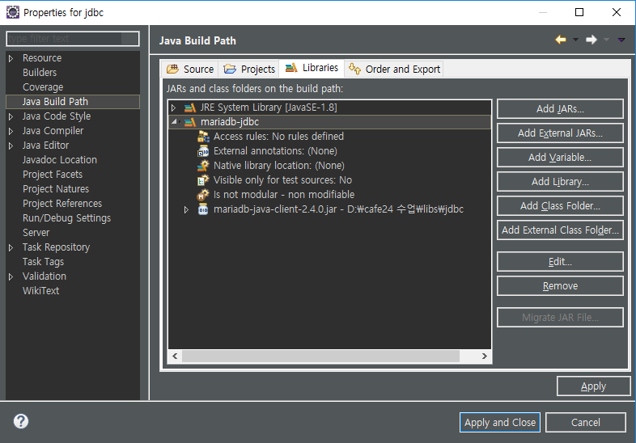

[TOC]

---

# JDBC

> 개발자를 위한 표준 인터페이스인 JDBC API와 데이터베이스 벤더, 
>
> ​									또는 기타 써드파티에서 제공하는 드라이버(driver)

- 자바를 이용한 데이터베이스 접속과 SQL 문장의  실행, 그리고  실행 결과로 얻어진 데이터의 핸들링을 제공하는 방법과 절차에 관한 규약
- 자바 프로그램내에서 SQL문을 실행하기 위한 자바 API
- SQL과 프로그래밍 언어의 통합 접근 중 한 형태


---


##  [Eclipse] add mariadb-jdbc libs at project

**new java project - jdbc**





**Add External JARs**


**라이브러리 추가**



---

## JDBC를 이용한 데이터 베이스 연결 방법

– 1 단계 : import java.sql.*;

– 2 단계 : 드라이버를 로드 한다.

– 3 단계 : Connection 객체를 생성한다.

– 4 단계 : Statement 객체를 생성 및 질의 수행

– 5 단계 : SQL문에 결과물이 있다면 ResultSet 객체를 생성한다.

– 6 단계 : 모든 객체를 닫는다.

---


> 굳이 JDBC가 어떻게 돌아가는지 그 내부 Class 구조는 알필요 없어
>
> 그냥 어떤 클래스[^Class.forName();] 써야하고, 그 이름[^"org.mariadb.jdbc.Driver"]만 알면 돼


---

## Connection Test

**jdbc/src/test/ConnectionTest.java**

```java
package test;
public class ConnectionTest {
	public static void main(String[] args) {

		Connection conn = null;
		
		try {
			// 1. JDBC Driver(MariaDB) 로딩
			Class.forName("org.mariadb.jdbc.Driver");
			
			// 2. 연결하기
			String url = "jdbc:mariadb://192.168.1.52:3307/webdb";
			conn = DriverManager.getConnection(url,"webdb","webdb");
			
			System.out.println("연결 성공!!!!");
			
		} catch (ClassNotFoundException e) {
			System.out.println("Fail To Driver Loading : " +  e);
		} catch (SQLException e) {
			System.out.println("Error : " + e);
		} finally{
			try {
				if(conn != null) {
					conn.close();
				}
			} catch (SQLException e) {
				e.printStackTrace();
			}
		}
	}
}
```

> ```출력
> 연결 성공!!!!
> ```

> 사실 필요한 코드는 3줄밖에 안되는데 try/catch로 코드가 지저분해짐 
>
> -> 그래서 Spring mybatis로 나중에 관리


---

## SelectTest

**jdbc/src/test/SelectTest.java**

> sql문은 workbench에서 미리 날리고, 확인한 뒤 가져오자
>
> 

```java
package test;
public class SelectTest {
	
public static void main(String[] args) {
		
		// 	자원정리
		Connection conn = null;
		Statement stmt = null;
		ResultSet rs = null;
		
		try {
			// 1. JDBC Driver(MariaDB) 로딩
			Class.forName("org.mariadb.jdbc.Driver");
			
			// 2. 연결하기
			String url = "jdbc:mariadb://192.168.1.52:3307/webdb";
			conn = DriverManager.getConnection(url,"webdb","webdb");
			
			// 3. statement 객체 생성
			stmt =  conn.createStatement();
			
			// 4. SQL문 실행
			String sql = "select no, dept_name from department";
			rs = stmt.executeQuery(sql);
			
			// 5. 결과 가져오기
			// rs는 처음에 비어있음, rs.next()가 첫번째 값을 가리킴
			while(rs.next()) {
				Long no = rs.getLong(1); 
                // 기본 타입보다 wrapper로 묶는게 좋음
				String name = rs.getString(2);
				
				System.out.println(no + " : " + name);
			}	
		} catch (ClassNotFoundException e) {
			System.out.println("Fail To Driver Loading : " +  e);
		} catch (SQLException e) {
			System.out.println("Error : " + e);
		} finally{
			try {
				if(rs != null) {
					rs.close();
				}
				if(stmt != null) {
					stmt.close();
				}
				if(conn != null) {
					conn.close();
				}
			} catch (SQLException e) {
				e.printStackTrace();
			}
		}
	}
}
```

> ```출력
> 1 : 총무팀
> 2 : 개발팀
> 3 : 인사팀
> 4 : 영업팀
> 5 : 광고팀
> ```

---


------

## InsertTest

**jdbc/src/test/InsertTest.java**

`insert into department values(null, '디자인팀')`

```java
package test;
public class InsertTest {
	
	public static void main(String[] args) {
		boolean result = insert("디자인팀");
		if(result) {
			System.out.println("insert 성공");
		}
	}
	public static boolean insert(String name) {
		boolean result = false;
		
		// 	자원정리
		Connection conn = null;
		Statement stmt = null;
		
		try {
			// 1. JDBC Driver(MariaDB) 로딩
			Class.forName("org.mariadb.jdbc.Driver");
			
			// 2. 연결하기
			String url = "jdbc:mariadb://192.168.1.52:3307/webdb";
			conn = DriverManager.getConnection(url,"webdb","webdb");
			
			// 3. statement 객체 생성
			stmt =  conn.createStatement();
			
			// 4. SQL문 실행
			String sql = "insert into department values(null, '" + name + "')";
			
			int count = stmt.executeUpdate(sql); // 들어간 갯수만큼 return
			
			result = count == 1; // 1개 insert 성공하면 true!
			
		} catch (ClassNotFoundException e) {
			System.out.println("Fail To Driver Loading : " +  e);
		} catch (SQLException e) {
			System.out.println("Error : " + e);
		} finally{
			try {
				if(stmt != null) {
					stmt.close();
				}
				if(conn != null) {
					conn.close();
				}
			} catch (SQLException e) {
				e.printStackTrace();
			}
		}
		return result;
	}
}
```

---


------

## DeleteTest

**jdbc/src/test/DeleteTest.java**

`delete from department where no=5`

```java
package test;

public class DeleteTest {
	
	public static void main(String[] args) {
		boolean result = delete( 7L ); //Long인걸 알려주는거
		if(result) {
			System.out.println("delete 성공");
		}
	}
	
	public static boolean delete(Long no) {
		boolean result = false;
		
		// 	자원정리
		Connection conn = null;
		Statement stmt = null;
		
		try {
			// 1. JDBC Driver(MariaDB) 로딩
			Class.forName("org.mariadb.jdbc.Driver");
			
			// 2. 연결하기
			String url = "jdbc:mariadb://192.168.1.52:3307/webdb";
			conn = DriverManager.getConnection(url,"webdb","webdb");
			
			// 3. statement 객체 생성
			stmt =  conn.createStatement();
			
			// 4. SQL문 실행
			String sql = "delete from department where no=" + no;
			
			int count = stmt.executeUpdate(sql); // 들어간 갯수만큼 return
			
			result = count == 1; // 1개 insert 성공하면 true!
			
		} catch (ClassNotFoundException e) {
			System.out.println("Fail To Driver Loading : " +  e);
		} catch (SQLException e) {
			System.out.println("Error : " + e);
		} finally{
			try {
				if(stmt != null) {
					stmt.close();
				}
				if(conn != null) {
					conn.close();
				}
			} catch (SQLException e) {
				e.printStackTrace();
			}
		}
	
		return result;
	}
}
```

---


------

## UpdateTest

**jdbc/src/test/UpdateTest.java**

`update department set dept_name=name where no=no`

```java
package test;

public class UpdateTest {
	
	public static void main(String[] args) {
		boolean result = update( 1L, "경영지원팀" );
		if(result) {
			System.out.println("update 성공");
		}
	}
	
	public static boolean update(Long no, String name) {
		boolean result = false;
		
		// 	자원정리
		Connection conn = null;
		Statement stmt = null;
		
		try {
			// 1. JDBC Driver(MariaDB) 로딩
			Class.forName("org.mariadb.jdbc.Driver");
			
			// 2. 연결하기
			String url = "jdbc:mariadb://192.168.1.52:3307/webdb";
			conn = DriverManager.getConnection(url,"webdb","webdb");
			
			// 3. statement 객체 생성
			stmt =  conn.createStatement();
			
			// 4. SQL문 실행
			String sql = " update department"
						  + " set dept_name='" + name + "'"
						  + " where no=" + no;
			
			int count = stmt.executeUpdate(sql); // 들어간 갯수만큼 return
			
			result = count == 1; // 1개 insert 성공하면 true!
			
		} catch (ClassNotFoundException e) {
			System.out.println("Fail To Driver Loading : " +  e);
		} catch (SQLException e) {
			System.out.println("Error : " + e);
		} finally{
			try {
				if(stmt != null) {
					stmt.close();
				}
				if(conn != null) {
					conn.close();
				}
			} catch (SQLException e) {
				e.printStackTrace();
			}
		}
		return result;
	}
}

```

> 반복되는 코드 너~~무 많잖아,
>
> 이 코드는 template화 시킴 --> mybatis, spring, ...
>
> 디자인 패턴~


