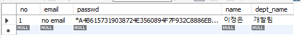

[TOC]


# DDL

## MySQL 데이터 타입


> - 보통 Varchar쓰고 4000byte 넘어갈 것 같으면 Text 쓰면 됨
>
> - Integer Unsigned  : PK는 Integer Unsigned를 무난하게 씀
>
>   > 근데  데이터에 `-`넣는 경우는 매우 드물다.
>   >
>   > 다른 속성은 Integer써라(강사님 경우 다른 것을 썼을 때 문제가 더 많았음)
>
> - BLOB, CLOB 같은 경우는 java에서 맞는 type이 없으니, 예제를 찾아봐라 


## Table 생성

```mysql
drop table member; 
create table member(
	no int not null auto_increment,
    email varchar(50) not null default '',
    passwd varchar(64) not null, -- mysql 함수로 암호화 시킬 수 있음
    name varchar(25),
    dept_name varchar(25),
    
    primary key(no)
);

desc member;
```


`password('1234')`    ==> 암호화 함수


## insert

```mysql
insert into member(passwd, name, dept_name)
 values(password('1234'), '이정은', '개발팀');
select * from member; 
```

> **자동암호화**
>
> 


## alter

`after` 해당 컬럼 다음위치에

```mysql
alter table member add juminbunho char(13) not null after no;
alter table member drop juminbunho;

alter table member add join_date datetime default now();

alter table member change no no int unsigned not null auto_increment;

alter table member change dept_name department_name varchar(25);

alter table member rename user;
desc user;
```


## update

```mysql
update user
set join_date = (select now())
where no = 1;

update user
set join_date = (select now()),
	name = "이정은수정"
where no =1;
```


## delete

```mysql
delete from user where no = 1;
```

