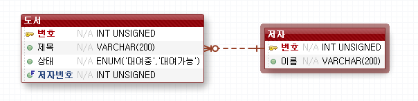

[TOC]

---

## Bookmall

### schema, DDL




> 

---


---

### 프로젝트 구성

> 


---

## Author

**AuthorVo.java**

```java
private Long no;
private String name;
```

**BookVo.java**

```java
private Long no;
private String title;
private String status;

private Long authorNo;
private String authorName;
```

**AuthorDao.java**

### select

```java
public List<AuthorVo> getList() {
    List<AuthorVo> result = new ArrayList<AuthorVo>();

    // 자원정리
    Connection conn = null;
    PreparedStatement pstmt = null;
    ResultSet rs = null;

    try {
        Class.forName("org.mariadb.jdbc.Driver");

        String url = "jdbc:mariadb://192.168.1.52:3307/webdb";
        conn = DriverManager.getConnection(url, "webdb", "webdb");

        String sql = "select no, name from author";
        pstmt = conn.prepareStatement(sql);

        rs = pstmt.executeQuery();

        while (rs.next()) {
            Long no = rs.getLong(1); 
            String name = rs.getString(2);

            AuthorVo vo = new AuthorVo();
            vo.setNo(no);
            vo.setName(name);

            result.add(vo);
        }

    } catch (ClassNotFoundException e) {
        System.out.println("Fail To Driver Loading : " + e);
    } catch (SQLException e) {
        System.out.println("Error : " + e);
    } finally {
        try {
            if (rs != null) {
                rs.close();
            }
            if (pstmt != null) {
                pstmt.close();
            }
            if (conn != null) {
                conn.close();
            }
        } catch (SQLException e) {
            e.printStackTrace();
        }
    }

    return result;
}
```

### select test

**AuthorDaoTest.java**

```java
package bookshop.test;

public class AuthorDaoTest {
	
	
	public static void main(String[] args) {
		// get List Test
		getListTest();
	}
	
	public static void getListTest() {
		AuthorDao dao = new AuthorDao();
		List<AuthorVo> list = dao.getList();
		
		for(AuthorVo vo : list) {
			System.out.println(vo);
		}	
	}
}

```


### insert

#### 중복코드 함수로 만들기

**AuthorDao.java**

```java
private Connection getConnection() throws SQLException {
		Connection conn = null;
		
		try {
		
			Class.forName("org.mariadb.jdbc.Driver");
			String url = "jdbc:mariadb://192.168.1.52:3307/webdb";
			conn = DriverManager.getConnection(url, "webdb", "webdb");

		} catch (ClassNotFoundException e) {
			System.out.println("드라이버 로딩 실패");
		} finally {
			
		}

		return conn;
		
	}
```

**기존 코드 변경**

```java
Class.forName("org.mariadb.jdbc.Driver");
String url = "jdbc:mariadb://192.168.1.52:3307/webdb";
conn = DriverManager.getConnection(url, "webdb", "webdb");
->
    conn = getConnection();
```

```java
public boolean insert(AuthorVo vo) {
    boolean result = false;
    Connection conn = null;
    PreparedStatement pstmt = null;

    try {
        conn = getConnection();
        
        String sql = "insert into author values(null, ? )";
        pstmt = conn.prepareStatement(sql);
        pstmt.setString(1, vo.getName());

        int count = pstmt.executeUpdate();
        result = count == 1; 
    } catch (SQLException e) {
        System.out.println("Error : " + e);
    } finally {
        try {
            if (pstmt != null) {
                pstmt.close();
            }
            if (conn != null) {
                conn.close();
            }
        } catch (SQLException e) {
            e.printStackTrace();
        }
    }
    return result;
}
```

### insertTest

**AuthorDaoTest.java**

```java
public static void main(String[] args) {
    //insert test
    insertTest("김동인");
    insertTest("김난도");
    insertTest("천상병");
    insertTest("원수연");

    // get List Test select
    getListTest();
}
public static void insertTest(String name) {
    AuthorVo vo = new AuthorVo();
    vo.setName(name);

    new AuthorDao().insert(vo);

}
```

---


---

## Book

**BookDao.java**

```java
package bookshop.dao;

public class BookDao {

    public boolean insert(BookVo vo) {
        boolean result = false;

        Connection conn = null;
        PreparedStatement pstmt = null;

        try {
            conn = getConnection();

            String sql = "insert into book values(null, ?, '대여가능', ? )";
            pstmt = conn.prepareStatement(sql);

            pstmt.setString(1, vo.getTitle());
            pstmt.setLong(2, vo.getAuthorNo());

            int count = pstmt.executeUpdate();
            result = count == 1;

        } catch (SQLException e) {
            System.out.println("Error : " + e);
        } finally {
            try {
                if (pstmt != null) {
                    pstmt.close();
                }
                if (conn != null) {
                    conn.close();
                }
            } catch (SQLException e) {
                e.printStackTrace();
            }
        }

        return result;

    }

    public List<BookVo> getList() {
        List<BookVo> result = new ArrayList<BookVo>();

        // 자원정리
        Connection conn = null;
        PreparedStatement pstmt = null;
        ResultSet rs = null;

        try {
            conn = getConnection();

            String sql = " select a.title, b.name, a.status " + 
                " from book a, author b " + 
                " where a.author_no = b.no " + 
                " order by a.no asc";
            pstmt = conn.prepareStatement(sql);

            rs = pstmt.executeQuery();

            while (rs.next()) {
                String title = rs.getString(1);
                String authorName = rs.getString(2);
                String status = rs.getString(2);

                BookVo vo = new BookVo();
                vo.setTitle(title);
                vo.setauthorName(authorName);
                vo.setStatus(status);

                result.add(vo);
            }

        } catch (SQLException e) {
            System.out.println("Error : " + e);
        } finally {
            try {
                if (rs != null) {
                    rs.close();
                }
                if (pstmt != null) {
                    pstmt.close();
                }
                if (conn != null) {
                    conn.close();
                }
            } catch (SQLException e) {
                e.printStackTrace();
            }
        }

        return result;
    }

    private Connection getConnection() throws SQLException {
        Connection conn = null;

        try {

            Class.forName("org.mariadb.jdbc.Driver");
            String url = "jdbc:mariadb://192.168.1.52:3307/webdb";
            conn = DriverManager.getConnection(url, "webdb", "webdb");

        } catch (ClassNotFoundException e) {
            System.out.println("드라이버 로딩 실패");
        } finally {

        }
        return conn;
    }
}

```

### BookDaoTest

**BookDaoTest.java**

```java
package bookshop.test;

public class BookDaoTest {
	public static void main(String[] args) {
		// insert
		insert("아리랑", 2L);
		insert("젊은그들", 5L);
		insert("아프니깐 청춘이다", 6L);
		insert("귀천", 7L);
		insert("태백산맥", 2L);
		insert("풀하우스", 8L);
		
		// select
		getListTest();
	}

	public static void insert(String title, Long authorNo) {
		BookVo vo = new BookVo();
		vo.setTitle(title);
		vo.setAuthorNo(authorNo);
		new BookDao().insert(vo);
	}

	public static void getListTest() {
		List<BookVo> list = new BookDao().getList();
		for(BookVo vo : list) {
			System.out.println(vo);
		}
	}
}
```


### update -대여중

**BookDao.java**

```java
public BookVo get(Long no) {
    return null;
}

public List<BookVo> get(BookVo vo) {
    return null;
}

public Boolean update(BookVo vo) {
    return false;
}

public Boolean update(Long no, String status) {
    Boolean result = false;
    Connection conn = null;
    PreparedStatement pstmt = null;

    try {
        conn = getConnection();


        String sql = " update book " + 
            "  set status=? " + 
            " where no=? ";
        pstmt = conn.prepareStatement(sql);

        pstmt.setString(1, status);
        pstmt.setLong(2, no);

        int count = pstmt.executeUpdate();
        result = count == 1; 

    } catch (SQLException e) {
        System.out.println("Error : " + e);
    } finally {
        try {
            if (pstmt != null) {
                pstmt.close();
            }
            if (conn != null) {
                conn.close();
            }
        } catch (SQLException e) {
            e.printStackTrace();
        }
    }

    return result;
}
```

---


**MainApp.java**

```java
package bookshop.main;

import java.util.List;
import java.util.Scanner;

import bookshop.dao.BookDao;
import bookshop.vo.BookVo;

public class MainApp {

	public static void main(String[] args) {
		displayBookInfo();
		
		Scanner scanner = new Scanner(System.in);
		System.out.print("대여 하고 싶은 책의 번호를 입력하세요:");
		Long no = scanner.nextLong();
		scanner.close();
		
		rent(no);
		displayBookInfo();
		
	}
	
	private static void rent(Long BookNo) {
		new BookDao().update(BookNo, "대여중");
	}
	
	private static void displayBookInfo( ) {
		System.out.println("****** 도서 정보 출력하기 *******");
		
		List<BookVo> list = new BookDao().getList();
		
		for(BookVo vo : list) {
			System.out.println(
					"책 제목 : " + vo.getTitle() +
					", 작가 : " +vo.getauthorName() +
					", 대여유무 : " + vo.getStatus());
		}
	}	
}

```


> 전체코드는
>
> jdbc-mariadb 레포지토리 bookshop 패키지에!
>
> <https://github.com/jungeunlee95/jdbc-mariadb>


