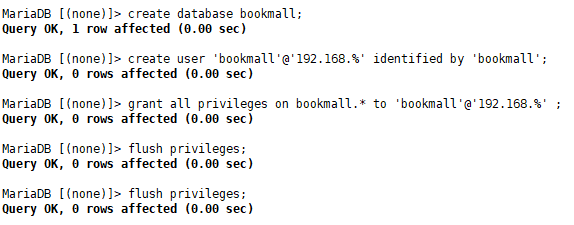
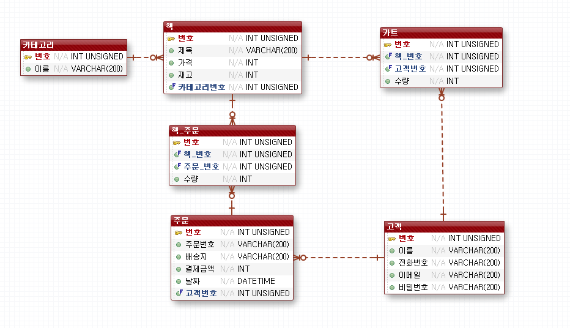
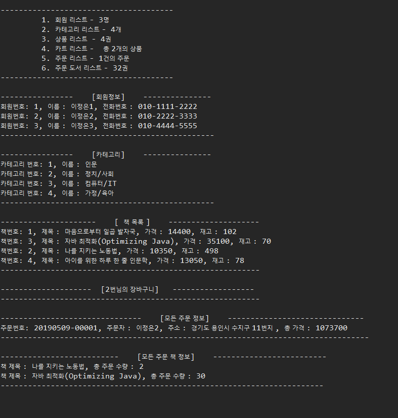

[TOC]

---

### project 전체 코드

> <https://github.com/jungeunlee95/bookmall-project>

---

# bookmall 계정 생성



---

# Schema 생성



---

# 프로젝트 package 구성





.. 이것때문에 한시간 고생했다.......

```
insert into orders(no, order_no, address, total_price, member_no) 
values(null, concat(DATE_FORMAT(now(),'%Y%m%d'), '-', 
        lpad( ((select count(*) from orders ALIAS_FOR_SUBQUERY )+1), '5', '0' )),
       '주소',
       (select sum(b.price)
			from cart c, book b
			where c.book_no = b.no 
			and member_no = 1), 
		1 );
```


