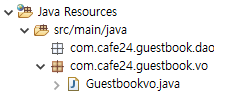
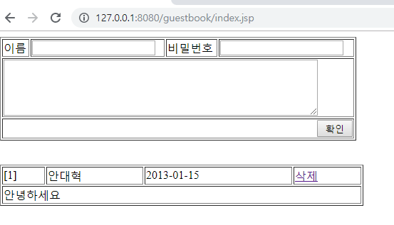
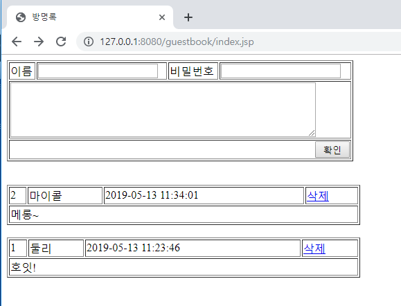

[TOC]

---

## 방명록 만들기


포워드 엔지니어링 






---


쿼리 만들기

```mysql
insert into guestbook 
values(null, '둘리', '1234', '호잇!', now());

select no, name, contents , date_format(reg_date, '%Y-%m-%d %h:%i:%s')
from guestbook
order by reg_date desc;
```

**Guestbookvo.java**

```java
	private Long no;
	private String name;
	private String password;
	private String contents;
	private String regDate;
```

## SELECT

**GuestbookDao.java**

```java
package com.cafe24.guestbook.dao;
public class GuestbookDao {

    public List<GuestbookVo> getList() {
        List<GuestbookVo> result = new ArrayList<GuestbookVo>();

        // 자원정리
        Connection conn = null;
        PreparedStatement pstmt = null;
        ResultSet rs = null;

        try {
            conn = getConnection();

            String sql = "select no, name, contents, "
                + "          date_format(reg_date, '%Y-%m-%d %h:%i:%s') " + 
                " from guestbook " + 
                " order by reg_date desc ";
            pstmt = conn.prepareStatement(sql);

            rs = pstmt.executeQuery();

            while (rs.next()) {
                Long no = rs.getLong(1);
                String name = rs.getString(2);
                String contents = rs.getString(3);
                String regDate = rs.getString(4);

                GuestbookVo vo = new GuestbookVo();
                vo.setNo(no);
                vo.setName(name);
                vo.setContents(contents);
                vo.setRegDate(regDate);

                result.add(vo);
            }

        } catch (SQLException e) {
            System.out.println("Error : " + e);
        } finally {
            try {
                if (rs != null) {
                    rs.close();
                }
                if (pstmt != null) {
                    pstmt.close();
                }
                if (conn != null) {
                    conn.close();
                }
            } catch (SQLException e) {
                e.printStackTrace();
            }
        }

        return result;
    }

    private Connection getConnection() throws SQLException {
        Connection conn = null;

        try {

            Class.forName("org.mariadb.jdbc.Driver");
            String url = "jdbc:mariadb://192.168.1.52:3307/webdb";
            conn = DriverManager.getConnection(url, "webdb", "webdb");

        } catch (ClassNotFoundException e) {
            System.out.println("드라이버 로딩 실패");
        } finally {

        }

        return conn;
    }
}
```


**index.jsp**

```html
<%@ page language="java" contentType="text/html; charset=UTF-8"
    pageEncoding="UTF-8"%>
<%@ page import="com.cafe24.guestbook.dao.GuestbookDao" %>
<%@ page import="com.cafe24.guestbook.vo.GuestbookVo" %> 
<%@ page import="java.util.List" %>

<%
	GuestbookDao dao = new GuestbookDao();
	List<GuestbookVo> list = dao.getList();
%>

<html>
<head>
<meta http-equiv="Content-Type" content="text/html; charset=UTF-8">
<title>방명록</title>
</head>
<body>
	<form action="/guestbook/add.jsp" method="post">
	<table border=1 width=500>
		<tr>
			<td>이름</td><td><input type="text" name="name"></td>
			<td>비밀번호</td><td><input type="password" name="password"></td>
		</tr>
		<tr>
			<td colspan=4><textarea name="contents" cols=60 rows=5></textarea></td>
		</tr>
		<tr>
			<td colspan=4 align=right><input type="submit" VALUE=" 확인 "></td>
		</tr>
	</table>
	</form>
	
<%	
		int count = list.size();
		int index = 0;
		for(GuestbookVo vo : list){

	%>
	<br>
	<table width=510 border=1>
		<tr>
			<td>[<%= count-index++ %>]</td>
			<td><%= vo.getName() %></td>
			<td><%= vo.getRegDate() %></td>
			<td><a href="/guestbook/deleteform.jsp?no<%=vo.getNo()%>">삭제</a></td>
		</tr>
		<tr>
			<td colspan=4><%= vo.getContents().replaceAll("\n", "<br>") %></td>
		</tr>
	</table>
	<%
		}
	%>
</body>
</html>
```



## INSERT

**add.jsp**

```html
<%@ page language="java" contentType="text/html; charset=UTF-8"
	pageEncoding="UTF-8"%>
<%
   	request.setCharacterEncoding("utf-8");
	String name = request.getParameter("name");
	String password = request.getParameter("password");
	String contents = request.getParameter("contents");
%>
<!DOCTYPE html>
<html>
<head>
<meta charset="UTF-8">
<title>Insert title here</title>
</head>
<body>
	<h1><%=name%></h1>
	<h1><%=password%></h1>
	<h1><%=contents%></h1>
</body>
</html>
```


**server.xml**

```xml
<Connector connectionTimeout="20000" port="8080" protocol="HTTP/1.1" URIEncoding="UTF-8" redirectPort="8443"/>
```

---

**GuestbookDao.java**

-> insert추가

```java
public boolean insert(GuestbookVo vo) {
    boolean result = false;

    Connection conn = null;
    PreparedStatement pstmt = null;

    try {
        conn = getConnection();


        String sql = " insert into guestbook  " + 
            "  values(null, ?, ?, ?, now()) ";
        pstmt = conn.prepareStatement(sql);

        pstmt.setString(1, vo.getName());
        pstmt.setString(2, vo.getPassword());
        pstmt.setString(3, vo.getContents());

        int count = pstmt.executeUpdate();
        result = count == 1; 

    } catch (SQLException e) {
        System.out.println("Error : " + e);
    } finally {
        try {
            if (pstmt != null) {
                pstmt.close();
            }
            if (conn != null) {
                conn.close();
            }
        } catch (SQLException e) {
            e.printStackTrace();
        }
    }

    return result;

}
```

**add.jsp**

```html
<%@ page language="java" contentType="text/html; charset=UTF-8" pageEncoding="UTF-8"%>
<%@page import="com.cafe24.guestbook.dao.GuestbookDao"%>
<%@page import="com.cafe24.guestbook.vo.GuestbookVo"%>
<%
	request.setCharacterEncoding("utf-8");
	String name = request.getParameter("name");
	String password = request.getParameter("password");
	String contents = request.getParameter("contents");
	
	GuestbookVo vo = new GuestbookVo();
	vo.setName(name);
	vo.setPassword(password);
	vo.setContents(contents);
	
	new GuestbookDao().insert(vo);
%>
<!DOCTYPE html>
<html>
<head>
<meta charset="UTF-8">
<title>Insert title here</title>
</head>
<body>
	<h1><%=name%></h1>
	<h1><%=password%></h1>
	<h1><%=contents%></h1>
</body>
</html>
```

`response.sendRedirect("/guestbook");`    추가! redirect!!!

```html
<%@ page language="java" contentType="text/html; charset=UTF-8" pageEncoding="UTF-8"%>
<%@ page import="com.cafe24.guestbook.dao.GuestbookDao"%>
<%@ page import="com.cafe24.guestbook.vo.GuestbookVo"%>
<%
	request.setCharacterEncoding("utf-8");
	String name = request.getParameter("name");
	String password = request.getParameter("password");
	String contents = request.getParameter("contents");
	
	GuestbookVo vo = new GuestbookVo();
	vo.setName(name);
	vo.setPassword(password);
	vo.setContents(contents);
	
	new GuestbookDao().insert(vo);
	response.sendRedirect("/guestbook");
%>
```

## DELETE

**GuestbookDao.java**

```java
public boolean delete(GuestbookVo vo) {
    boolean result = false;

    Connection conn = null;
    PreparedStatement pstmt = null;

    try {
        conn = getConnection();


        String sql = " delete from guestbook  " + 
            "  where no = ? "
            + " and password = ? ";
        pstmt = conn.prepareStatement(sql);

        pstmt.setLong(1, vo.getNo());
        pstmt.setString(2, vo.getPassword());

        int count = pstmt.executeUpdate();
        result = count == 1; 

    } catch (SQLException e) {
        System.out.println("Error : " + e);
    } finally {
        try {
            if (pstmt != null) {
                pstmt.close();
            }
            if (conn != null) {
                conn.close();
            }
        } catch (SQLException e) {
            e.printStackTrace();
        }
    }
    return result;
}
```


**deleteform.jsp**

```html
<%@ page language="java" contentType="text/html; charset=UTF-8" pageEncoding="UTF-8" %>

<% 
	String no = request.getParameter("no"); 

%>
<html>
<head>
<meta http-equiv="Content-Type" content="text/html; charset=UTF-8">
<title>방명록</title>
</head>
<body>
	<form method="post" action="/guestbook/delete.jsp">
	<input type='hidden' name="no" value="<%=no%>">
	<table>
		<tr>
			<td>비밀번호</td>
			<td><input type="password" name="password"></td>
			<td><input type="submit" value="확인"></td>
			<td><a href="/guestbook/index.jsp">메인으로 돌아가기</a></td>
		</tr>
	</table>
	</form>
</body>
</html>
```

**delete.jsp**

```html
<%@page import="com.cafe24.guestbook.dao.GuestbookDao"%>
<%@page import="com.cafe24.guestbook.vo.GuestbookVo"%>
<%@ page language="java" contentType="text/html; charset=UTF-8"
    pageEncoding="UTF-8"%>
    
<%
	String no = request.getParameter("no");
	String password = request.getParameter("password");
	
	GuestbookVo vo = new GuestbookVo();
	vo.setNo(Long.parseLong(no));
	vo.setPassword(password);
	
	new GuestbookDao().delete(vo);
	
	response.sendRedirect("/guestbook");
%>
```


