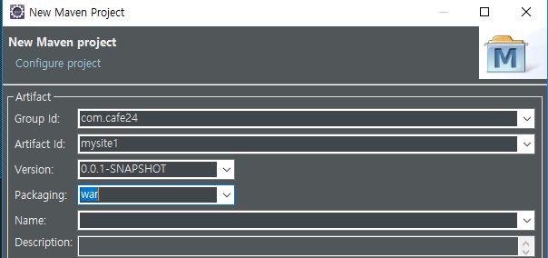
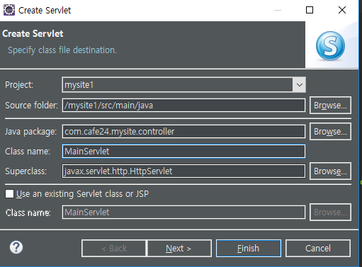
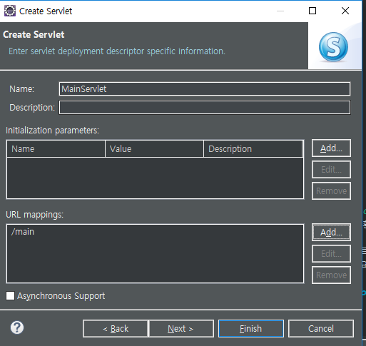
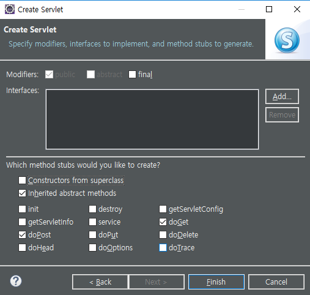
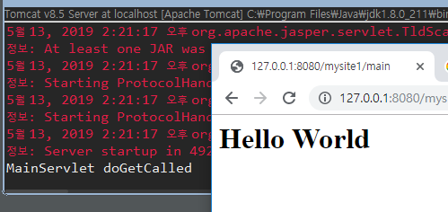

[TOC]


---

# Mysite1



프로젝트 우클릭 -> Build Path -> Configure Build Path...-> Libraries 탭 -> add library 

-> server runtime -> was 선택

 [우리집앞마당]

pom.xml 설정

Java EE Tools

web.xml -> 3.0으로

자료 mysite.zip : static - assets, templates-> views


## MainServlet

**com.cafe24.mysite.controller -> serlvet**







**MainServlet.java**

```java
	protected void doGet(HttpServletRequest request, HttpServletResponse response) throws ServletException, IOException {
		System.out.println("MainServlet doGetCalled");
        // getWirter모다 위에 있어야함!
		response.setContentType("text/html; charset=utf-8");
        
		PrintWriter pw = response.getWriter();
		pw.println("<h1> Hello World</h1>");
	}
```




## JSP 빼기

요청은 servlet이 받고, 응답은 jsp

1. request extend : 메인서블릿(doGet)으로 request를 받고 같은 객체를 jsp로 

2. Dispatch : 구현기술
3. forwarding  vs redirect : 페이지 이동

**MainServlet.java**

```java
package com.cafe24.mysite.controller;

@WebServlet("/main")
public class MainServlet extends HttpServlet {
	private static final long serialVersionUID = 1L;

	protected void doGet(HttpServletRequest request, HttpServletResponse response) throws ServletException, IOException {
		RequestDispatcher rd = request.getRequestDispatcher("/WEB-INF/views/main/index.jsp");
		rd.forward(request, response);
	}

	protected void doPost(HttpServletRequest request, HttpServletResponse response) throws ServletException, IOException {
		doGet(request, response);
	}
}
```

**index.jsp**

```html
<link href="<%=request.getContextPath()%>/assets/css/main.css" rel="stylesheet" type="text/css">
```


---

new package -> com.cafe24.web

**WebUtil.java**

```java
package com.cafe24.web;
public class WebUtil {
	
	public static void redirect(HttpServletRequest request, 
								HttpServletResponse response, 
								String location) throws IOException {
		response.sendRedirect(location);
		
	}
	
	public static void forward( HttpServletRequest request, 
								HttpServletResponse response, 
								String location) throws ServletException, IOException {
		RequestDispatcher rd = request.getRequestDispatcher(location);
		rd.forward(request, response);
		
	}
}
```

**MainServlet.java**

```java
package com.cafe24.mysite.controller;

@WebServlet("/main")
public class MainServlet extends HttpServlet {
	private static final long serialVersionUID = 1L;

	protected void doGet(HttpServletRequest request, HttpServletResponse response) throws ServletException, IOException {
		WebUtil.forward(request, response, "/WEB-INF/views/main/index.jsp");
	}

	protected void doPost(HttpServletRequest request, HttpServletResponse response) throws ServletException, IOException {
		doGet(request, response);
	}
}
```


