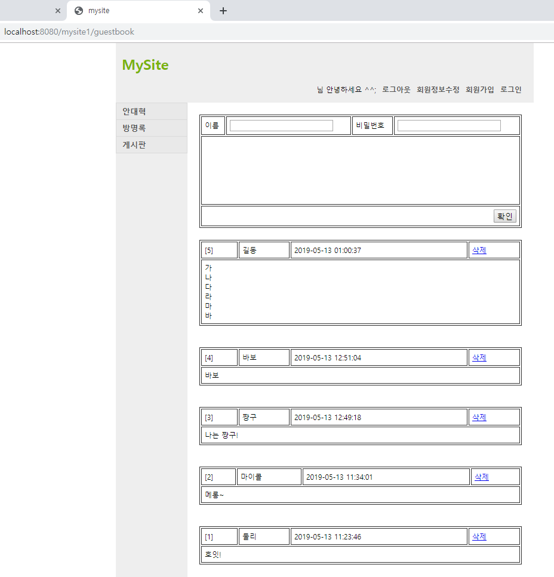
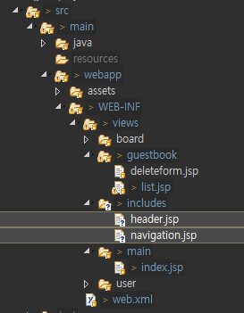
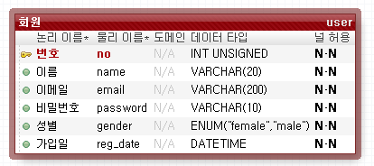
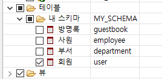

[TOC]


---

servlet -> jsp의 로직을 서블릿으로 옮기기

# 코드 : git repository -> [Servlet-Basic](https://github.com/jungeunlee95/Servlet-Basic)

## guestbook list

mysite1/src/main/java/com.cafe24.mysite.controller

**GuestbookServlet.java**


```java
package com.cafe24.mysite.controller;

// @WebServlet("/guestbook")
public class GuestbookServlet extends HttpServlet {
	private static final long serialVersionUID = 1L;
       
	protected void doGet(HttpServletRequest request, 
			HttpServletResponse response) throws ServletException, IOException {
		String actionName = request.getParameter("a");
		// 사용자의 url 매핑
		if("add".equals(actionName)) {
			
		} else if("deleteform".equals(actionName)) {
			
		} else if("delete".equals(actionName)) {
			
		}  else{
			// list action
			GuestbookDao dao = new GuestbookDao();
			List<GuestbookVo> list = dao.getList();
            
            // 공유객체
			request.setAttribute("list", list);
			WebUtil.forward(request, response, "/WEB-INF/views/guestbook/list.jsp");
		}		
	}

	protected void doPost(HttpServletRequest request, 
			HttpServletResponse response) throws ServletException, IOException {

		doGet(request, response);
	}
}
```

> `request.setAttribute("list", list);`   : 공유객체 등록


---

## web.xml 매핑 수정

```xml
		<!-- Servlet Register -->
	<servlet>
		<servlet-name>MainServlet</servlet-name>
		<servlet-class>com.cafe24.mysite.controller.MainServlet</servlet-class>
	</servlet>
	<servlet>
		<servlet-name>GuestbookServlet</servlet-name>
		<servlet-class>com.cafe24.mysite.controller.GuestbookServlet</servlet-class>
	</servlet>

	<!-- Mapping URL:ServletName -->	
	<servlet-mapping>
		<servlet-name>MainServlet</servlet-name>
		<url-pattern></url-pattern>
	</servlet-mapping>
	<servlet-mapping>
		<servlet-name>GuestbookServlet</servlet-name>
		<url-pattern>/guestbook</url-pattern>
	</servlet-mapping> 
```


---

**webapp/WEB-INF/views/guestbook/list.jsp**

```html
<%
   List<GuestbookVo> list = (List<GuestbookVo>)request.getAttribute("list");
%>

    <body>
        <% 
           int count = list.size();
           int index = 0;
           for (GuestbookVo vo : list) {
         %>		
            <ul>
                <li>
                    <table>
                        <tr>
                            <td>[<%= count-index++ %>]</td>
                            <td><%=vo.getName() %></td>
                            <td><%=vo.getRegDate() %></td>
                            <td><a href="/guestbook?a=deleteform&no=<%=vo.getNo() %>">삭제</a></td>
                        </tr>
                        <tr>
                            <td colspan=4>
                                <%= vo.getContents().replaceAll("\n", "<br>") %>	
                                    </td>
                        </tr>
                    </table>
                    <br>
                </li>
            </ul>
       <% } %>
    </body>
```

> 


## delete & add

**GuestbookServlet.java**

```java
	protected void doGet(HttpServletRequest request, 
			HttpServletResponse response) throws ServletException, IOException {
		// post 방식 인코딩은 기본
		request.setCharacterEncoding("utf-8");

		String actionName = request.getParameter("a");		
		// 사용자의 url 매핑
		if("add".equals(actionName)) {
			String name = request.getParameter("name");
			String password = request.getParameter("password");
			String contents = request.getParameter("contents");
			
			GuestbookVo vo = new GuestbookVo();
			vo.setName(name);
			vo.setPassword(password);
			vo.setContents(contents);
			
			new GuestbookDao().insert(vo);
			WebUtil.redirect(request, response, request.getContextPath() + "/guestbook");

		} else if("deleteform".equals(actionName)) {
			
			String no = request.getParameter("no");
			request.setAttribute("no", no);
			WebUtil.forward(request, response, "/WEB-INF/views/guestbook/deleteform.jsp");
			
		} else if("delete".equals(actionName)) {
			String no = request.getParameter("no");
			String password = request.getParameter("password");
			
			GuestbookVo vo = new GuestbookVo();
			vo.setNo(Long.parseLong(no));
			vo.setPassword(password);
			
			new GuestbookDao().delete(vo);
			
			WebUtil.redirect(request, response, request.getContextPath() + "/guestbook");
			
		} else{
			// list action
			GuestbookDao dao = new GuestbookDao();
			List<GuestbookVo> list = dao.getList();
			// 공유객체
			request.setAttribute("list", list);
			WebUtil.forward(request, response, "/WEB-INF/views/guestbook/list.jsp");
		}
		
	}
```


## includes



```html
<jsp:include page="/WEB-INF/views/includes/header.jsp" />
<jsp:include page="/WEB-INF/views/includes/navigation.jsp" />
<jsp:include page="/WEB-INF/views/includes/footer.jsp" />
```


---

## ActionFactory 추상, Action 인터페이스

### com.cafe24.web.mvc

**ActionFactory.java**

```java
package com.cafe24.web.mvc;

public abstract class ActionFactory {
	public abstract Action getAction(String actionName);
}
```

**Action.java**

```java
package com.cafe24.web.mvc;

public interface Action {
	public void execute(HttpServletRequest request, 
			HttpServletResponse response) throws IOException, ServletException;
}
```


### com.cafe24.mysite.action.guestbook

**GuestbookActionFactory.java**

```java
package com.cafe24.mysite.action.guestbook;
public class GuestbookActionFactory extends ActionFactory {

	@Override
	public Action getAction(String actionName) {
		Action action = null;
		if("add".equals(actionName)) {
			action = new AddAction();
		} else if("deleteform".equals(actionName)) {
			action = new DeleteFormAction();
		} else if("delete".equals(actionName)) {
			action = new DeleteAction();
		} else{
			action = new ListAction();
		}
		
		return action;
	}

}

```

**GuestbookServlet.java**

```java
protected void doGet(HttpServletRequest request, 
                     HttpServletResponse response) throws ServletException, IOException {
    request.setCharacterEncoding("utf-8");

    String actionName = request.getParameter("a");		

    Action action = new GuestbookActionFactory().getAction(actionName);
    action.execute(request, response);

}
```


---

### com.cafe24.mysite.action.main

MainAction 만듦

MainAction.java

MainActionFactory.java

MainServlet.java

```java
Action action = new MainActionFactory().getAction(actionName);
```


---


## User


### com.cafe24.mysite.action.user

**UserActionFactory.java**

```java
package com.cafe24.mysite.action.user;
public class UserActionFactory extends ActionFactory {

	// String s = "JoinAction";  -> string으로 create class 이름 만들기.?
	@Override
	public Action getAction(String actionName) {
		Action action = null;
		
		if("joinform".equals(actionName)) {
			action = new JoinFormAction();
		} else if("join".equals(actionName)) {
			action = new JoinAction();
		} else if("joinsuccess".equals(actionName)) {
			
		} else {
			action = new MainAction();
		}
		return action;
	}
}
```

JoinFormAction.java

```java
package com.cafe24.mysite.action.user;
public class JoinFormAction implements Action {

	@Override
	public void execute(HttpServletRequest request, HttpServletResponse response) throws IOException, ServletException {
		WebUtil.forward(request, response, "/WEB-INF/views/user/joinform.jsp");
	}

}

```


### webdb - user 만들기

> 




### UserVo , Dao 만들기


## JoinAciton

**JoinFormAction.java**

```java
@Override
public void execute(HttpServletRequest request, HttpServletResponse response) throws IOException, ServletException {
    WebUtil.forward(request, response, "/WEB-INF/views/user/joinform.jsp");
}
```

**JoinAction.java**

```java
@Override
public void execute(HttpServletRequest request, HttpServletResponse response) throws IOException, ServletException {
    String name = request.getParameter("name");
    String email = request.getParameter("email");
    String password = request.getParameter("password");
    String gender = request.getParameter("gender");

    UserVo vo = new UserVo();
    vo.setName(name);
    vo.setEmail(email);
    vo.setPassword(password);
    vo.setGender(gender);

    new UserDao().insert(vo);

    WebUtil.redirect(request, response, request.getContextPath()+"/user?a=joinsuccess");

}
```

**JoinSuccessAction.java**

```java
@Override
public void execute(HttpServletRequest request, HttpServletResponse response) throws IOException, ServletException {
    WebUtil.forward(request, response, "/WEB-INF/views/user/joinsuccess.jsp");
}
```

**joinform.jsp - action추가**

```html
<form id="join-form" name="joinForm" method="post" action="<%= request.getContextPath() + "/user" %>">
    <input type="hidden" name = "a" value="join">
```


---


## Login

**UserActionFactory.java**

```java
else if("loginform".equals(actionName)) {
    action = new LoginFormAction();
} 
```

**LoginFormAction.java**

```java
@Override
public void execute(HttpServletRequest request, HttpServletResponse response) throws IOException, ServletException {
    WebUtil.forward(request, response, "/WEB-INF/views/user/loginform.jsp");
}
```

**loginform.jsp**

```html
<form id="login-form" name="loginform" method="post"
      action="<%= request.getContentPath() + "/user" %>">
    <input type="hidden" name="a" value="login" />
```

