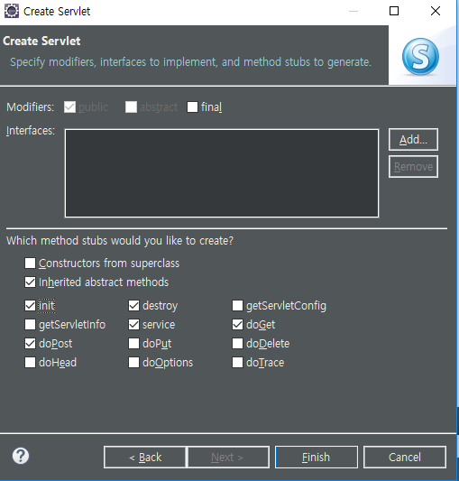
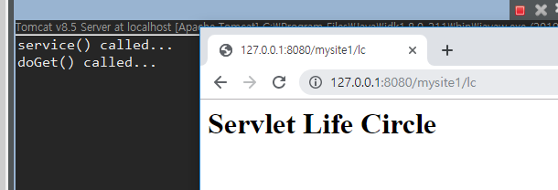
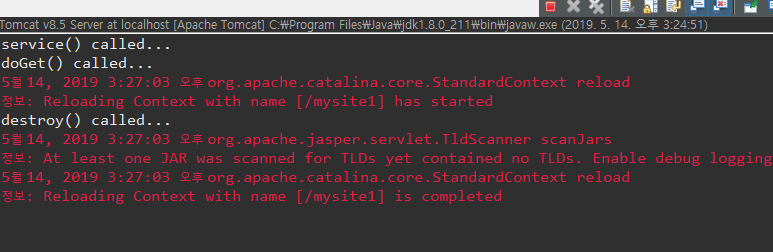

[TOC]

코드 : [Servlet-Basic](https://github.com/jungeunlee95/Servlet-Basic)

---

# 생명주기

[참고사이트](<https://hackersstudy.tistory.com/72>)

---

com.cafe24.mysite.controller

**LifeCircleServlet.java**

---

**서블릿 생명 주기**

**init() -> service() -> destroy()**

**1. init()**

 \- 딱 한번 실행이 된다.

init()은 생성자가 아니다

생성자는 생성시점에 호출되고 init은 생성된 이후 곧바로 서블릿을 초기화 하기 위한 

용도로 호출한다. 생성자가 더 빠르다.

**2. service(request,response)**

 \- 사용자의 요청이 발생할 때 마다 실행

service()는 클라이언트의 전송방식이 get방식이면 doGet를 post방식이면 doPost를 호출한다. 이때 service()가 전달받은 request, response는 전송방식에 따라 전달 된다.

**3. destory()**

 \- 서버 다운 직전 딱 한번만 실행

destory()에서는 연결된 자원을 해제 등의 작업을 주로 한다.

---

---

### 1 최초요청

최초요청 servlet을 객체로 만들고

init()  : 객체로 만들어 졌을 때 최초로 한번만 부름

-> service() 

-> doGet() or doPost()

### 2 두 번째 요청

코드 수정 했을 때 destroy()

다시 요청하면

scope

